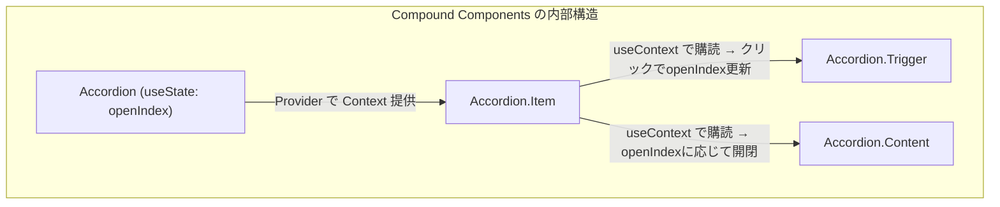
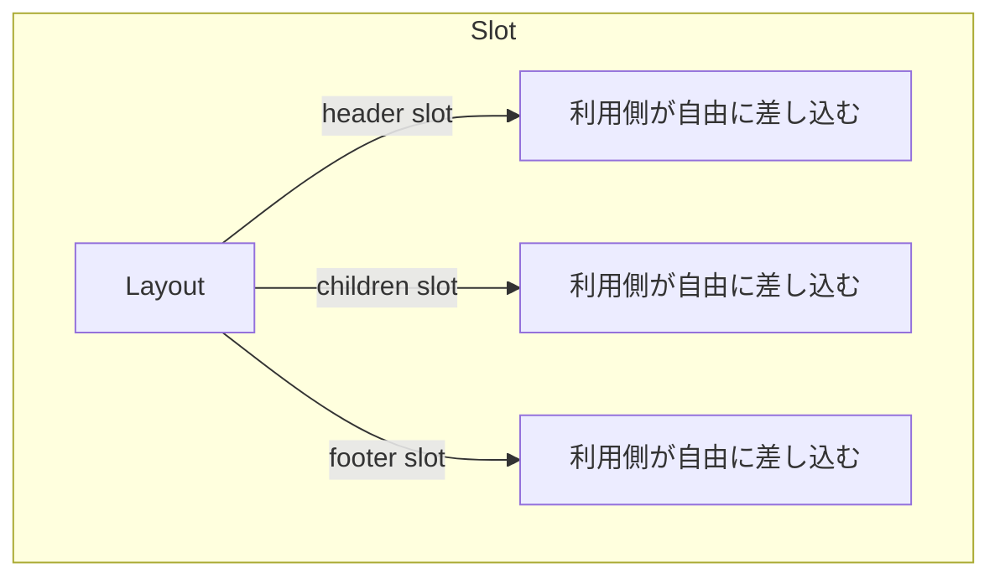
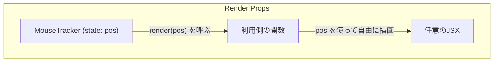
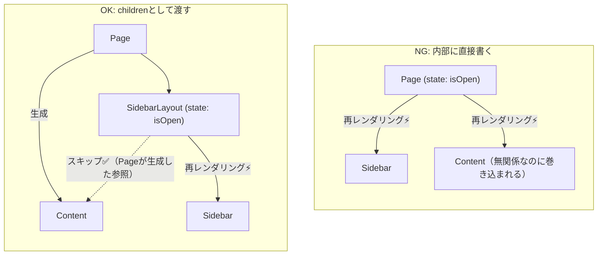
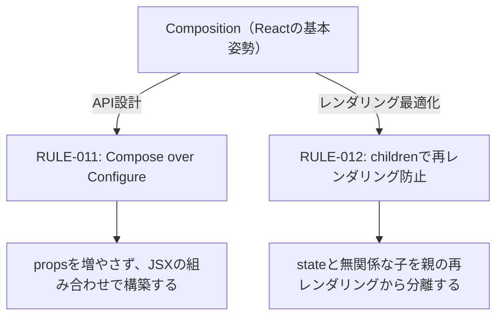

# coderule

## RULE-001: 関数型ライクな書き方

* データは不変とし、書き換えしない
* 値を変更したい場合は、値が変更された新しいobjectを返す
* classを使わず、export関数を中心としたモジュール構造を採用する
* 設計上無理のない範囲で、純粋関数と、副作用のある操作を切り分ける。

## RULE-002: 理解しやすい妥当な命名を採用し、ドメイン言語を統一する

関数、変数の命名は、その実際の役割や挙動を明示的に表す命名を採用する。
(スコープの小さいローカル変数に関しては、例外的にidiom的な短い命名を認める)

命名にあたってはドメイン言語の用語(グロッサリー)を使用すること。
定義されていなければ、他で同じような用語が使われていないかを調査する。
**export関数の命名は厳密に注意を払うこと。**

### 数値には単位を含める

NG: `timeout`, `delay`, `size`
OK: `timeoutMs`, `delaySeconds`, `fileSizeBytes`

### booleanは肯定形で命名する

否定形の命名は条件反転時に二重否定を招き、バグの原因になる。

NG: `const disableNotification = false;` → `if (!disableNotification)` は二重否定
OK: `const isNotificationEnabled = true;` → `if (isNotificationEnabled)` で直感的に読める

## RULE-003: classは例外を除き禁止

classの利用は禁止(NEVER)とし、データと関数のみで処理フローを構築する。

例外的に使っても良いケース

* Errorをextendしたclass (JavaScriptの慣例)
* Cloudflare Durable Objects (frameworkの制約)
* Cloudflare Workflows (frameworkの制約)

## RULE-004: try/catchは原則として禁止

例外(throw)はentrypointに近い場所で一括でハンドリングし、ユーザメッセージを表示すべき。
モジュールレベルでは例外をハンドリングしないことをデフォルトにする。
モジュールは「失敗しらたどうなるか」ではなく、**「何に失敗したか」を返す**ようにする。
(代わりに、例外を発生しうる関数コールの上に `// @throws` とコメントをいれること)

ただし、モジュール側で潰すべきケース(e.g. ユーザに関係のないエラーなど)があると判断した場合は、try/catchを用いてモジュール側でのハンドリングを行っても良い。

## RULE-005: 早期リターン

ガード節、複数条件の早期脱出など、早期リターンを意識した書き方にする。
異常系は必ず早期リターンし、関数の大部分は正常系であることを前提で読める書き方にする。

## RULE-006: enum-likeな値は、if-elseではなくswitchでハンドリングする

(enum-like: unionも含める)

* if-elseでハンドリングすると、将来的に新しい列挙値を追加した際、容易に既存コードのロジックバグを作ってしまう。
少なくとも2つのケースを扱う際は、if-elseではなく毎回switchを使用すること。

* 通常のswitchではdefaultの利用は避ける。
1,2つのケースのみ正常フローとし、他はスルーしたいケースでのみdefaultを使う。
=> exaustiveの検査はlintで行える。新しいケースが追加された場合は、常にswitchの挙動を再確認すべき。

* 例外的に、1つのケースのみを判定し、かつ、将来的にも判定ケースに変更が起こり得ないと判断できる場合は、ifを使ってもよい。

## RULE-007: 不要な関数をexportしない

モジュールの設計レベルで、できるだけexport関数が少なくなるように設計を行う。
また、開発段階で不要と思われるexportを記載してしまっている場合は、削除する。

## RULE-008: 変数の命名にPascalCaseを避ける

変数の名前でPascalCaseを使わないこと。
ただし、例外的に、(1) React Component (2) zod schemaはPascalCaseの利用を認める。

NG:

* `const HttpStatusOk = 200;`
* `const FooObject = createSomeObject(...);`

OK:

* `const httpStatusOk = 200;`
* `const FooRequestSchema = z.object(...);`

## RULE-009: (React) useEffectを避ける

不要な場面でuseEffectは避け、最小限の利用に留める。

使うべきでない例

* 描画用データの整形 -> 通常の変数として関数内で計算する。
* stateの変化に応じて、違うstateを更新する -> 通常の変数として関数内で計算する。パフォーマンスの考慮があればuseMemoなどを使う
* fetchを行う -> TanStack Queryなどを使う。fetchをするためにuseEffectをしない
* その他様々なケースで、useEffectを使わずとも実現できる場合が多い。

使っても良い例

* DOMのイベント購読のため: addEventListener
* 外部ライブラリの操作を行うなど
  * DOM イベントの購読 (addEventListener)
  * WebSocket 接続
  * サードパーティライブラリの初期化

要するに、useEffect は「React の外の世界」との接続点であって、React内部のデータフローを制御する道具ではないということを徹底しなさい。

## RULE-010: 関数にモードをつくらない

関数の`isFoo: boolean`や`mode: string`のような引数を追加し、モードによって処理を変える設計は避ける。
=> パッチワーク的変更(存の関数にif分岐を継ぎ足していく変更のこと)に陥りやすいため。
別の関数として分離できないか検討すること。modeやisFooを足したくなったら、それは「本来別の関数であるべきものを1つに押し込めようとしている」という危険信号と気づきましょう。

## RULE-011: (React) Compose over Configure

propsの数が多くなったり(4-5個以上)、booleanのpropsが2つ以上ある場合は、UIの細部を「設定」で制御しようとしている兆候。
propsでの設定ではなく、子要素や差し込み用コンポーネントで組み立てる設計を優先すること。

Compound／Slot／Render Propsなど、Composition(組み合わせ)できる設計を用いる。

### Compositionパターンの使い分け

**Compound Components**: 振る舞い（state）はコンポーネント内部に隠蔽し、見た目の構造は利用側がJSXで自由に組み立てられるパターン。Accordion, Tabs, Menuなど。
Compound ComponentsはuseContextありき

本質は**API設計**の話。Configure型（propsで設定）との対比で理解する。

```tsx
// Configure型（避けるべき）: propsで中身を設定する
// → Triggerにアイコンを付けたい、Contentにフォームを入れたい等の要件でpropsが膨れる
<Accordion
  items={[
    { trigger: "セクション1", triggerIcon: <Star />, content: <Form /> },
    { trigger: "セクション2", content: "内容2" },
  ]}
/>

// Compound型（推奨）: JSXで構造を組み立てる
// → Trigger, Contentの中身は利用側が自由に決められる。propsを増やす必要がない
<Accordion>
  <Accordion.Item>
    <Accordion.Trigger><Star /> セクション1</Accordion.Trigger>
    <Accordion.Content><Form /></Accordion.Content>
  </Accordion.Item>
  <Accordion.Item>
    <Accordion.Trigger>セクション2</Accordion.Trigger>
    <Accordion.Content>内容2</Accordion.Content>
  </Accordion.Item>
</Accordion>
```

内部の仕組みとしては、Accordionがstateを持ち、Provider配下にスコープされたContext(useContext)を通じて子に共有する。
Trigger, ContentはuseContextで購読しており、開閉状態の変化に応じて意図的に再レンダリングされる。



**Slot**: 名前付きの差し込み口をpropsとして公開し、利用側が任意の要素を注入するパターン。レイアウトの各領域に任意のコンテンツを流し込む場合に使う。

```tsx
<Layout
  header={<SearchBar />}
  footer={<Pagination />}
>
  <ArticleList />
</Layout>
```



**Render Props**: 関数をpropsとして渡し、コンポーネント内部のデータを受け取りながら利用側が描画を決めるパターン。内部データを利用側に公開して描画を委ねる場合に使う。

```tsx
<MouseTracker render={(pos) => <p>{pos.x}, {pos.y}</p>} />
```



## RULE-012: (React) childrenで不要な再レンダリングを防ぐ

コンポーネント内部に直接子コンポーネントを書くと、そのコンポーネントのstate変更時にすべての子が再レンダリングされる。
childrenやpropsとして外から渡された要素は、呼び出し元で生成されたReact Elementであり参照が変わらないため、Reactが再レンダリングをスキップする。

stateを持つコンポーネントと、そのstateに無関係な子コンポーネントがある場合、childrenパターンで分離することを検討する。

```tsx
// NG: isOpen の変更で Content も再レンダリングされる
function Page() {
  const [isOpen, setIsOpen] = useState(false);
  return (
    <div>
      <Sidebar isOpen={isOpen} onToggle={() => setIsOpen(!isOpen)} />
      <Content />
    </div>
  );
}

// OK: isOpen の変更で Content は再レンダリングされない
function SidebarLayout({ children }: { children: ReactNode }) {
  const [isOpen, setIsOpen] = useState(false);
  return (
    <div>
      <Sidebar isOpen={isOpen} onToggle={() => setIsOpen(!isOpen)} />
      {children}
    </div>
  );
}

function Page() {
  return (
    <SidebarLayout>
      <Content />
    </SidebarLayout>
  );
}
```



### RULE-011 & RULE-012 の背景: Reactにおける Composition

Reactのコンポーネント設計の基本姿勢は **Composition（組み合わせ）** である。
コンポーネントの内部に子コンポーネントを直接書くのではなく、propsやchildrenを通じて外から組み合わせる。

この基本姿勢が、2つの恩恵をもたらす。

**RULE-011（保守性・柔軟性）**: Compositionに基づくデザインパターン（Compound / Slot / Render Props）を活用することで、propsの肥大化を防ぎ、利用側がJSXで自由に構造を組み立てられる柔軟なAPIを設計できる。

**RULE-012（パフォーマンス）**: childrenとして外から渡された要素は、親のstate変更時に参照が変わらないため、Reactが再レンダリングをスキップする。stateと無関係な子コンポーネントが不要な再レンダリングに巻き込まれることを防げる。



## RULE-013: 複雑な条件式は説明変数に分割する

複数の条件を `&&` / `||` で連結した巨大な式は、各条件を意味のある名前の変数に抽出する。
条件の意図がコード上で自己説明的になり、どの条件に問題があるかの特定が容易になる。

NG:

```ts
if (
  !user.isDeleted &&
  (user.role === "admin" || user.teamId === doc.teamId) &&
  !doc.isArchived &&
  !(doc.visibility === "private" && !user.hasPrivateAccess)
) {
  publish(doc);
}
```

OK:

```ts
const isActiveUser = !user.isDeleted;
const canAccessTeamDoc = user.role === "admin" || user.teamId === doc.teamId;
const isPublishableDoc = !doc.isArchived;
const isBlockedByPrivateRule = doc.visibility === "private" && !user.hasPrivateAccess;

if (isActiveUser && canAccessTeamDoc && isPublishableDoc && !isBlockedByPrivateRule) {
  publish(doc);
}
```

## RULE-014 : React useMemo / useCallback 運用ルール

### 前提

* React 19 と React Compiler を導入済みの環境を対象とする
* React 19 単体では自動メモ化は行われない。React Compiler は別途インストールするビルドタイムツール（Babel プラグイン）である
* React Compiler 1.0 安定版リリース: 2025年10月7日

### 基本方針

**Compiler に任せることをデフォルトとし、手動メモ化は例外的に使う。**

* 自前コード内の計算・関数は Compiler が純粋性を検証して自動メモ化するため、手動で `useMemo` / `useCallback` を書かない
* フィルタリング・ソート等の重い処理、`React.memo` との組み合わせ、`useEffect` 依存配列の安定化は Compiler の最適化対象であり、手動メモ化は不要
* 予防的・防御的なメモ化はノイズになるため行わない

### 手動メモ化が必要なケース

#### サードパーティライブラリ（3PL）のメソッドを含む計算結果のメモ化

React Compiler は `node_modules` 内のコードを解析しないため、3PL が提供するメソッドの純粋性を判断できない。結果として Compiler がメモ化をスキップし、毎レンダーで新しいオブジェクト参照が生まれる可能性がある。

**手動メモ化を書く条件:**

1. 3PL のメソッドが計算に含まれている
2. そのメソッドが**純粋であることをドキュメントまたはソースコードで確認済み**である
3. 生成されたオブジェクト/関数の参照安定性が外部ライブラリの動作に影響する

```tsx
// ✅ ライブラリのメソッドが純粋であることを確認済みの場合のみ囲む
const options = useMemo(() => ({
  center: viewport.center,
  zoom: viewport.zoom,
  bearing: libMethod(viewport, markers), // 純粋性を確認済み
}), [viewport, markers]);
```

**手動メモ化を書いてはいけないケース:**

* 3PL メソッドの純粋性が確認できない場合 → メモ化しない（Compiler と同じ保守的判断）
* 不純な関数を useMemo で囲むと古い結果がキャッシュされ続け、サイレントバグの原因になる

### その他の手動メモ化が有効なケース

* React 外の仕組み（DnD ライブラリ、地図ライブラリ、チャートライブラリ等）に渡すコールバックやオブジェクトの参照安定性が必要な場合
* `useEffect` の依存配列で、effect の不要な再発火を精密に制御したい場合（Compiler の粒度では足りない場合に限る）

### 判断フローチャート

```txt
メモ化が必要か？
│
├─ 自前コードのみで完結している
│   └─ Compiler に任せる → 手動メモ化不要
│
├─ 3PL のメソッドが計算に含まれている
│   ├─ 純粋性をドキュメント/ソースで確認済み
│   │   └─ useMemo / useCallback で囲む
│   └─ 純粋性が確認できない
│       └─ メモ化しない
│
└─ React 外のライブラリに参照を渡している
    ├─ Profiler で不要な再初期化/再描画が観測された
    │   └─ useMemo / useCallback で囲む
    └─ 問題が観測されていない
        └─ Compiler に任せる
```

## RULE-015: 共有依存は catalog で一元管理する

複数パッケージで使う依存は、ルート `package.json` の `catalog` でバージョンを一元定義する。
各パッケージは `"catalog:"` で参照し、バージョン番号を直接書かない。

```json
// ルート package.json
"catalog": {
  "vitest": "^3.2.0"
}

// packages/*/package.json
"devDependencies": {
  "vitest": "catalog:"
}
```

新しい依存を追加する際のチェックポイント:

* 複数パッケージで使う依存か → catalog に追加してバージョンを一元管理
* 1つのパッケージでしか使わない依存か → そのパッケージの devDependencies に直接バージョンを記載

## 備考

* `useMemo` は**関数が純粋である**ことを前提にキャッシュする仕組みである

## 参考

* [React 19 コンパイラ 2025: useMemo/useCallback はまだ必要ですか?](https://isitdev.com/react-19-compiler-usememo-usecallback-2025/)
