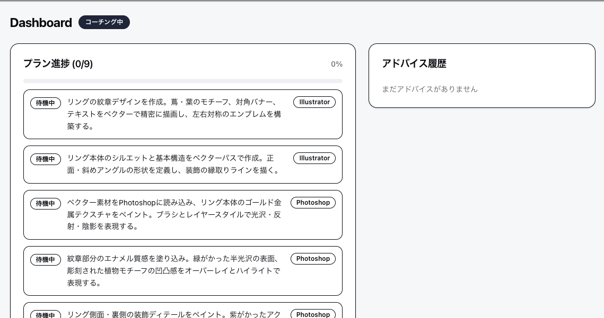

# DCC Coach

Adobe CC（Illustrator / Photoshop / After Effects）の制作画面をAIがリアルタイムで監視し、方針判断・手順案内・GUI操作の指示を出すコーチングツール。

**AIは画面を操作しない。隣に座る先輩デザイナーのように、見て・考えて・声をかける。**



## Features

- **リファレンス画像分析** — アップロードした参考画像から表現技法・色彩・構図を解析
- **制作プラン自動生成** — リファレンスと目標に基づき、アプリ間のワークフロー（Illustrator → Photoshop 等）を設計
- **リアルタイムコーチング** — 画面のスクリーンショットを定期取得し、差分検知でAIに問い合わせ
- **メッセージ送信** — 制作中にコーチへ質問や方針を伝えられる
- **セッション履歴** — 過去のコーチングセッションを閲覧・復元可能

### コーチングの3つの価値

| 種類 | 例 |
|---|---|
| 方針判断 | 「その方向で合ってる」「コントラストをもう少し効かせると良い」 |
| 手順・ノウハウ | 「次はクリッピングマスクを使うといい。やり方は…」 |
| GUI操作の具体指示 | 「レイヤーパネルで右クリック → クリッピングマスクを作成（Create Clipping Mask）」 |

## Tech Stack

| カテゴリ | 技術 |
|---|---|
| Runtime | Bun + TypeScript |
| AI | Claude Code CLI (Claude Agent SDK) |
| Server | Hono + tRPC + Drizzle ORM (SQLite) |
| Client | React + Tailwind CSS + shadcn/ui |
| Screenshot | screenshot-desktop |
| Image Processing | sharp + pixelmatch |

## Prerequisites

- **Bun** v1.1+
- **Claude Code CLI** — [インストール手順](https://docs.anthropic.com/en/docs/claude-code/overview)
- **Gemini API Key** — YouTube動画からの知識抽出に使用（[取得はこちら](https://aistudio.google.com/apikey)）
- **macOS** （screenshot-desktop はmacOS/Linux/Windowsに対応、ただし現時点ではmacOSでのみ動作確認済み）

## Getting Started

```bash
# リポジトリをクローン
git clone https://github.com/yukaorange/dcc_suport.git
cd dcc_suport

# 依存関係のインストール
bun install

# 環境変数の設定
echo 'GEMINI_API_KEY=your-api-key-here' > .env

# 開発サーバーの起動（サーバー + クライアント）
bun dev
```

ブラウザで `http://localhost:5173` を開く。

### 使い方

1. **モニター選択** — コーチングで監視するディスプレイを選ぶ
2. **リファレンス画像アップロード** — 目指す方向性の参考画像を設定
3. **目標の入力** — 何を作りたいかをテキストで記述
4. **プラン生成** — AIがリファレンスを分析し、制作ステップを提案
5. **コーチング開始** — 画面監視が始まり、AIが適宜アドバイスを発信

## Project Structure

```text
dcc_suport/
├── packages/
│   ├── core/          # ビジネスロジック（AI呼び出し、画面キャプチャ、差分検知）
│   ├── server/        # Hono + tRPC サーバー
│   ├── client/        # React フロントエンド
│   └── cli/           # CLI版（サーバー不要で動作）
├── docs/              # プロジェクト仕様・アーキテクチャ
└── e2e/               # E2Eテスト（Playwright）
```

## Scripts

| コマンド | 説明 |
|---|---|
| `bun dev` | 開発サーバー起動（server + client） |
| `bun dev:cli` | CLI版を起動 |
| `bun run check` | TypeCheck + Lint + Test |
| `bun run test` | ユニットテスト実行 |
| `bun run test:e2e` | E2Eテスト実行 |
| `bun run typecheck` | TypeScript型チェック |
| `bun run lint` | Biome Lint & Format チェック |
| `bun run lint:fix` | Lint自動修正 |
| `bun run verify` | AI接続・画像認識の動作検証 |

## Architecture

```text
Client (React)  ──→  tRPC Router  ──→  Coach Session  ──→  Core
                                            │
                                    ┌───────┴───────┐
                                    │               │
                              Coach Loop      Plan Generator
                                    │
                            ┌───────┴───────┐
                            │               │
                      Screen Capture    Claude Agent SDK
                      + Diff Detection    (query / session)
```

詳細は [docs/README.md](./docs/README.md) を参照。

## Development

開発の方針・コーディング規約は以下を参照：

- [docs/README.md](./docs/README.md) — ドキュメント全体マップ
- [.claude/rules/coderule.md](./.claude/rules/coderule.md) — コーディング規約
- [.claude/rules/convention.md](./.claude/rules/convention.md) — 設計原則・テスト・セキュリティ

## License

MIT
