# アーキテクチャ概要

更新日: 2026-03-19

## 全体フロー（現行 + DCC-7）

起動からコーチングまでの全体の流れ。灰色のノードは DCC-7 で追加される部分。

```mermaid
flowchart TD
    Start([bun run start]) --> LoadConfig["config.ts<br>loadConfig()"]
    LoadConfig --> Setup["setup-flow.ts<br>runSetupFlow()"]

    Setup --> SelectDisplay["ディスプレイ選択<br>listDisplays() → inquirer"]
    SelectDisplay --> InputRef["リファレンス画像入力<br>inquirer"]
    InputRef --> InputGoal["目標記述入力<br>inquirer"]
    InputGoal --> GenPlan["planner.ts<br>generatePlan()"]
    GenPlan --> ConfirmPlan{"プラン承認？"}
    ConfirmPlan -->|修正| GenPlan
    ConfirmPlan -->|承認| LoadManifest

    LoadManifest["skills.ts<br>loadSkillManifest()"]:::dcc7
    LoadManifest --> StartLoop["coach-loop.ts<br>startCoachLoop()"]

    subgraph loop ["コーチングループ（5秒間隔）"]
        Capture["capture.ts<br>captureScreen()"]
        Diff["diff.ts<br>computeDiff()"]
        BuildPrompt["prompts.ts<br>buildCoachSystemPrompt()<br>buildCoachUserPrompt()"]
        Engine["engine.ts<br>invokeClaude()"]
        Parse["parseAdvice()"]

        Capture --> CheckFirst{初回？}
        CheckFirst -->|Yes| BuildPrompt
        CheckFirst -->|No| CheckMsg{ユーザー<br>メッセージ？}
        CheckMsg -->|Yes| BuildPrompt
        CheckMsg -->|No| Diff
        Diff -->|変化あり| BuildPrompt
        Diff -->|変化なし| Sleep
        BuildPrompt --> Engine
        Engine --> Parse
        Parse --> Sleep[5秒スリープ<br>or ユーザー入力]
        Sleep --> Capture
    end

    StartLoop --> Capture

    subgraph subagents ["サブエージェント（DCC-7）"]:::dcc7box
        Coach["advisor<br>方向性判断・GUI案内"]:::dcc7
        Researcher["researcher<br>多段探索・知識蓄積"]:::dcc7
    end

    Engine -.->|"isSubagentsEnabled<br>= true"| subagents

    classDef dcc7 fill:#e8eaf6,stroke:#5c6bc0
    classDef dcc7box fill:#f5f5ff,stroke:#9fa8da
```

## モジュール構成と関数マップ

各ソースファイルが持つ export 関数と、その依存関係。

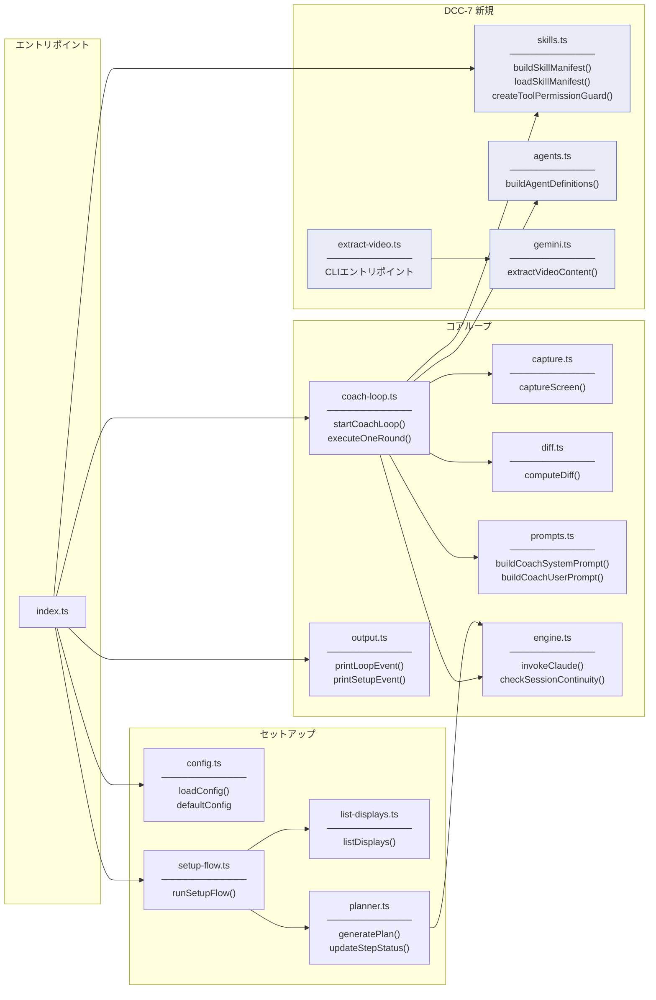

### テストカバレッジ

#### @dcc/core（vitest）

| モジュール | テスト | ファイル / 理由 |
|-----------|--------|----------------|
| config.ts | あり | test/config.test.ts |
| list-displays.ts | あり | test/list-displays.test.ts |
| planner.ts | あり | test/planner.test.ts |
| coach-loop.ts | あり | test/coach-loop.test.ts（統合テスト、モック使用） |
| capture.ts | あり | test/capture.test.ts |
| diff.ts | あり | test/diff.test.ts |
| prompts.ts | あり | test/prompts.test.ts |
| engine.ts | あり | test/engine.test.ts |
| skills.ts | あり | test/skills.test.ts |
| agents.ts | あり | test/agents.test.ts |
| gemini.ts | あり | test/gemini.test.ts（APIキー未設定・URL不正の異常系のみ） |
| output.ts | なし | 純粋な表示ロジック（console.log のみの副作用） |
| extract-video.ts | なし | CLIエントリポイント（gemini.ts を呼ぶだけ） |
| index.ts | なし | エントリポイント（各モジュールの組み合わせのみ） |

手動検証スクリプト群: `src/verify/`（11ファイル）。SDK連携やストリーミング動作を実環境で検証。

#### @dcc/server（bun:test）

| モジュール | テスト | ファイル / 理由 |
|-----------|--------|----------------|
| db/sessions.ts | あり | test/db.test.ts（CRUD + パージ） |
| db/plans.ts | あり | test/db.test.ts（CRUD + ステップ更新） |
| db/advices.ts | あり | test/db.test.ts（CRUD + 復元コピー） |

#### @dcc/cli（vitest）

| モジュール | テスト | ファイル / 理由 |
|-----------|--------|----------------|
| setup-flow.ts | あり | test/setup-flow.test.ts（キャンセル動作） |

#### E2E テスト（Playwright）

| テスト | ファイル / 内容 |
|--------|----------------|
| セットアップフロー | e2e/（Chromium、サーバー + クライアント自動起動） |

## データフロー: セットアップからコーチングまで

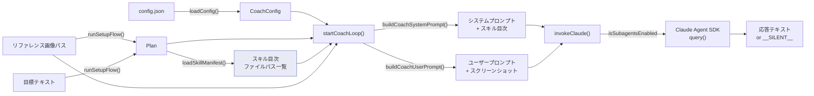

## キャプチャ・差分検知パイプライン

デスクトップ画面の取得から差分率算出までの流れ。

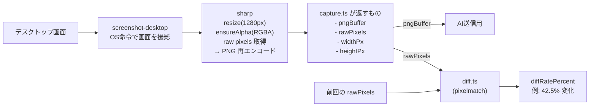

### captureScreen の内部フロー

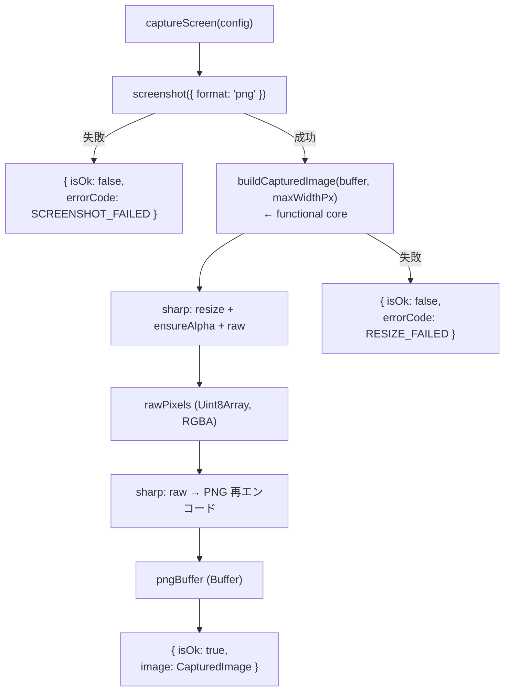

### functional core / mutable shell の分離

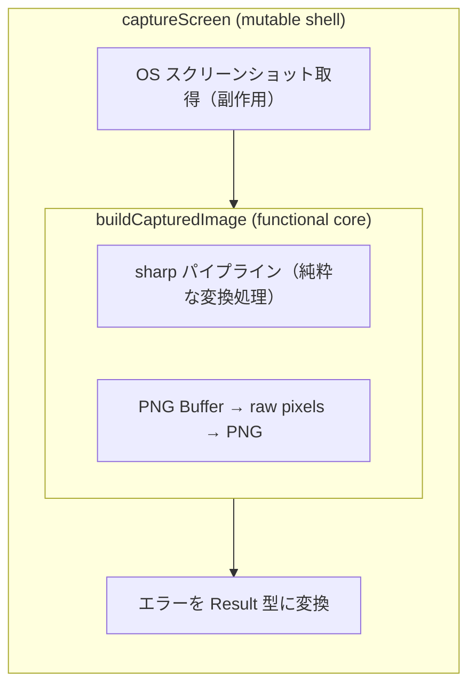

### computeDiff のガード節

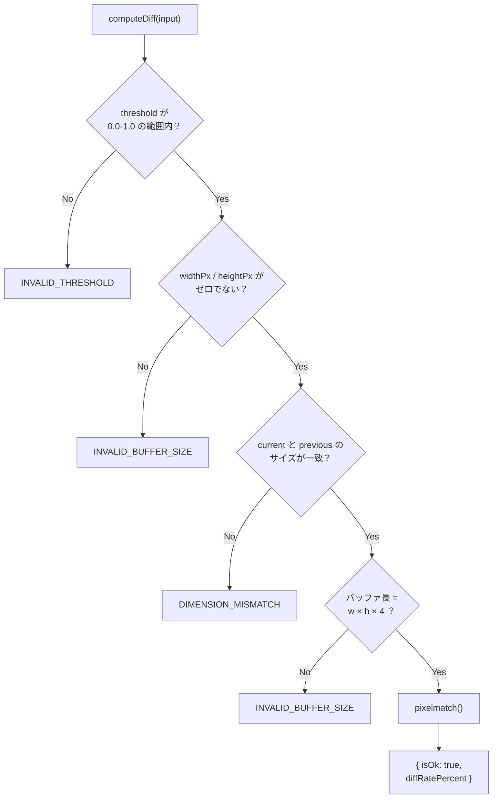

### 2つの threshold の違い

| 名前 | 範囲 | 意味 | 使用箇所 |
|------|------|------|----------|
| `pixelmatchThreshold` | 0.0 - 1.0 | ピクセル単位の色差感度。「2つのピクセルの色がどれくらい違ったら '違う' とみなすか」 | diff.ts が pixelmatch に渡す |
| `diffThresholdPercent` | 例: 5% | 画面全体の変化率の閾値。「画面の何%が変わったら AI に送信するか」 | coach-loop が判定 |

### 型の関係（疎結合）

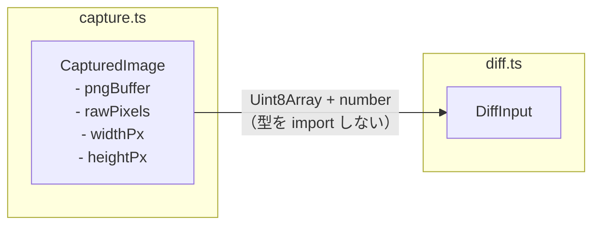

> diff.ts は capture.ts の型を import しない。Uint8Array + プリミティブだけで繋がる疎結合設計。

## コーチングループ詳細

### メインループフロー

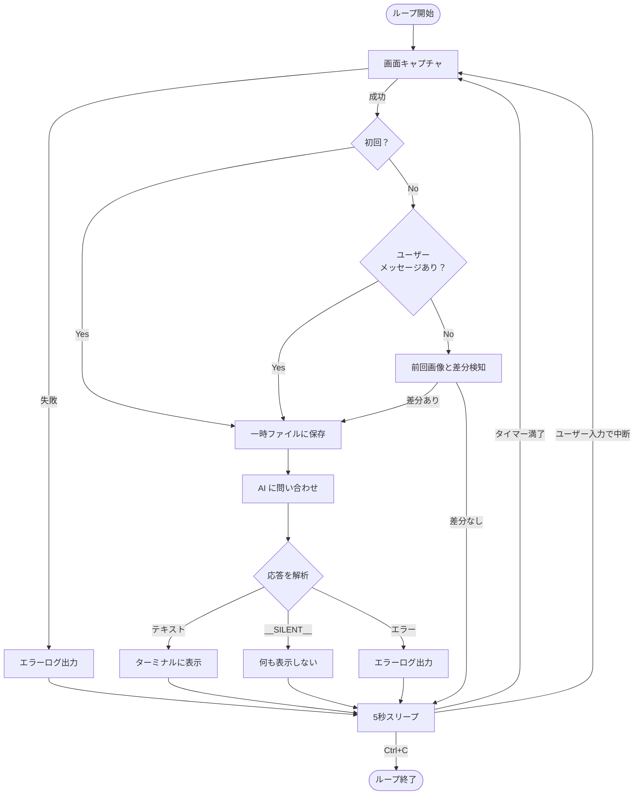

### 双方向チャンネル（MessageBox パターン）

ユーザーが stdin から入力したメッセージを MessageBox にバッファし、<br>ループ側の sleep を中断して即座に AI を呼び出す仕組み。

```mermaid
sequenceDiagram
    participant User as ユーザー（stdin）
    participant RL as readline
    participant MB as MessageBox
    participant Loop as コーチループ
    participant AI as Claude API

    Note over Loop: 5秒スリープ中...

    User->>RL: "ここどうすればいい？" + Enter
    RL->>MB: submit("ここどうすればいい？")
    MB-->>Loop: sleep 中断

    Loop->>MB: consume()
    MB-->>Loop: "ここどうすればいい？"

    Loop->>Loop: 画面キャプチャ（diff はスキップ）
    Loop->>AI: メッセージ + スクリーンショット
    AI-->>Loop: 応答テキスト
    Loop->>User: ターミナルに表示

    Note over Loop: 再び5秒スリープ...
```

### AI の判断パターン

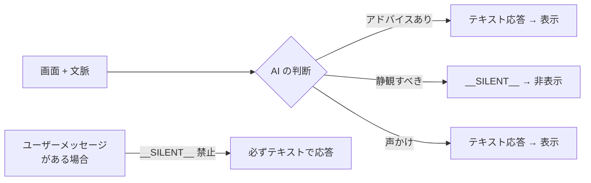

### 3-case プロンプト分岐

AI に送るユーザープロンプトは状況に応じて 3 パターンに分岐する。

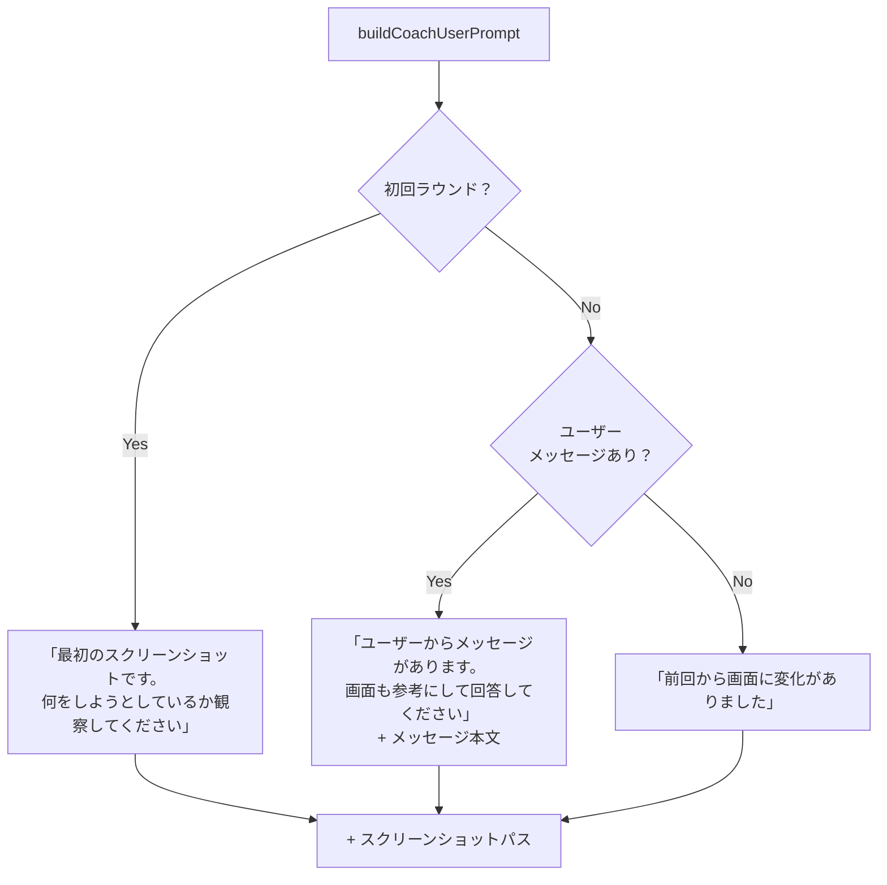

### グレースフルシャットダウン

```mermaid
sequenceDiagram
    participant User as ユーザー
    participant Process as プロセス
    participant AC as AbortController
    participant RL as readline
    participant Loop as コーチループ
    participant Tmp as 一時ファイル

    User->>Process: Ctrl+C（SIGINT）
    Process->>AC: abort()
    Process->>RL: close()
    AC-->>Loop: signal.aborted = true
    Loop->>Loop: while ループ脱出
    Loop->>Tmp: 一時ファイル削除
    Loop-->>Process: done Promise 解決
    Process->>Process: プロセス終了
```

## エージェント構成（DCC-7）

### 全体像：親エージェントとサブエージェントの関係

Claude Agent SDK では、AI は「ツール」を通じてテキスト生成以外のアクション（ファイル読み書き・Web検索・コマンド実行等）を行う。
本プロジェクトでは、親エージェントが直接ツールを使わず、目的別のサブエージェントに委譲する構成を取っている。

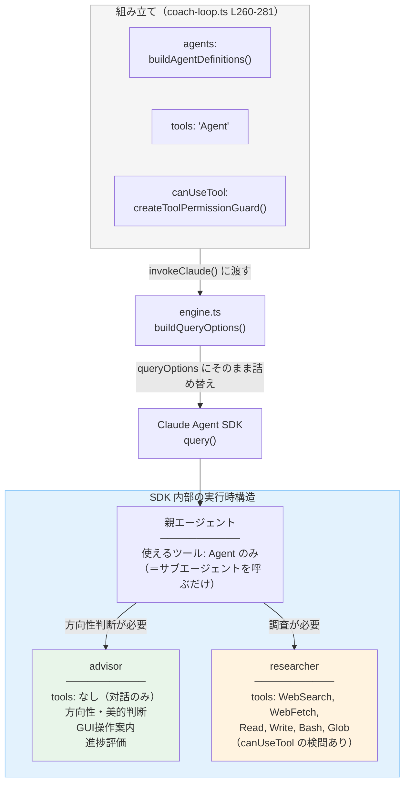

### 3つの設定プロパティの役割

`invokeClaude()` に渡す3つのプロパティが、エージェントの権限構造を決定する。

| プロパティ | 担当関数 | 定義場所 | 役割 |
|-----------|---------|---------|------|
| `agents` | `buildAgentDefinitions()` | agents.ts | **誰を呼べるか**：サブエージェントの名簿。名前・説明・プロンプト・使えるツール一覧を定義 |
| `tools` | — (リテラル) | coach-loop.ts | **セッション全体のツール一覧**：親・サブエージェント含め、このセッションで利用可能な全ツール。ここに含まれないツールはサブエージェントにも渡されない |
| `allowedTools` | — (リテラル) | coach-loop.ts | **親が直接使えるツール**：`tools` のサブセット。親エージェント（advisor）自身が自動承認で使えるツールを制限する |
| `canUseTool` | `createToolPermissionGuard()` | skills.ts | **使い方が安全か**：ツール実行の直前に毎回呼ばれるコールバック。引数の内容を見て allow / deny を返す |

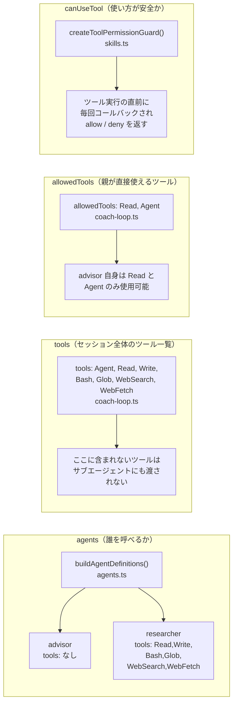

#### tools と allowedTools の違い（重要）

更新日: 2026-03-30

`tools` と `allowedTools` は似ているが役割が異なる。混同するとサブエージェントがツールを使えなくなる。

| プロパティ | スコープ | 役割 |
|-----------|---------|------|
| `tools` | セッション全体（親 + サブエージェント） | このセッションで「存在を認識する」ツールの一覧。ここにないツールは誰も使えない |
| `allowedTools` | 親エージェントのみ | `tools` のうち、親が自動承認で直接使えるものを制限する |

```
tools: ["Read", "Agent", "WebSearch", "WebFetch", "Write", "Bash", "Glob"]
                 ↑ セッション全体のメニュー（全員が見える）

allowedTools: ["Read", "Agent"]
                 ↑ advisor が自分で注文できるもの（advisor の制限）
```

**実例**: researcher が Bash で `extract-video.ts` を実行するには、parent の `tools` に `"Bash"` が含まれている必要がある。`allowedTools` に含まれていなくても、サブエージェントの agent 定義で `tools: ["Bash"]` と指定されていれば researcher は使える。

### 注意: createToolPermissionGuard() が実質 researcher にのみ影響する理由

`createToolPermissionGuard()` は SDK レベルでは**全エージェント共通**のコールバックとして登録される。
しかし、このコールバックが発火するのは「ツールを実行しようとした瞬間」のみであるため、
ツールを持たないエージェントには判定が走る機会自体がない。

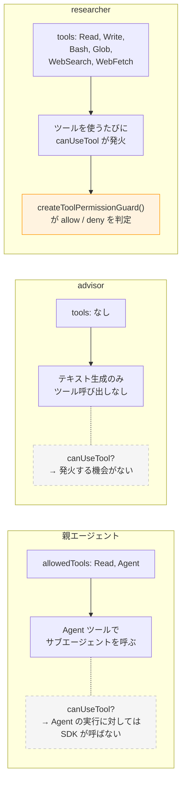

| エージェント | tools | canUseTool が発火するか | 理由 |
|-------------|-------|----------------------|------|
| 親 | `allowedTools: ["Read", "Agent"]` | しない | SDK は Agent ツール（サブエージェント呼び出し）に対して canUseTool を呼ばない |
| advisor | なし | しない | ツールを一切持たないので、判定を受ける機会がない |
| researcher | 6つ | **する** | Read / Write / Bash 等を使うたびに毎回判定される |

結果として、`createToolPermissionGuard()` 内の判定ロジック（skills/ 配下のみ書き込み可、Bash は extract-video.ts のみ等）は**事実上 researcher のためのルール**となっている。
関数名を `createToolPermissionGuard` としているのは、これが SDK の `canUseTool` コールバックとして全体に登録される仕組みであることを正確に表すためである。

### ツール実行時の二重チェック

サブエージェントがツールを使おうとしたとき、2段階のチェックが走る。

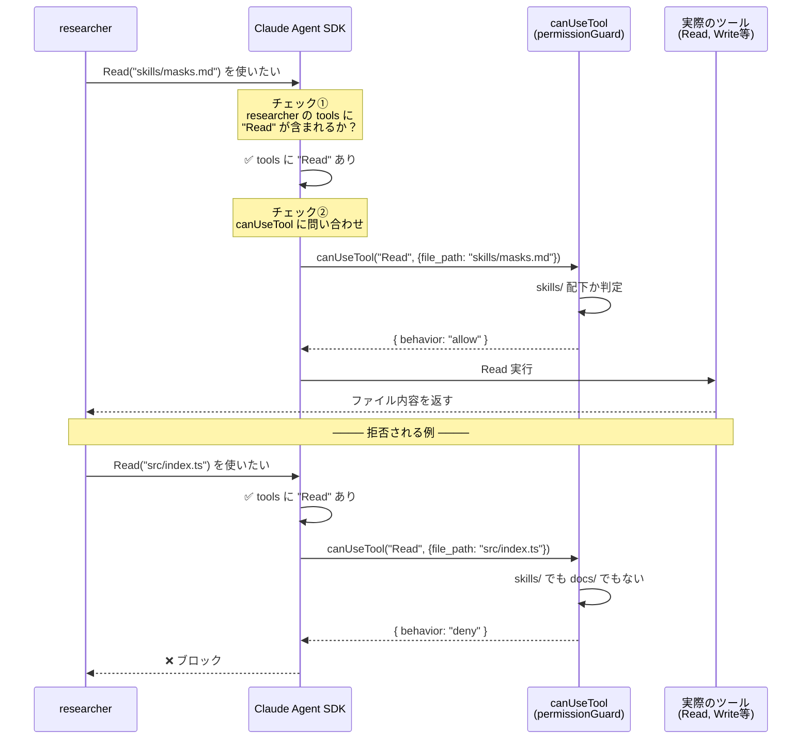

### canUseTool の判定ルール一覧

`createToolPermissionGuard()` (skills.ts) が返すコールバック関数の判定ルール。

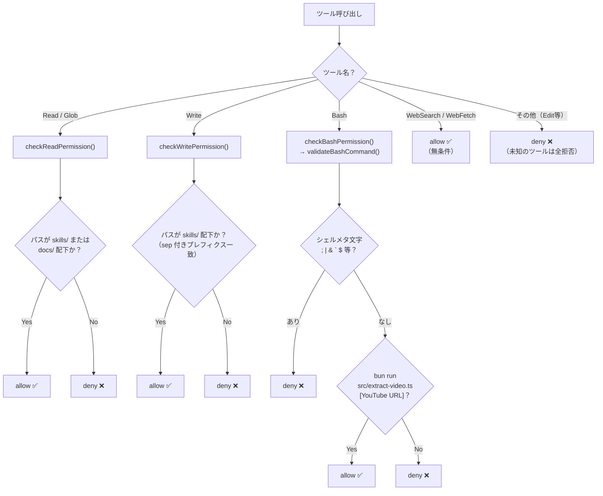

### スキルファイルの流れ

スキルファイルはシステムプロンプトに**目次（ファイルパス一覧）だけ**注入し、<br>中身は researcher が必要に応じて Read で読む。<br>調査結果は Write でスキルファイルに蓄積され、次回以降はローカルでヒットする。

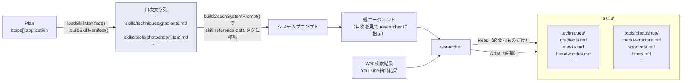

## DCC-8: モノレポ構成 + プログレスダッシュボード + セッション管理

更新日: 2026-03-19

DCC-8 では CLIセットアップをブラウザGUIに置き換え、プログレスダッシュボードとセッション永続化を追加する。
既存コードをモノレポに再構成し、4つのパッケージに分離する。

### パッケージ構成

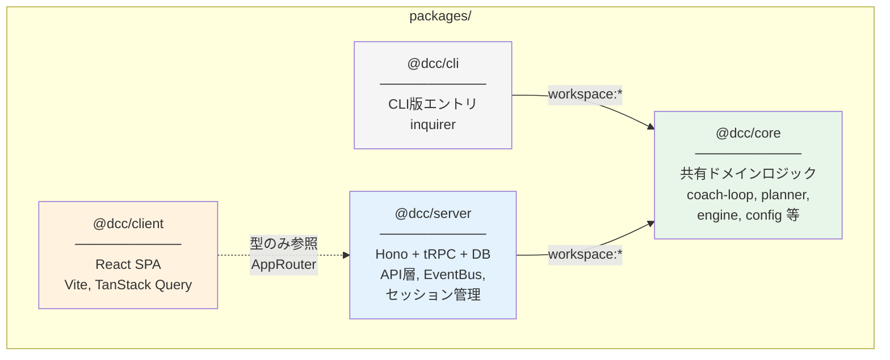

### 技術スタック（DCC-8 追加分）

| 領域 | 技術 | 役割 |
|------|------|------|
| モノレポ | Bun workspaces | パッケージ分離 |
| サーバー | Hono | 軽量Webフレームワーク。Bun.serve() で起動 |
| API | tRPC v11 | 型安全なRPC。Hono fetchアダプタ経由 |
| リアルタイム | tRPC subscription (SSE) | サーバー→ブラウザの一方向ストリーム |
| フロントエンド | React 19 + Vite | SPA。開発時はVite proxy経由でHonoと通信 |
| 状態管理 | TanStack Query | tRPC React統合でサーバー状態を管理 |
| DB | bun:sqlite (WALモード) | セッション・プラン・アドバイス履歴の永続化 |

### 全体フロー（GUI版 / DCC-8）

```mermaid
flowchart TD
    Start([bun run start:web]) --> LoadConfig["@dcc/core<br>loadConfig()"]
    LoadConfig --> InitDB["@dcc/server<br>createDatabase()"]
    InitDB --> StartHono["Hono + tRPC<br>localhost:3456"]

    subgraph browser ["ブラウザ（React SPA）"]
        SetupUI["セットアップUI<br>ディスプレイ選択<br>リファレンス画像D&D<br>目標入力"]
        PlanReview["プラン確認<br>承認 / 再生成"]
        Dashboard["ダッシュボード<br>プラン進捗<br>アドバイス履歴"]
        SessionList["セッション一覧<br>過去セッション閲覧<br>復元"]
    end

    StartHono --> SetupUI
    SetupUI -->|"tRPC mutation<br>plan.generate"| GenPlan["@dcc/core<br>generatePlan()"]
    GenPlan --> PlanReview
    PlanReview -->|"tRPC mutation<br>setup.start"| StartLoop

    StartLoop["@dcc/server<br>coach-session.ts<br>startCoachLoop()"]:::dcc8

    subgraph loop ["コーチングループ（既存・変更なし）"]
        Capture["captureScreen()"]
        Diff["computeDiff()"]
        Engine["invokeClaude()"]
    end

    StartLoop --> Capture

    subgraph eventflow ["イベント配信"]
        EventBus["EventBus<br>(TaggedLoopEvent)"]:::dcc8
        SSE["tRPC subscription<br>(SSE)"]:::dcc8
        DB["bun:sqlite<br>INSERT advice"]:::dcc8
    end

    Engine -->|"onEvent()"| EventBus
    EventBus -->|"sessionIdフィルタ"| SSE
    SSE -->|"リアルタイム"| Dashboard
    EventBus --> DB

    SessionList -->|"tRPC query<br>session.list"| DB
    Dashboard -->|"tRPC query<br>session.get"| DB

    classDef dcc8 fill:#e8eaf6,stroke:#5c6bc0
```

### パッケージ間の依存と型の流れ

```mermaid
flowchart LR
    subgraph core ["@dcc/core"]
        Types["Plan, LoopEvent,<br>CoachAdvice,<br>CoachConfig 等"]
    end

    subgraph server ["@dcc/server"]
        Router["AppRouter<br>(tRPCルーター)"]
        TaggedEvent["TaggedLoopEvent<br>= LoopEvent &<br>{ sessionId }"]
    end

    subgraph client ["@dcc/client"]
        TrpcClient["tRPCクライアント<br>createTRPCReact&lt;AppRouter&gt;()"]
    end

    core -->|"import { Plan, ... }"| server
    server -->|"export type AppRouter"| client
    core -.->|"型はtRPC経由で<br>自動伝搬"| client

    style core fill:#e8f5e9
    style server fill:#e3f2fd
    style client fill:#fff3e0
```

### SSE データフロー

```mermaid
sequenceDiagram
    participant Loop as coach-loop<br>(@dcc/core)
    participant Session as coach-session<br>(@dcc/server)
    participant Bus as EventBus
    participant Sub as tRPC subscription
    participant UI as ブラウザ

    Loop->>Session: onEvent({ kind: "advice", ... })
    Session->>Bus: publish({ ...event, sessionId })
    Session->>Session: INSERT INTO advices

    Bus->>Sub: listener 呼び出し（sessionId フィルタ）
    Sub-->>UI: SSE data: { kind: "advice", ... }
    UI->>UI: useState で adviceHistory に追加

    Note over Loop,UI: 5秒後、次のラウンドへ...
```

### DBスキーマ

```mermaid
erDiagram
    sessions ||--o{ plans : "has"
    sessions ||--o{ advices : "has"
    plans ||--o{ advices : "references"

    sessions {
        TEXT id PK
        TEXT goal
        TEXT reference_image_path
        TEXT display_id
        TEXT display_name "default=''"
        TEXT started_at
        TEXT ended_at "NULLなら進行中"
    }

    plans {
        TEXT id PK
        TEXT session_id FK
        TEXT goal
        TEXT reference_summary
        TEXT steps "JSON: PlanStep[]"
        TEXT created_at
    }

    advices {
        TEXT id PK
        TEXT session_id FK
        TEXT plan_id FK "nullable"
        INTEGER round_index
        TEXT content
        INTEGER timestamp_ms
        INTEGER is_restored "default=0, 復元されたアドバイスか"
    }
```

#### インデックス

- `idx_plans_session` — plans.session_id
- `idx_advices_session` — advices.session_id

### セットアップフローの変化

| 項目 | CLI版（DCC-6） | GUI版（DCC-8） |
|------|---------------|---------------|
| ディスプレイ選択 | inquirer select | `<select>` ドロップダウン |
| リファレンス画像 | パス手入力 | D&D / ファイル選択 + プレビュー |
| 目標入力 | inquirer input | `<textarea>` |
| プラン確認 | ターミナル表示 + Y/N | カード表示 + 承認/再生成ボタン |
| アドバイス表示 | ターミナル出力 | ダッシュボード（リアルタイム） |
| ユーザーメッセージ送信 | stdin入力 | メッセージ入力バー（⌘+Enter） |
| セッション履歴 | なし | SQLite永続化 + 一覧/復元UI |
| セッション復元 | なし | 過去セッションのアドバイス履歴を引き継いで新セッション作成 |
| セッションパージ | なし | 200件超の古いセッションを自動削除（画像ファイル含む） |

### CLI版との共存

```text
bun run start      → packages/cli/src/index.ts    → @dcc/core（既存動作を維持）
bun run start:web  → packages/server/src/index.ts  → @dcc/core + Hono + tRPC + DB
```

コアロジック（`@dcc/core`）は両方から共有。CLI版は一切変更なし。

## @dcc/server パッケージ内部構成

```mermaid
flowchart LR
    subgraph trpc ["tRPC ルーター (src/trpc/)"]
        Router["appRouter"]
        Session["sessionRouter<br>list / get / sendMessage / restore"]
        Plan["planRouter<br>generate"]
        Setup["setupRouter<br>start"]
        Display["displayRouter<br>list"]
        Events["eventsRouter<br>subscribe (SSE)"]
        Debug["debugRouter<br>ping / ctx / activeSession / dbStatus / log<br>（dev環境のみ）"]
    end

    subgraph lib ["アプリケーション層 (src/lib/)"]
        CoachSession["coach-session.ts<br>createCoachSession()"]
        StartSession["start-session.ts<br>startSession() / schedulePurge()"]
        ImageStore["image-store.ts<br>saveBase64Image()"]
        Logger["logger.ts<br>createTaggedLogger()"]
    end

    subgraph pure ["純粋ロジック (src/pure/)"]
        EventBus["event-bus.ts<br>createEventBus()"]
        PlanCache["pending-plan-cache.ts<br>createPendingPlanCache()<br>TTL: 30分"]
    end

    subgraph db ["データアクセス (src/db/)"]
        Database["database.ts<br>createDatabase()"]
        Sessions["sessions.ts<br>CRUD + purge"]
        Plans["plans.ts<br>CRUD + stepStatus更新"]
        Advices["advices.ts<br>CRUD + copyAdvicesToSession()"]
    end

    Router --> Session & Plan & Setup & Display & Events & Debug
    Setup --> CoachSession & StartSession & PlanCache
    Session --> CoachSession & db
    Plan --> PlanCache & ImageStore
    Events --> EventBus
    CoachSession --> EventBus & db
    StartSession --> db

    style trpc fill:#e3f2fd
    style lib fill:#fff3e0
    style pure fill:#e8f5e9
    style db fill:#f3e5f5
```

### tRPC プロシージャ一覧

| ルーター | プロシージャ | 種類 | 役割 |
|---------|------------|------|------|
| session | list | query | セッション一覧（プランステップ数付き） |
| session | get | query | セッション詳細（プラン + アドバイス履歴） |
| session | sendMessage | mutation | アクティブセッションへユーザーメッセージ送信 |
| session | restore | mutation | 過去セッションのアドバイス履歴を引き継いで新セッション作成 |
| plan | generate | mutation | リファレンス画像 + 目標からプラン生成 |
| setup | start | mutation | キャッシュ済みプランでセッション開始 |
| display | list | query | 接続ディスプレイ一覧 |
| events | subscribe | subscription | SSE でリアルタイムイベント配信（sessionId フィルタ） |

## セッション復元フロー

過去のセッションからアドバイス履歴を引き継いで新セッションを作成する機能。

```mermaid
sequenceDiagram
    participant UI as ブラウザ
    participant API as session.restore
    participant DB as SQLite

    UI->>API: restore({ sourceSessionId })
    API->>DB: findSessionById(sourceId)
    API->>DB: findPlanBySessionId(sourceId)
    API->>DB: insertSession(新セッション)
    API->>DB: insertPlan(プランコピー)
    API->>DB: copyAdvicesToSession(sourceId → targetId)
    Note over DB: isRestored=1 でコピー
    API->>API: schedulePurge(db, newSessionId)
    API-->>UI: { sessionId: 新ID }
    UI->>UI: ダッシュボードに遷移
    Note over UI: 復元アドバイスは「前回」バッジで表示
```

## セッションパージ

セッション数が 200 を超えた場合、古いセッションを自動削除する。`setup.start` と `session.restore` の完了後に `setImmediate` で非同期実行される。

- 現在のセッションは除外
- カスケード削除: advices → plans → sessions
- 関連する画像ファイルも削除（他セッションと共有していないもののみ）

## ユーザーメッセージ送信フロー

ダッシュボードからコーチに質問を送る機能。

```mermaid
sequenceDiagram
    participant UI as MessageInput
    participant API as session.sendMessage
    participant CS as CoachSession
    participant Loop as Coーチングループ

    UI->>API: sendMessage({ sessionId, content })
    API->>CS: submitMessage(sessionId, content)
    CS->>Loop: loop.submitMessage(content)
    Note over Loop: MessageBox にバッファ<br>→ sleep を中断<br>→ diff スキップで即座に AI 呼び出し
    Loop-->>CS: onEvent({ kind: "advice", ... })
    CS-->>UI: SSE で配信
```

## CI/CD（GitHub Actions）

`.github/workflows/check.yml` で push 時に 3 つのジョブを並列実行。

| ジョブ | コマンド | 内容 |
|--------|---------|------|
| TypeCheck | `bun run typecheck` | 全パッケージの TypeScript 型検査 |
| Lint & Format | `bunx biome ci .` | Biome によるコード品質チェック |
| Unit Tests | `bun run test` | vitest（core/cli）+ bun:test（server） |

## @dcc/client ページ構成

クライアントは React 19 + Vite の SPA で、3 つのフェーズを状態マシンで管理する。

```mermaid
stateDiagram-v2
    [*] --> setup
    setup --> coaching : onCoachingStarted
    setup --> sessions : onNavigateToSessions
    coaching --> sessions : onNavigateToSessions
    coaching --> setup : onBackToSetup
    sessions --> setup : onNavigateToSetup
    sessions --> coaching : onRestore
```

| フェーズ | ページ | 主なコンポーネント |
|---------|-------|------------------|
| setup | SetupPage | DisplaySelector, ReferenceUploader, GoalInput, PlanReview |
| coaching | DashboardPage | LatestAdvice, PlanProgress, AdviceTimeline, MessageInput |
| sessions | SessionListPage / SessionDetailPage | セッション一覧, 復元ボタン, 過去アドバイス閲覧 |

### SSE サブスクリプション

`useLoopEvents` カスタムフックが `trpc.events.subscribe` を購読し、リアルタイムでダッシュボードを更新する。

| イベント種別 | 処理 |
|------------|------|
| advice | adviceHistory に追加 |
| plan_step_updated | プランステップの status を更新 |
| stopped | コーチング終了表示 |

## 関連ドキュメント

- [プロジェクト思想](./memory/README.md) — 「隣に座っている先輩デザイナー」の考え方
- [ロードマップ](./roadmap/loadmap.md) — Phase 1-6 の開発計画
