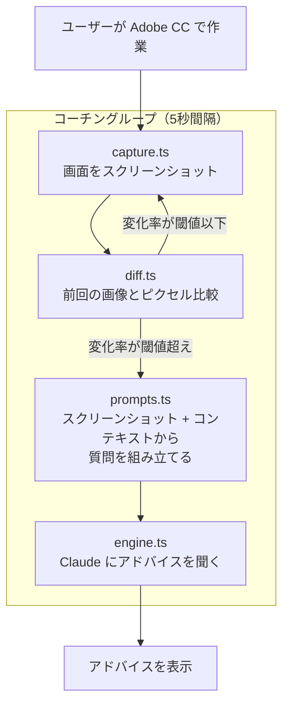
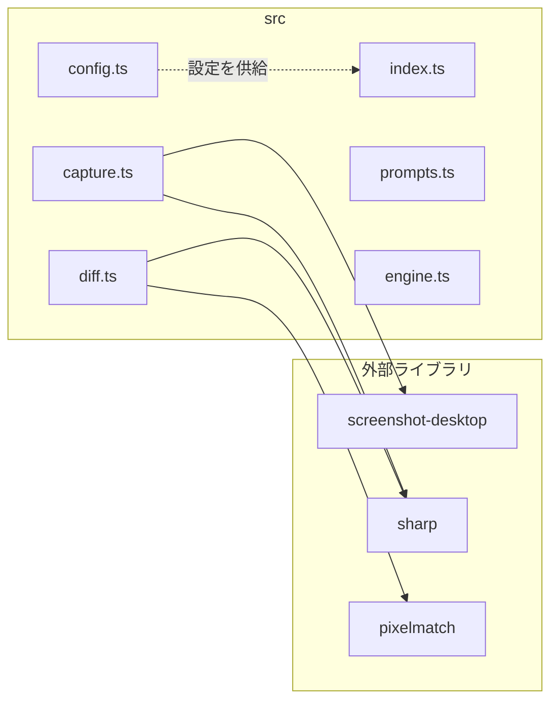
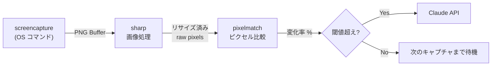

# アーキテクチャ概要

更新日: 2026-02-27

## コーチングループの処理フロー

Adobe CC で作業中のユーザーの画面を定期的にキャプチャし、変化を検知してAIがアドバイスを返す一連の流れ。

```mermaid
flowchart TD
    User["ユーザーが Adobe CC で作業"]

    User --> Capture

    subgraph loop["コーチングループ（5秒間隔）"]
        Capture["capture.ts<br/>画面をスクリーンショット"]
        Diff["diff.ts<br/>前回の画像とピクセル比較"]
        Prompts["prompts.ts<br/>スクリーンショット + コンテキストから<br/>質問を組み立てる"]
        Engine["engine.ts<br/>Claude にアドバイスを聞く"]

        Capture --> Diff
        Diff -- "変化率が閾値以下" --> Capture
        Diff -- "変化率が閾値超え" --> Prompts
        Prompts --> Engine
    end

    Engine --> Advice["アドバイスを表示"]
```

## モジュール構成

```mermaid
flowchart LR
    subgraph src
        index.ts
        config.ts
        capture.ts
        diff.ts
        prompts.ts
        engine.ts
    end

    subgraph external["外部ライブラリ"]
        SD["screenshot-desktop"]
        Sharp["sharp"]
        PM["pixelmatch"]
    end

    capture.ts --> SD
    capture.ts --> Sharp
    diff.ts --> PM
    diff.ts --> Sharp
    config.ts -.->|"設定を供給"| index.ts
```

## データフロー

```mermaid
flowchart LR
    A["screencapture<br/>(OS コマンド)"] -- "PNG Buffer" --> B["sharp<br/>画像処理"]
    B -- "リサイズ済み<br/>raw pixels" --> C["pixelmatch<br/>ピクセル比較"]
    C -- "変化率 %" --> D{閾値超え?}
    D -- Yes --> E["Claude API"]
    D -- No --> F["次のキャプチャまで待機"]
```
