# アーキテクチャ概要

更新日: 2026-04-11

## 全体フロー（Web UI 主導 / DCC-37 以降）

起動からコーチングまでの全体の流れ。Web UI（React SPA）が主動線で、CLI（`packages/cli`）は後方互換用に残されている。コーチングループはデフォルトで **manual モード** で起動し、ユーザーが「次へ進む」ボタンを押した時のみ 1 ラウンド実行される。「自動ループ ON/OFF」トグルで auto モードに切り替えると従来通り interval 毎に自動実行する。

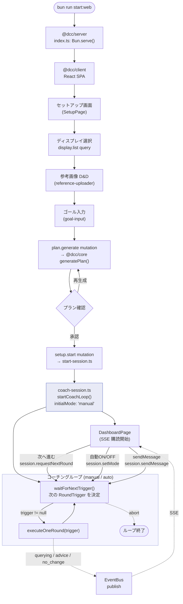

> CLI 版（`bun run start`）も存在する。`packages/cli/src/index.ts` から `startCoachLoop({ initialMode: "auto" })` を直接呼ぶシンプルな構成で、setMode / requestNextRound の UI を持たないため manual モードはサポートしない。後方互換のために残されている。

## モジュール構成と関数マップ

各ソースファイルが持つ export 関数と、その依存関係。

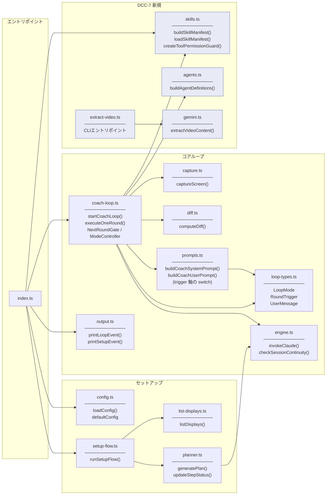

### テストカバレッジ

#### @dcc/core（vitest）

| モジュール | テスト | ファイル / 理由 |
|-----------|--------|----------------|
| config.ts | あり | test/config.test.ts |
| list-displays.ts | あり | test/list-displays.test.ts |
| planner.ts | あり | test/planner.test.ts |
| coach-loop.ts | あり | test/coach-loop.test.ts（統合テスト、モック使用） |
| capture.ts | あり | test/capture.test.ts |
| diff.ts | あり | test/diff.test.ts |
| prompts.ts | あり | test/prompts.test.ts |
| engine.ts | あり | test/engine.test.ts |
| skills.ts | あり | test/skills.test.ts |
| agents.ts | あり | test/agents.test.ts |
| gemini.ts | あり | test/gemini.test.ts（APIキー未設定・URL不正の異常系のみ） |
| output.ts | なし | 純粋な表示ロジック（console.log のみの副作用） |
| extract-video.ts | なし | CLIエントリポイント（gemini.ts を呼ぶだけ） |
| index.ts | なし | エントリポイント（各モジュールの組み合わせのみ） |

手動検証スクリプト群: `src/verify/`（11ファイル）。SDK連携やストリーミング動作を実環境で検証。

#### @dcc/server（bun:test）

| モジュール | テスト | ファイル / 理由 |
|-----------|--------|----------------|
| db/sessions.ts | あり | test/db.test.ts（CRUD + パージ） |
| db/plans.ts | あり | test/db.test.ts（CRUD + ステップ更新） |
| db/advices.ts | あり | test/db.test.ts（CRUD + 復元コピー） |

#### @dcc/cli（vitest）

| モジュール | テスト | ファイル / 理由 |
|-----------|--------|----------------|
| setup-flow.ts | あり | test/setup-flow.test.ts（キャンセル動作） |

#### E2E テスト（Playwright）

| テスト | ファイル / 内容 |
|--------|----------------|
| セットアップフロー | e2e/（Chromium、サーバー + クライアント自動起動） |

## データフロー: セットアップからコーチングまで

Web UI 経路（`bun run start:web`）の場合は `plan.generate` → `setup.start` の 2 段 mutation で組み立てる。CLI 経路（`bun run start`）は `runSetupFlow()` で同じく `Plan` を組み立てる。どちらも最終的に `startCoachLoop()` に同じ `CoachConfig` / `Plan` / `SkillManifest` を渡す。

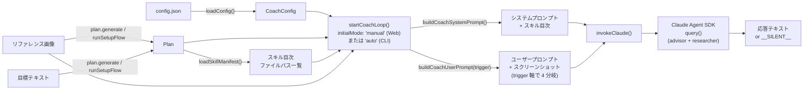

## キャプチャ・差分検知パイプライン

デスクトップ画面の取得から差分率算出までの流れ。

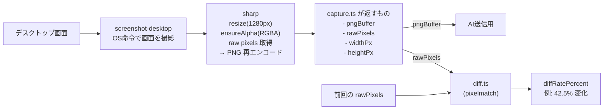

### captureScreen の内部フロー

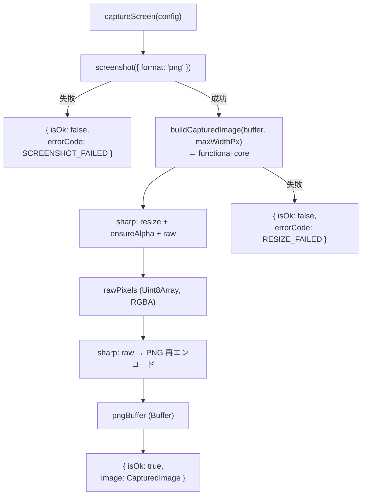

### functional core / mutable shell の分離

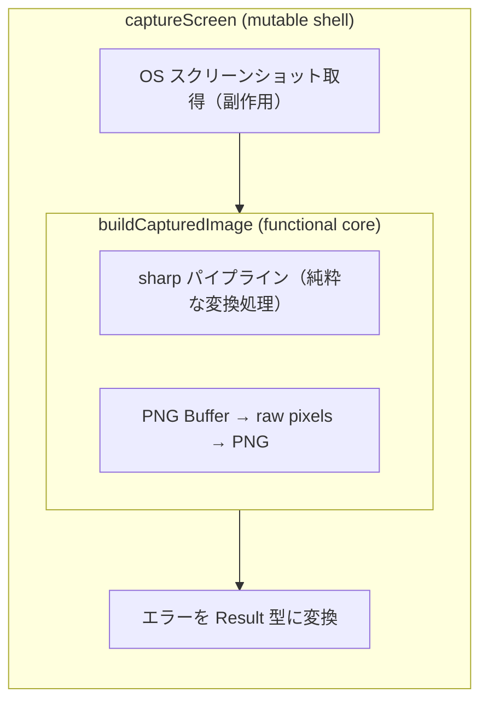

### computeDiff のガード節

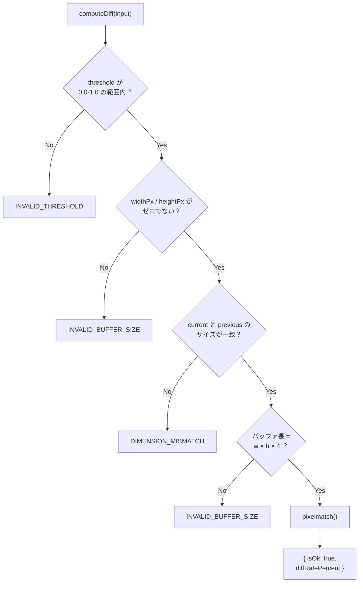

### 2つの threshold の違い

| 名前 | 範囲 | 意味 | 使用箇所 |
|------|------|------|----------|
| `pixelmatchThreshold` | 0.0 - 1.0 | ピクセル単位の色差感度。「2つのピクセルの色がどれくらい違ったら '違う' とみなすか」 | diff.ts が pixelmatch に渡す |
| `diffThresholdPercent` | 例: 5% | 画面全体の変化率の閾値。「画面の何%が変わったら AI に送信するか」 | coach-loop が判定 |

### 型の関係（疎結合）

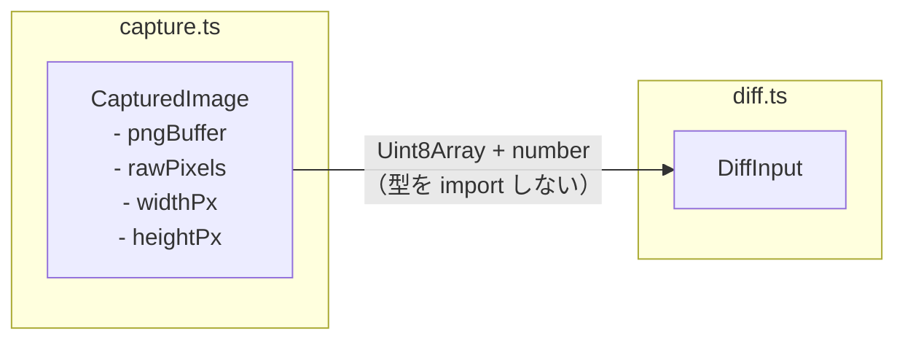

> diff.ts は capture.ts の型を import しない。Uint8Array + プリミティブだけで繋がる疎結合設計。

## コーチングループ詳細

### メインループフロー（manual / auto 二モード制）

`startCoachLoop()` は内部で `waitForNextTrigger()` を呼んで次の `RoundTrigger` を決定し、得られた trigger を `executeOneRound()` に渡す。trigger が無いケース（mode 切替や spurious wake）はループ先頭に戻って再判定する。

```mermaid
flowchart TD
    Start([ループ開始<br>initialMode: manual or auto]) --> Init[LoopState 初期化<br>previousImage: null]
    Init --> WaitTrig["waitForNextTrigger()"]

    WaitTrig --> Decide{"次の trigger を決定"}
    Decide -->|"queuedMessage あり"| TUser["trigger: user_message"]
    Decide -->|"nextRoundGate.pending"| TManual["trigger: manual_next"]
    Decide -->|"初回 + auto モード"| TInit["trigger: initial"]
    Decide -->|"その他"| Wait["waitForNextRound()<br>(timer は auto モードのみ)"]

    Wait -->|"timer 満了"| TTimer["trigger: timer"]
    Wait -->|"abort"| End([ループ終了])
    Wait -->|"message 到着"| TUser
    Wait -->|"next_round 要求"| TManual
    Wait -->|"mode_changed"| WaitTrig

    TUser --> Execute["executeOneRound(trigger)"]
    TManual --> Execute
    TInit --> Execute
    TTimer --> Execute

    Execute --> Capture[captureScreen]
    Capture -->|失敗| Emit1["emit: capture_failed"]
    Emit1 --> WaitTrig
    Capture -->|成功| Bypass{"shouldBypassDiffCheck<br>(trigger)"}

    Bypass -->|"true (initial /<br>user_message / manual_next)"| Save[saveScreenshot]
    Bypass -->|"false (timer)"| Diff{"前回画像と diff"}
    Diff -->|"閾値以下"| Emit2["emit: no_change"]
    Emit2 --> WaitTrig
    Diff -->|"閾値超え"| Save

    Save --> Query[invokeClaude<br>buildCoachUserPrompt(trigger)]
    Query --> Parse{応答}
    Parse -->|テキスト| EmitAdvice["emit: advice"]
    Parse -->|__SILENT__| EmitSilent["emit: silent"]
    Parse -->|エラー| EmitError["emit: engine_error"]
    EmitAdvice --> WaitTrig
    EmitSilent --> WaitTrig
    EmitError --> WaitTrig
```

### 「次へ進む」専用チャンネル: NextRoundGate

ユーザーが「次へ進む」ボタンを押した場合、`messageBox` ではなく専用の `NextRoundGate`（`pending: boolean` 単一フラグの状態機械）を起こす。これにより:
- **連打 dedupe**: 既に pending=true なら no-op。連打しても次の 1 ラウンドにまとめられる
- **advice 履歴を汚さない**: messageBox を経由しないので `user_message_received` イベントは発火せず、偽のユーザー発話が advice 履歴に混入しない

prompt には `manual_next` trigger を渡し、「ユーザーが次の指示を求めている」というメタ情報のみを伝える。

```mermaid
sequenceDiagram
    participant UI as MessageInput
    participant API as session.requestNextRound
    participant CS as coach-session
    participant Gate as NextRoundGate
    participant Loop as メインループ

    UI->>API: requestNextRound({ sessionId })
    API->>CS: requestNextRound(sessionId)
    CS->>Gate: request()
    Note over Gate: pending = true<br>(既に true なら no-op)
    Gate-->>Loop: waitForNextRound 中断

    Loop->>Gate: consumePending() → true
    Note over Gate: pending = false
    Loop->>Loop: makeNextRoundTrigger() → manual_next
    Loop->>Loop: executeOneRound(manual_next)

    Note over UI,Loop: 連打しても pending は 1 枚<br>= 次の 1 ラウンド分しか溜まらない
```

### sendMessage（ユーザー発話）の経路

これとは別に、ユーザーが Textarea からテキストを送信する `sendMessage` は従来通り `messageBox` 経由で `user_message` trigger としてループを起こす。`user_message_received` イベントが発火するが、このイベントは SSE で配信されるだけで **DB 永続化や client 側での特別表示はされない**（永続化されるのは `advice` イベントのみ）。

```mermaid
sequenceDiagram
    participant User as ユーザー
    participant MI as MessageInput
    participant API as session.sendMessage
    participant MB as MessageBox
    participant Loop as コーチループ

    User->>MI: テキスト入力 + 送信
    MI->>API: sendMessage({ message, images })
    API->>MB: submit({ text, imagePaths })
    MB-->>Loop: waitForNextRound 中断
    Loop->>MB: consume() → UserMessage
    Loop->>Loop: trigger=user_message<br>diff スキップで AI 呼び出し
    Loop-->>MI: SSE: user_message_received → querying → advice
```

### AI の判断パターン

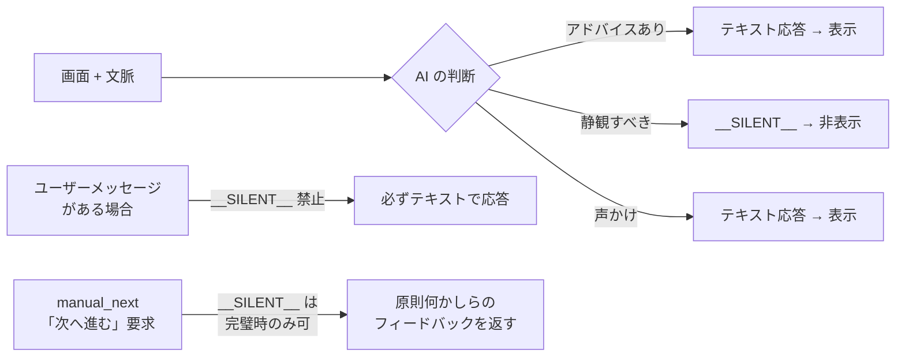

### 4-trigger プロンプト分岐

`buildCoachUserPrompt()` は `RoundTrigger` を主軸に switch 分岐する。各 trigger の中で `isFirstRound`（初回キャプチャかどうか）を内部で扱う。**`isFirstRound` と `trigger` は直交した次元** として扱い、起動契機ごとに AI に伝えるべき文脈を切り替える。

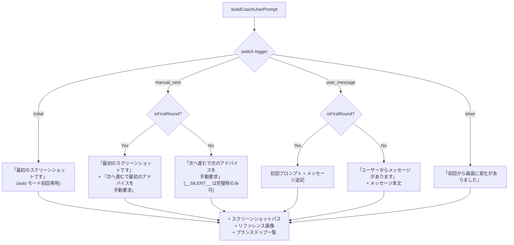

`manual_next` は **偽の発話を入れない**のがポイント。「やりました、次の指示をもらえますか？」のような架空のユーザー発話を作るのではなく、「ユーザーが次へ進むボタンで次のアドバイスを手動で要求した」というメタ情報を伝える。advice 履歴も汚染されない。

### auto/manual 切替の race 対策

auto モードで `waitForNextRound` が `setTimeout` を待っている最中に manual に切り替えると、放置すれば timer 満了で 1 ラウンド余計に走ってしまう。これを防ぐため、`ModeController.onChange` を `waitForNextRound` の wake 要因に組み込んでいる。

```mermaid
sequenceDiagram
    participant UI as ダッシュボード
    participant CS as coach-session
    participant MC as ModeController
    participant Loop as waitForNextRound

    Note over Loop: auto モード中、timer (60s) を仕掛けて待機

    UI->>CS: setMode({ mode: "manual" })
    CS->>MC: set("manual")
    MC->>MC: current = "manual"
    MC-->>Loop: onChange() callback

    Note over Loop: wakeUp("mode_changed")
    Loop->>Loop: cleanup() → clearTimeout(timer)
    Loop-->>CS: 戻り値 reason="mode_changed"

    Note over CS: メインループ先頭に戻り<br>新 mode で再判定<br>= manual なので timer 仕掛けず wait
```

`setMode("auto")` の場合は逆に「即時 1 ラウンド実行」が UX 上自然なので、`setMode` の中で `nextRoundGate.request()` を内部から呼ぶ。これにより auto に切替えた瞬間にすぐ 1 ラウンド回る。

### グレースフルシャットダウン

#### Web UI 版（@dcc/server）

abort 経路:
- ブラウザを閉じる / セッション切断 → SSE が切れるが、サーバー側の loop は **動き続ける**
- 同セッションを再度 `coachSession.start()` した場合、前のループを `abortController.abort()` で停止してから新規起動
- 明示的な `coachSession.stop()` で全終了

`loopFinished` Promise の `.then` / `.catch` 両方で `finalizeSession()` → `publish('stopped')` を実行する契約。`finalizeSession()` は `endSession()` を `try/catch` で保護するヘルパーで、DB エラーが起きても `stopped` 配信が止まらない。`.catch` 経路では `engine_error` を publish した後に `stopped` も publish する（成功/失敗問わず終端を保証）。

#### CLI 版（@dcc/cli）

```mermaid
sequenceDiagram
    participant User as ユーザー
    participant Process as プロセス
    participant AC as AbortController
    participant RL as readline
    participant Loop as コーチループ
    participant Tmp as 一時ファイル

    User->>Process: Ctrl+C（SIGINT）
    Process->>AC: abort()
    Process->>RL: close()
    AC-->>Loop: signal.aborted = true
    Loop->>Loop: while ループ脱出
    Loop->>Tmp: 一時ファイル削除
    Loop-->>Process: loopFinished Promise 解決
    Process->>Process: プロセス終了
```

## エージェント構成（DCC-7）

### 全体像：親エージェントとサブエージェントの関係

Claude Agent SDK では、AI は「ツール」を通じてテキスト生成以外のアクション（ファイル読み書き・Web検索・コマンド実行等）を行う。
本プロジェクトでは、親エージェントが直接ツールを使わず、目的別のサブエージェントに委譲する構成を取っている。

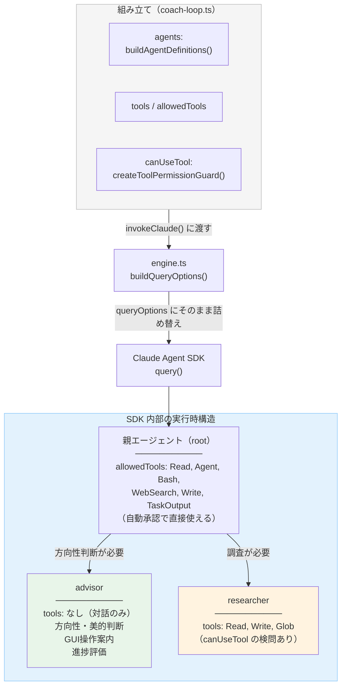

### 3つの設定プロパティの役割

`invokeClaude()` に渡す3つのプロパティが、エージェントの権限構造を決定する。

| プロパティ | 担当関数 | 定義場所 | 役割 |
|-----------|---------|---------|------|
| `agents` | `buildAgentDefinitions()` | agents.ts | **誰を呼べるか**：サブエージェントの名簿。名前・説明・プロンプト・使えるツール一覧を定義 |
| `tools` | — (リテラル) | coach-loop.ts | **セッション全体のツール一覧**：親・サブエージェント含め、このセッションで利用可能な全ツール。ここに含まれないツールはサブエージェントにも渡されない |
| `allowedTools` | — (リテラル) | coach-loop.ts | **親が直接使えるツール**：`tools` のサブセット。親エージェント（advisor）自身が自動承認で使えるツールを制限する |
| `canUseTool` | `createToolPermissionGuard()` | skills.ts | **使い方が安全か**：ツール実行の直前に毎回呼ばれるコールバック。引数の内容を見て allow / deny を返す |

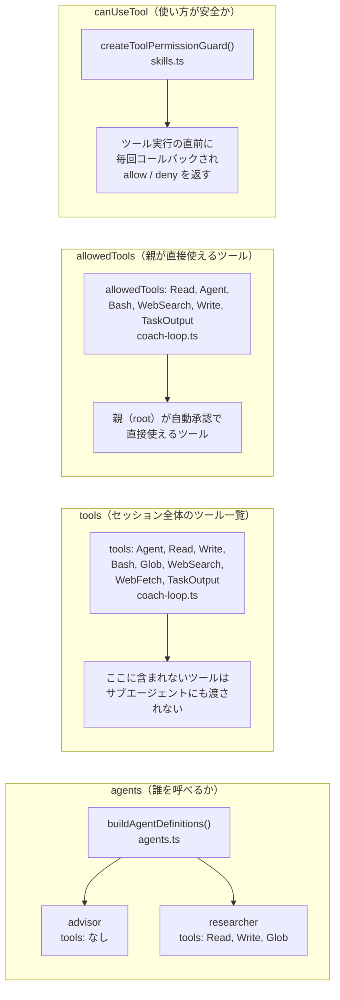

#### tools と allowedTools の違い（重要）

更新日: 2026-03-30

`tools` と `allowedTools` は似ているが役割が異なる。混同するとサブエージェントがツールを使えなくなる。

| プロパティ | スコープ | 役割 |
|-----------|---------|------|
| `tools` | セッション全体（親 + サブエージェント） | このセッションで「存在を認識する」ツールの一覧。ここにないツールは誰も使えない |
| `allowedTools` | 親エージェントのみ | `tools` のうち、親が自動承認で直接使えるものを制限する |

```
tools: ["Read", "Agent", "WebSearch", "WebFetch", "Write", "Bash", "Glob", "TaskOutput"]
                 ↑ セッション全体のメニュー（全員が見える）

allowedTools: ["Read", "Agent", "Bash", "WebSearch", "Write", "TaskOutput"]
                 ↑ 親（root）が自動承認で直接使えるもの
```

**実例**: researcher が Write でスキルファイルに書き込むには、parent の `tools` に `"Write"` が含まれている必要がある。`allowedTools` に含まれていても、それは親が自動承認で使えるだけであり、サブエージェントの agent 定義で `tools: ["Write"]` と指定されていなければ researcher は使えない。

### 注意: createToolPermissionGuard() が実質 researcher にのみ影響する理由

`createToolPermissionGuard()` は SDK レベルでは**全エージェント共通**のコールバックとして登録される。
しかし、このコールバックが発火するのは「ツールを実行しようとした瞬間」のみであるため、
ツールを持たないエージェントには判定が走る機会自体がない。

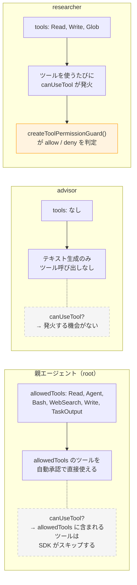

| エージェント | tools | canUseTool が発火するか | 理由 |
|-------------|-------|----------------------|------|
| 親（root） | `allowedTools: ["Read", "Agent", "Bash", "WebSearch", "Write", "TaskOutput"]` | しない | allowedTools に含まれるツールは SDK が canUseTool をスキップする |
| advisor | なし | しない | ツールを一切持たないので、判定を受ける機会がない |
| researcher | 3つ（Read, Write, Glob） | **する** | Read / Write / Glob を使うたびに毎回判定される |

結果として、`createToolPermissionGuard()` 内の判定ロジック（skills/ 配下のみ書き込み可、Bash は extract-video.ts のみ等）は**事実上 researcher のためのルール**となっている。
関数名を `createToolPermissionGuard` としているのは、これが SDK の `canUseTool` コールバックとして全体に登録される仕組みであることを正確に表すためである。

### ツール実行時の二重チェック

サブエージェントがツールを使おうとしたとき、2段階のチェックが走る。

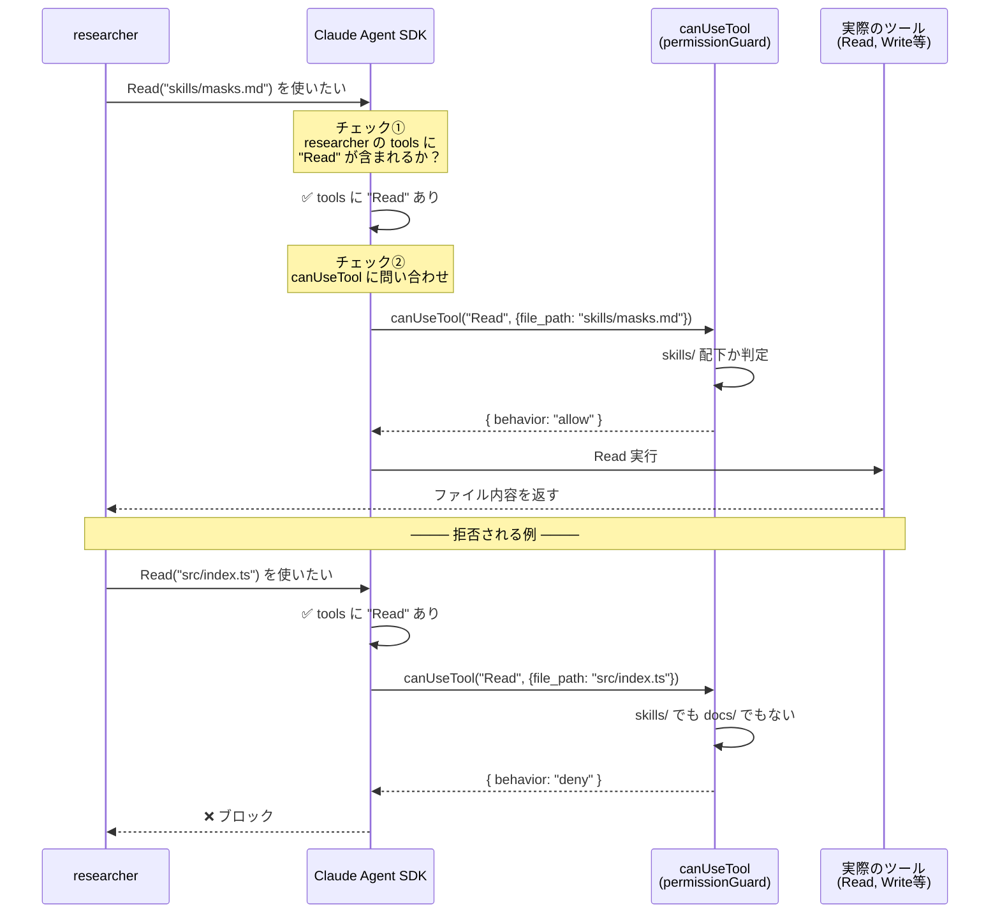

### canUseTool の判定ルール一覧

`createToolPermissionGuard()` (skills.ts) が返すコールバック関数の判定ルール。

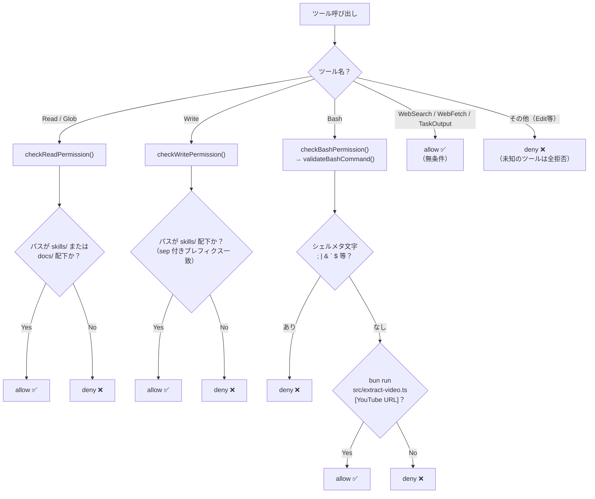

### スキルファイルの流れ

スキルファイルはシステムプロンプトに**目次（ファイルパス一覧）だけ**注入し、<br>中身は researcher が必要に応じて Read で読む。<br>調査結果は Write でスキルファイルに蓄積され、次回以降はローカルでヒットする。

```mermaid
flowchart LR
    subgraph skills ["skills/"]
        Tech["techniques/<br>gradients.md<br>masks.md<br>blend-modes.md<br>..."]
        Tools["tools/photoshop/<br>menu-structure.md<br>shortcuts.md<br>filters.md<br>..."]
    end

    Plan["Plan<br>steps[].application"]
    Plan -->|"loadSkillManifest()<br>→ buildSkillManifest()"| Manifest["目次文字列<br>- skills/techniques/gradients.md<br>- skills/tools/photoshop/filters.md<br>- ..."]

    Manifest -->|"buildCoachSystemPrompt() で<br>skill-reference-data タグに格納"| SysPrompt["システムプロンプト"]

    SysPrompt --> Parent2["親エージェント<br>（目次を見て researcher に指示）"]
    Parent2 --> Researcher3["researcher"]

    Researcher3 -->|"Read（必要なものだけ）"| skills
    Researcher3 -->|"Write（蓄積）"| skills

    WebResult["Web検索結果<br>YouTube抽出結果"] --> Researcher3

    style Manifest fill:#e8eaf6,stroke:#5c6bc0
```

## DCC-8: モノレポ構成 + プログレスダッシュボード + セッション管理

更新日: 2026-03-19

DCC-8 では CLIセットアップをブラウザGUIに置き換え、プログレスダッシュボードとセッション永続化を追加する。
既存コードをモノレポに再構成し、4つのパッケージに分離する。

### パッケージ構成

```mermaid
graph TD
    subgraph packages ["packages/"]
        Core["@dcc/core<br>───────────<br>共有ドメインロジック<br>coach-loop, planner,<br>engine, config 等"]
        Server["@dcc/server<br>───────────<br>Hono + tRPC + DB<br>API層, EventBus,<br>セッション管理"]
        Client["@dcc/client<br>───────────<br>React SPA<br>Vite, TanStack Query"]
        CLI["@dcc/cli<br>───────────<br>CLI版エントリ<br>inquirer"]
    end

    CLI -->|"workspace:*"| Core
    Server -->|"workspace:*"| Core
    Client -.->|"型のみ参照<br>AppRouter"| Server

    style Core fill:#e8f5e9
    style Server fill:#e3f2fd
    style Client fill:#fff3e0
    style CLI fill:#f5f5f5
```

### 技術スタック（DCC-8 追加分）

| 領域 | 技術 | 役割 |
|------|------|------|
| モノレポ | Bun workspaces | パッケージ分離 |
| サーバー | Hono | 軽量Webフレームワーク。Bun.serve() で起動 |
| API | tRPC v11 | 型安全なRPC。Hono fetchアダプタ経由 |
| リアルタイム | tRPC subscription (SSE) | サーバー→ブラウザの一方向ストリーム |
| フロントエンド | React 19 + Vite | SPA。開発時はVite proxy経由でHonoと通信 |
| 状態管理 | TanStack Query | tRPC React統合でサーバー状態を管理 |
| DB | bun:sqlite (WALモード) | セッション・プラン・アドバイス履歴の永続化 |

### 全体フロー（GUI版 / DCC-8）

```mermaid
flowchart TD
    Start([bun run start:web]) --> LoadConfig["@dcc/core<br>loadConfig()"]
    LoadConfig --> InitDB["@dcc/server<br>createDatabase()"]
    InitDB --> StartHono["Hono + tRPC<br>localhost:3456"]

    subgraph browser ["ブラウザ（React SPA）"]
        SetupUI["セットアップUI<br>ディスプレイ選択<br>リファレンス画像D&D<br>目標入力"]
        PlanReview["プラン確認<br>承認 / 再生成"]
        Dashboard["ダッシュボード<br>プラン進捗<br>アドバイス履歴"]
        SessionList["セッション一覧<br>過去セッション閲覧<br>復元"]
    end

    StartHono --> SetupUI
    SetupUI -->|"tRPC mutation<br>plan.generate"| GenPlan["@dcc/core<br>generatePlan()"]
    GenPlan --> PlanReview
    PlanReview -->|"tRPC mutation<br>setup.start"| StartLoop

    StartLoop["@dcc/server<br>coach-session.ts<br>startCoachLoop()"]:::dcc8

    subgraph loop ["コーチングループ（既存・変更なし）"]
        Capture["captureScreen()"]
        Diff["computeDiff()"]
        Engine["invokeClaude()"]
    end

    StartLoop --> Capture

    subgraph eventflow ["イベント配信"]
        EventBus["EventBus<br>(TaggedLoopEvent)"]:::dcc8
        SSE["tRPC subscription<br>(SSE)"]:::dcc8
        DB["bun:sqlite<br>INSERT advice"]:::dcc8
    end

    Engine -->|"onEvent()"| EventBus
    EventBus -->|"sessionIdフィルタ"| SSE
    SSE -->|"リアルタイム"| Dashboard
    EventBus --> DB

    SessionList -->|"tRPC query<br>session.list"| DB
    Dashboard -->|"tRPC query<br>session.get"| DB

    classDef dcc8 fill:#e8eaf6,stroke:#5c6bc0
```

### パッケージ間の依存と型の流れ

```mermaid
flowchart LR
    subgraph core ["@dcc/core"]
        Types["Plan, LoopEvent,<br>CoachAdvice,<br>CoachConfig 等"]
    end

    subgraph server ["@dcc/server"]
        Router["AppRouter<br>(tRPCルーター)"]
        TaggedEvent["TaggedLoopEvent<br>= LoopEvent &<br>{ sessionId }"]
    end

    subgraph client ["@dcc/client"]
        TrpcClient["tRPCクライアント<br>createTRPCReact&lt;AppRouter&gt;()"]
    end

    core -->|"import { Plan, ... }"| server
    server -->|"export type AppRouter"| client
    core -.->|"型はtRPC経由で<br>自動伝搬"| client

    style core fill:#e8f5e9
    style server fill:#e3f2fd
    style client fill:#fff3e0
```

### SSE データフロー

```mermaid
sequenceDiagram
    participant Loop as coach-loop<br>(@dcc/core)
    participant Session as coach-session<br>(@dcc/server)
    participant Bus as EventBus
    participant Sub as tRPC subscription
    participant Hook as useLoopEvents<br>(@dcc/client)
    participant Cache as session.get<br>クエリキャッシュ
    participant UI as React コンポーネント

    Loop->>Session: onEvent({ kind: "advice", ... })
    Session->>Bus: publish({ ...event, sessionId })
    Session->>Session: INSERT INTO advices

    Bus->>Sub: listener 呼び出し（sessionId フィルタ）
    Sub-->>Hook: SSE data: { kind: "advice", ... }
    Hook->>Cache: setData((prev) => advices に追加)
    Cache-->>UI: useQuery が再レンダリング

    Note over Loop,UI: manual モードなら次の<br>requestNextRound を待つ<br>auto モードなら interval 後に次へ
```

> client は `useState` を使わず、すべての SSE イベントを `trpc.session.get` のクエリキャッシュに書き戻す **single source of truth** 設計（DCC-37 で改修）。フック内 state とキャッシュの二重管理 race を構造的に防ぐ。

#### 主要 LoopEvent と client 側の処理

| event.kind | サーバー発火元 | client 側の処理 |
|---|---|---|
| `advice` | coach-loop | `advices` 配列に追加、ローディング解除 |
| `silent` | coach-loop | ローディング解除のみ（履歴汚さない） |
| `engine_error` | coach-loop / coach-session（クラッシュ時） | エラー文言表示、ローディング解除 |
| `no_change` | coach-loop（diff 閾値未満） | ローディング解除のみ |
| `querying` | coach-loop（AI 呼び出し直前） | 「次へ進む」ローディング表示開始 |
| `mode_changed` | coach-loop（setMode 時） | キャッシュの `mode` を上書き、Switch 同期 |
| `plan_step_updated` | coach-loop / DB 経由 | プランステップの status 更新 |
| `stopped` | coach-session（成功/失敗問わず） | `endedAt` を埋めて UI を終端状態に |
| `user_message_received` | coach-loop（user_message trigger 時） | （現在は client 側で特別処理なし） |

### DBスキーマ

```mermaid
erDiagram
    sessions ||--o{ plans : "has"
    sessions ||--o{ advices : "has"
    plans ||--o{ advices : "references"

    sessions {
        TEXT id PK
        TEXT goal
        TEXT reference_image_path
        TEXT display_id
        TEXT display_name "default=''"
        TEXT started_at
        TEXT ended_at "NULLなら進行中"
    }

    plans {
        TEXT id PK
        TEXT session_id FK
        TEXT goal
        TEXT reference_summary
        TEXT steps "JSON: PlanStep[]"
        TEXT created_at
    }

    advices {
        TEXT id PK
        TEXT session_id FK
        TEXT plan_id FK "nullable"
        INTEGER round_index
        TEXT content
        INTEGER timestamp_ms
        INTEGER is_restored "default=0, 復元されたアドバイスか"
    }
```

#### インデックス

- `idx_plans_session` — plans.session_id
- `idx_advices_session` — advices.session_id

### セットアップフローの変化

| 項目 | CLI版（DCC-6） | GUI版（DCC-8） |
|------|---------------|---------------|
| ディスプレイ選択 | inquirer select | `<select>` ドロップダウン |
| リファレンス画像 | パス手入力 | D&D / ファイル選択 + プレビュー |
| 目標入力 | inquirer input | `<textarea>` |
| プラン確認 | ターミナル表示 + Y/N | カード表示 + 承認/再生成ボタン |
| アドバイス表示 | ターミナル出力 | ダッシュボード（リアルタイム） |
| ユーザーメッセージ送信 | stdin入力 | メッセージ入力バー（⌘+Enter） |
| セッション履歴 | なし | SQLite永続化 + 一覧/復元UI |
| セッション復元 | なし | 過去セッションのアドバイス履歴を引き継いで新セッション作成 |
| セッションパージ | なし | 200件超の古いセッションを自動削除（画像ファイル含む） |

### CLI版との共存

```text
bun run start      → packages/cli/src/index.ts    → @dcc/core（既存動作を維持）
bun run start:web  → packages/server/src/index.ts  → @dcc/core + Hono + tRPC + DB
```

コアロジック（`@dcc/core`）は両方から共有。CLI版は一切変更なし。

## @dcc/server パッケージ内部構成

```mermaid
flowchart LR
    subgraph trpc ["tRPC ルーター (src/trpc/)"]
        Router["appRouter"]
        Session["sessionRouter<br>list / get / sendMessage / restore<br>setMode / requestNextRound /<br>updateStepStatus"]
        Plan["planRouter<br>generate"]
        Setup["setupRouter<br>start"]
        Display["displayRouter<br>list"]
        Events["eventsRouter<br>subscribe (SSE)"]
        Debug["debugRouter<br>ping / ctx / activeSession / dbStatus / log<br>（dev環境のみ）"]
    end

    subgraph lib ["アプリケーション層 (src/lib/)"]
        CoachSession["coach-session.ts<br>createCoachSession()"]
        StartSession["start-session.ts<br>startSession() / schedulePurge()"]
        ImageStore["image-store.ts<br>saveBase64Image()"]
        Logger["logger.ts<br>createTaggedLogger()"]
    end

    subgraph pure ["純粋ロジック (src/pure/)"]
        EventBus["event-bus.ts<br>createEventBus()"]
        PlanCache["pending-plan-cache.ts<br>createPendingPlanCache()<br>TTL: 30分"]
    end

    subgraph db ["データアクセス (src/db/)"]
        Database["database.ts<br>createDatabase()"]
        Sessions["sessions.ts<br>CRUD + purge"]
        Plans["plans.ts<br>CRUD + stepStatus更新"]
        Advices["advices.ts<br>CRUD + copyAdvicesToSession()"]
    end

    Router --> Session & Plan & Setup & Display & Events & Debug
    Setup --> CoachSession & StartSession & PlanCache
    Session --> CoachSession & db
    Plan --> PlanCache & ImageStore
    Events --> EventBus
    CoachSession --> EventBus & db
    StartSession --> db

    style trpc fill:#e3f2fd
    style lib fill:#fff3e0
    style pure fill:#e8f5e9
    style db fill:#f3e5f5
```

### tRPC プロシージャ一覧

| ルーター | プロシージャ | 種類 | 役割 |
|---------|------------|------|------|
| session | list | query | セッション一覧（プランステップ数付き） |
| session | get | query | セッション詳細（プラン + アドバイス履歴 + `mode`） |
| session | sendMessage | mutation | アクティブセッションへユーザーメッセージ送信 |
| session | setMode | mutation | manual / auto モード切替（DCC-37） |
| session | requestNextRound | mutation | 「次へ進む」要求。連打 dedupe は backend 側で処理（DCC-37） |
| session | updateStepStatus | mutation | プランステップの完了/未完了切替 |
| session | restore | mutation | 過去セッションのアドバイス履歴を引き継いで新セッション作成 |
| plan | generate | mutation | リファレンス画像 + 目標からプラン生成 |
| setup | start | mutation | キャッシュ済みプランでセッション開始 |
| display | list | query | 接続ディスプレイ一覧 |
| events | subscribe | subscription | SSE でリアルタイムイベント配信（sessionId フィルタ） |

> 旧仕様の `session.pause` / `session.resume` は **削除済み**（DCC-37）。manual/auto モードの 2 状態制で pause は冗長になったため。

## セッション復元フロー

過去のセッションからアドバイス履歴を引き継いで新セッションを作成する機能。

```mermaid
sequenceDiagram
    participant UI as ブラウザ
    participant API as session.restore
    participant DB as SQLite

    UI->>API: restore({ sourceSessionId })
    API->>DB: findSessionById(sourceId)
    API->>DB: findPlanBySessionId(sourceId)
    API->>DB: insertSession(新セッション)
    API->>DB: insertPlan(プランコピー)
    API->>DB: copyAdvicesToSession(sourceId → targetId)
    Note over DB: isRestored=1 でコピー
    API->>API: schedulePurge(db, newSessionId)
    API-->>UI: { sessionId: 新ID }
    UI->>UI: ダッシュボードに遷移
    Note over UI: 復元アドバイスは「前回」バッジで表示
```

## セッションパージ

セッション数が 200 を超えた場合、古いセッションを自動削除する。`setup.start` と `session.restore` の完了後に `setImmediate` で非同期実行される。

- 現在のセッションは除外
- カスケード削除: advices → plans → sessions
- 関連する画像ファイルも削除（他セッションと共有していないもののみ）

## ユーザーメッセージ送信フロー

ダッシュボードからコーチに質問を送る機能。`sendMessage` は「自由入力テキスト + 添付画像」を送る経路で、`requestNextRound` とは別チャンネル。

```mermaid
sequenceDiagram
    participant UI as MessageInput
    participant API as session.sendMessage
    participant CS as CoachSession
    participant Loop as コーチングループ

    UI->>API: sendMessage({ sessionId, message, images? })
    API->>CS: submitMessage(sessionId, { text, imagePaths })
    CS->>Loop: loop.submitMessage(message)
    Note over Loop: messageBox にバッファ<br>→ waitForNextRound 中断<br>→ trigger=user_message でラウンド実行<br>→ diff スキップで即座に AI 呼び出し
    Loop-->>CS: onEvent({ kind: "user_message_received", ... })
    Loop-->>CS: onEvent({ kind: "querying" })
    Loop-->>CS: onEvent({ kind: "advice", ... })
    CS-->>UI: SSE で配信
```

「次へ進む」（`requestNextRound`）の方は messageBox を経由せず `NextRoundGate` を起こすだけ。advice 履歴を汚さず、prompt には `manual_next` trigger 経由でメタ情報のみ伝わる（前述の「コーチングループ詳細」セクション参照）。

## CI/CD（GitHub Actions）

`.github/workflows/check.yml` で push 時に 3 つのジョブを並列実行。

| ジョブ | コマンド | 内容 |
|--------|---------|------|
| TypeCheck | `bun run typecheck` | 全パッケージの TypeScript 型検査 |
| Lint & Format | `bunx biome ci .` | Biome によるコード品質チェック |
| Unit Tests | `bun run test` | vitest（core/cli）+ bun:test（server） |

## @dcc/client ページ構成

クライアントは React 19 + Vite の SPA で、3 つのフェーズを状態マシンで管理する。

```mermaid
stateDiagram-v2
    [*] --> setup
    setup --> coaching : onCoachingStarted
    setup --> sessions : ヘッダー Sessions
    coaching --> sessions : ヘッダー Sessions
    coaching --> setup : onBackToSetup
    sessions --> setup : ヘッダー Setup
    sessions --> coaching : onRestore
```

| フェーズ | ページ | 主なコンポーネント |
|---------|-------|------------------|
| setup | SetupPage | DisplaySelector, ReferenceUploader, GoalInput, PlanReview |
| coaching | DashboardPage | LatestAdvice, PlanProgress, AdviceTimeline, MessageInput, Switch（モードトグル） |
| sessions | SessionListPage / SessionDetailPage | セッション一覧, 復元ボタン, 過去アドバイス閲覧 |

### SSE サブスクリプション

`useLoopEvents` カスタムフックが `trpc.events.subscribe` を購読し、`trpc.session.get` のクエリキャッシュを直接更新する（state を持たない設計、DCC-37 で改修）。

| イベント種別 | 処理 |
|------------|------|
| `advice` | キャッシュの `advices` に追加 + ローディング解除 |
| `silent` / `engine_error` / `no_change` / `diff_skipped` / `session_lost` / `capture_failed` | ローディング解除のみ |
| `querying` | 「次へ進む」ローディング表示開始 |
| `mode_changed` | キャッシュの `mode` を上書き、Switch 同期 |
| `plan_step_updated` | プランステップの status を更新 |
| `stopped` | キャッシュの `endedAt` を埋めて UI を終端状態に |

詳細は [packages/client/docs/reading-guide.md](../packages/client/docs/reading-guide.md) を参照。

## 関連ドキュメント

- [プロジェクト思想](./memory/README.md) — 「隣に座っている先輩デザイナー」の考え方
- [ロードマップ](./roadmap/loadmap.md) — Phase 1-6 の開発計画
- [@dcc/core リーディングガイド](../packages/core/docs/reading-guide.md) — coach-loop / prompts / agents の内部構造
- [@dcc/server リーディングガイド](../packages/server/docs/reading-guide.md) — coach-session / SSE / DB の内部構造
- [@dcc/client リーディングガイド](../packages/client/docs/reading-guide.md) — React + tRPC + クエリキャッシュ単一ソースの設計
