# アーキテクチャ概要

更新日: 2026-03-12

## 全体フロー（現行 + DCC-7）

起動からコーチングまでの全体の流れ。灰色のノードは DCC-7 で追加される部分。

```mermaid
flowchart TD
    Start([bun run start]) --> LoadConfig["config.ts<br>loadConfig()"]
    LoadConfig --> Setup["setup-flow.ts<br>runSetupFlow()"]

    Setup --> SelectDisplay["ディスプレイ選択<br>listDisplays() → inquirer"]
    SelectDisplay --> InputRef["リファレンス画像入力<br>inquirer"]
    InputRef --> InputGoal["目標記述入力<br>inquirer"]
    InputGoal --> GenPlan["planner.ts<br>generatePlan()"]
    GenPlan --> ConfirmPlan{"プラン承認？"}
    ConfirmPlan -->|修正| GenPlan
    ConfirmPlan -->|承認| LoadManifest

    LoadManifest["skills.ts<br>loadSkillManifest()"]:::dcc7
    LoadManifest --> StartLoop["coach-loop.ts<br>startCoachLoop()"]

    subgraph loop ["コーチングループ（5秒間隔）"]
        Capture["capture.ts<br>captureScreen()"]
        Diff["diff.ts<br>computeDiff()"]
        BuildPrompt["prompts.ts<br>buildCoachSystemPrompt()<br>buildCoachUserPrompt()"]
        Engine["engine.ts<br>invokeClaude()"]
        Parse["parseAdvice()"]

        Capture --> CheckFirst{初回？}
        CheckFirst -->|Yes| BuildPrompt
        CheckFirst -->|No| CheckMsg{ユーザー<br>メッセージ？}
        CheckMsg -->|Yes| BuildPrompt
        CheckMsg -->|No| Diff
        Diff -->|変化あり| BuildPrompt
        Diff -->|変化なし| Sleep
        BuildPrompt --> Engine
        Engine --> Parse
        Parse --> Sleep[5秒スリープ<br>or ユーザー入力]
        Sleep --> Capture
    end

    StartLoop --> Capture

    subgraph subagents ["サブエージェント（DCC-7）"]:::dcc7box
        Coach["coach<br>方向性判断・GUI案内"]:::dcc7
        Researcher["researcher<br>多段探索・知識蓄積"]:::dcc7
    end

    Engine -.->|"isSubagentsEnabled<br>= true"| subagents

    classDef dcc7 fill:#e8eaf6,stroke:#5c6bc0
    classDef dcc7box fill:#f5f5ff,stroke:#9fa8da
```

## モジュール構成と関数マップ

各ソースファイルが持つ export 関数と、その依存関係。

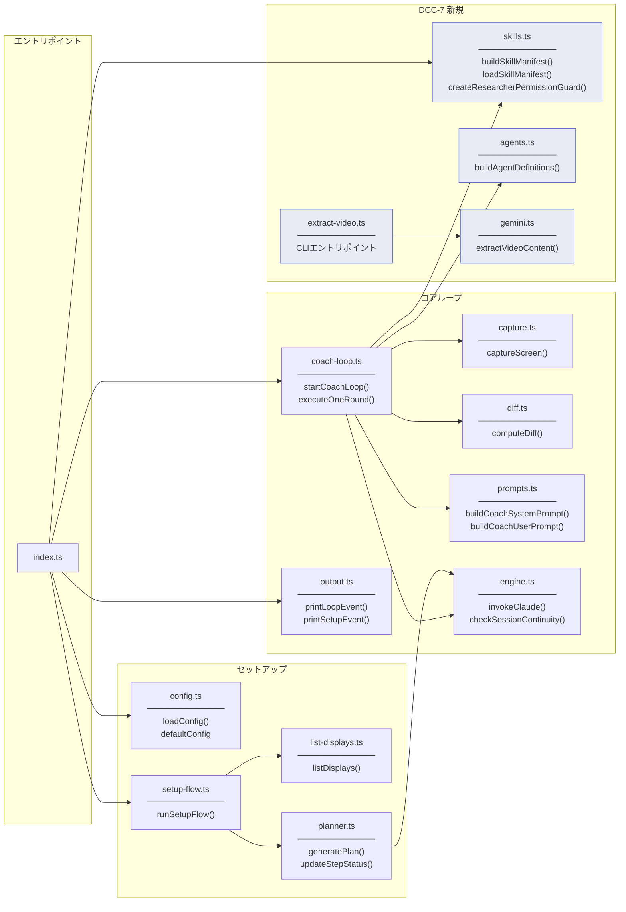

## データフロー: セットアップからコーチングまで

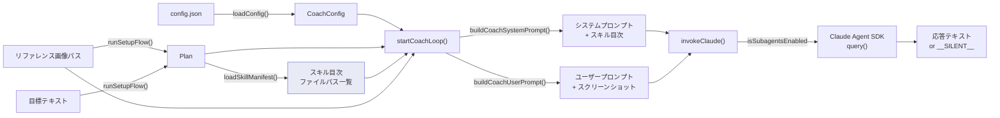

## キャプチャ・差分検知パイプライン

デスクトップ画面の取得から差分率算出までの流れ。

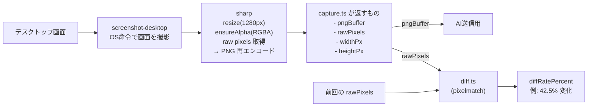

### captureScreen の内部フロー

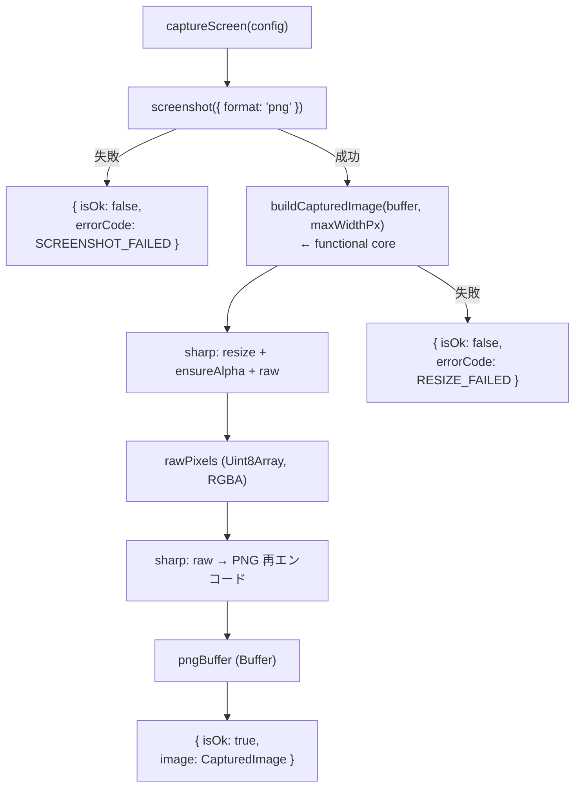

### functional core / mutable shell の分離

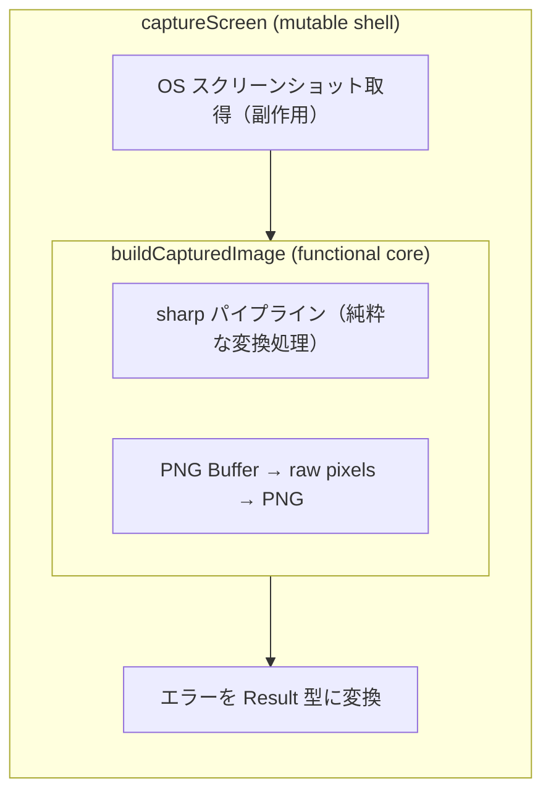

### computeDiff のガード節

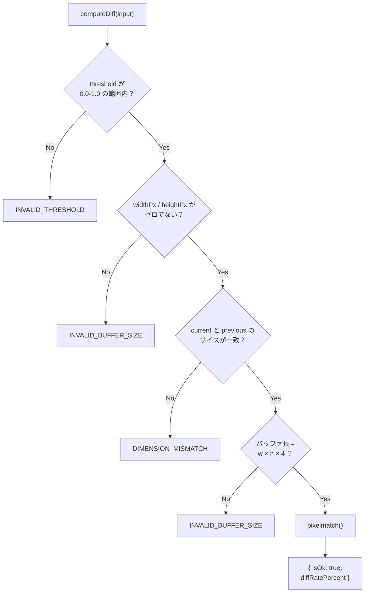

### 2つの threshold の違い

| 名前 | 範囲 | 意味 | 使用箇所 |
|------|------|------|----------|
| `pixelmatchThreshold` | 0.0 - 1.0 | ピクセル単位の色差感度。「2つのピクセルの色がどれくらい違ったら '違う' とみなすか」 | diff.ts が pixelmatch に渡す |
| `diffThresholdPercent` | 例: 5% | 画面全体の変化率の閾値。「画面の何%が変わったら AI に送信するか」 | coach-loop が判定 |

### 型の関係（疎結合）

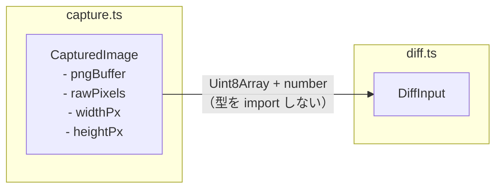

> diff.ts は capture.ts の型を import しない。Uint8Array + プリミティブだけで繋がる疎結合設計。

## コーチングループ詳細

### メインループフロー


### 双方向チャンネル（MessageBox パターン）

ユーザーが stdin から入力したメッセージを MessageBox にバッファし、<br>ループ側の sleep を中断して即座に AI を呼び出す仕組み。

```mermaid
sequenceDiagram
    participant User as ユーザー（stdin）
    participant RL as readline
    participant MB as MessageBox
    participant Loop as コーチループ
    participant AI as Claude API

    Note over Loop: 5秒スリープ中...

    User->>RL: "ここどうすればいい？" + Enter
    RL->>MB: submit("ここどうすればいい？")
    MB-->>Loop: sleep 中断

    Loop->>MB: consume()
    MB-->>Loop: "ここどうすればいい？"

    Loop->>Loop: 画面キャプチャ（diff はスキップ）
    Loop->>AI: メッセージ + スクリーンショット
    AI-->>Loop: 応答テキスト
    Loop->>User: ターミナルに表示

    Note over Loop: 再び5秒スリープ...
```

### AI の判断パターン

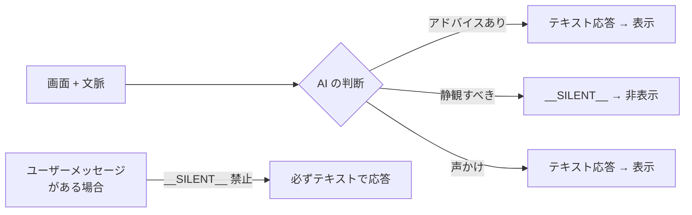

### 3-case プロンプト分岐

AI に送るユーザープロンプトは状況に応じて 3 パターンに分岐する。

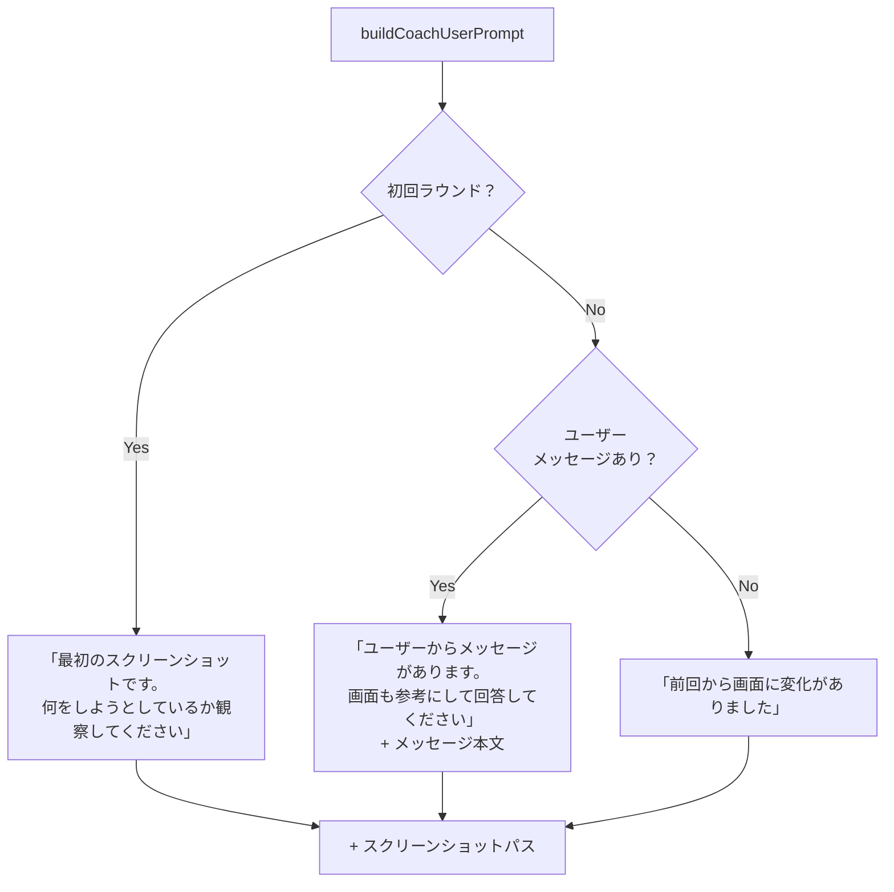

### グレースフルシャットダウン

```mermaid
sequenceDiagram
    participant User as ユーザー
    participant Process as プロセス
    participant AC as AbortController
    participant RL as readline
    participant Loop as コーチループ
    participant Tmp as 一時ファイル

    User->>Process: Ctrl+C（SIGINT）
    Process->>AC: abort()
    Process->>RL: close()
    AC-->>Loop: signal.aborted = true
    Loop->>Loop: while ループ脱出
    Loop->>Tmp: 一時ファイル削除
    Loop-->>Process: done Promise 解決
    Process->>Process: プロセス終了
```

## サブエージェント構成（DCC-7）

親エージェントがコンテキスト（スクリーンショット・会話履歴・プラン）を保持し、<br>必要に応じて子エージェントに委譲する。

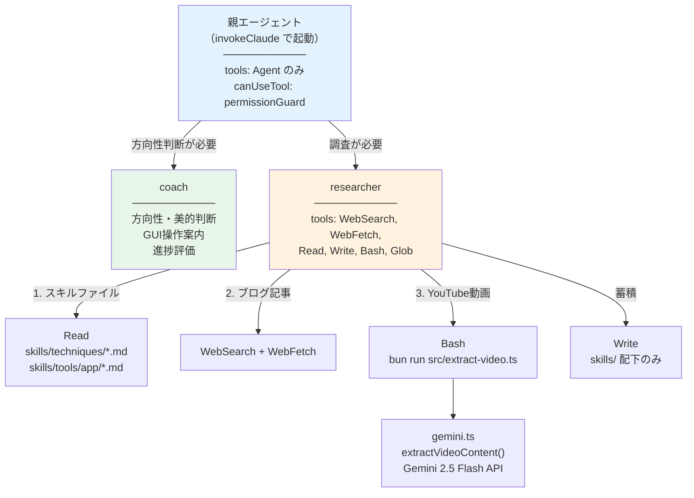

## スキルファイルの流れ（DCC-7）

スキルファイルはシステムプロンプトに目次だけ注入し、<br>中身は researcher が必要に応じて Read で読む。<br>調査結果は Write でスキルファイルに蓄積され、次回以降はローカルでヒットする。

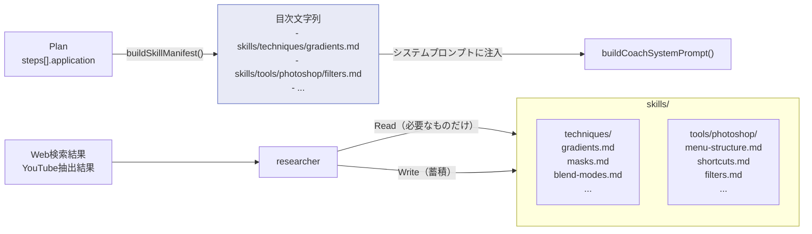

## セキュリティガード（DCC-7）

researcher の Write / Bash をコードレベルで制限する `createResearcherPermissionGuard()`。

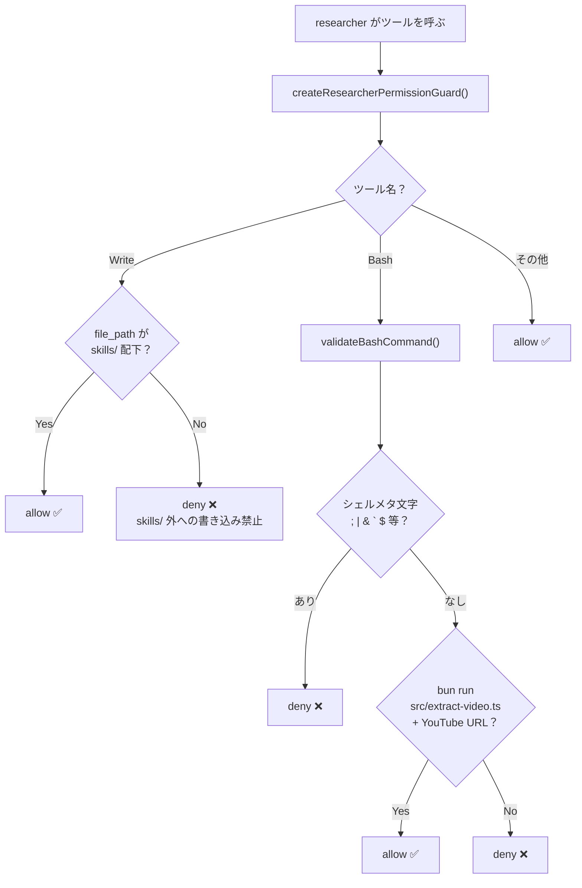

## 関連ドキュメント

- [プロジェクト思想](./memory/README.md) — 「隣に座っている先輩デザイナー」の考え方
- [ロードマップ](./roadmap/loadmap.md) — Phase 1-6 の開発計画
