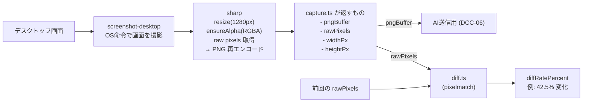
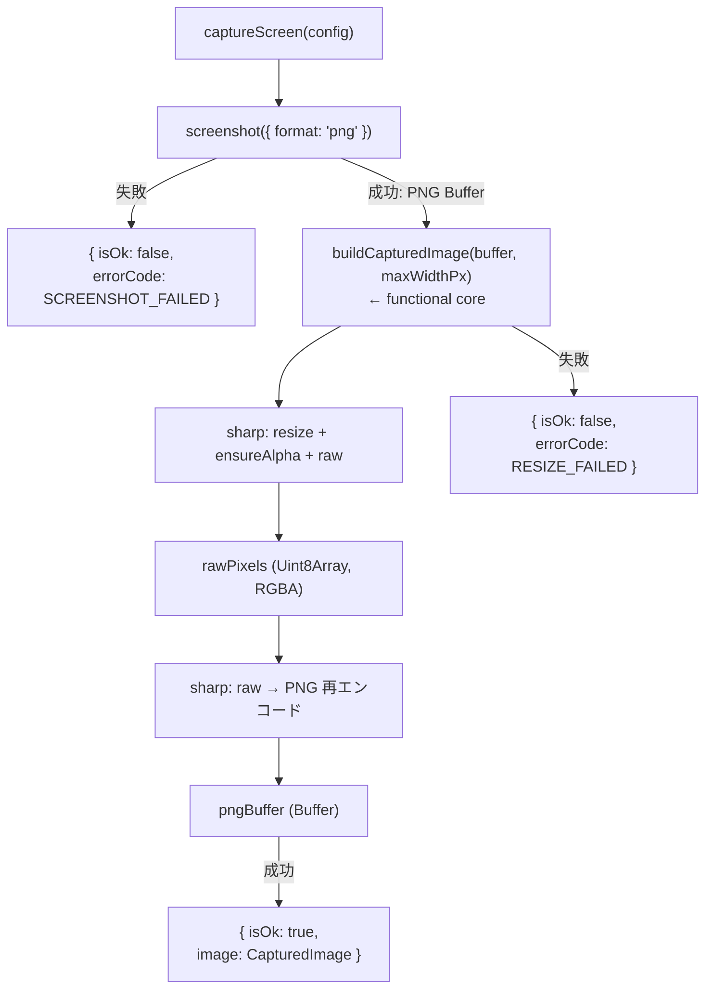
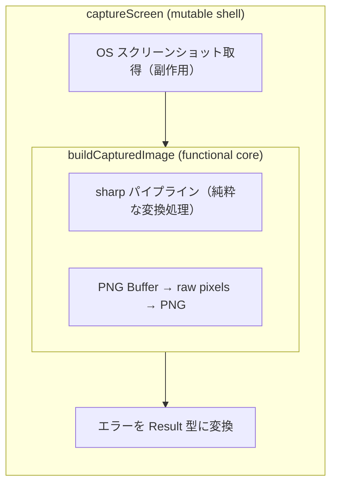
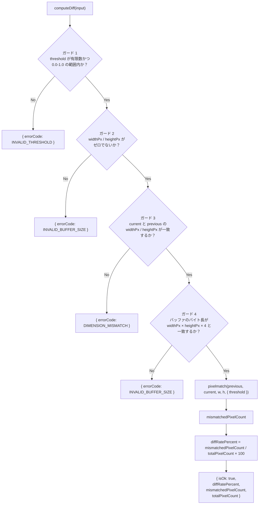
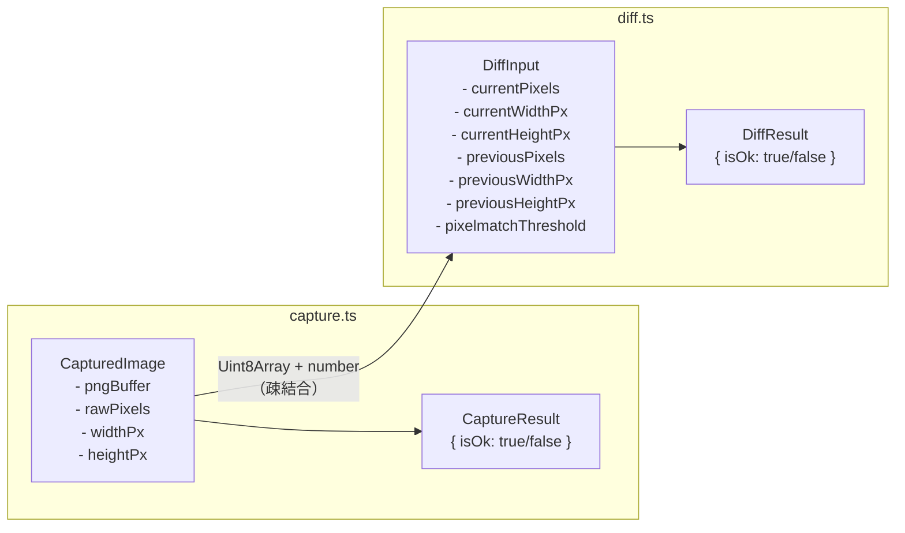

# capture.ts / diff.ts モジュール仕様

最終更新: 2026-03-04

## 全体フロー

## capture.ts

### captureScreen のフロー

### 構造の分離

## diff.ts

### computeDiff のフロー

### 2つの threshold の違い

| 名前 | 範囲 | 意味 | 使用箇所 |
|------|------|------|----------|
| `pixelmatchThreshold` | 0.0 - 1.0 | ピクセル単位の色差感度。「2つのピクセルの色がどれくらい違ったら '違う' とみなすか」 | diff.ts が pixelmatch に渡す |
| `diffThresholdPercent` | 例: 5% | 画面全体の変化率の閾値。「画面の何%が変わったら AI に送信するか」 | coach-loop (DCC-06) が判定する |

## 型の関係

> ※ diff.ts は capture.ts の型を import しない
> ※ Uint8Array + プリミティブだけで繋がる
