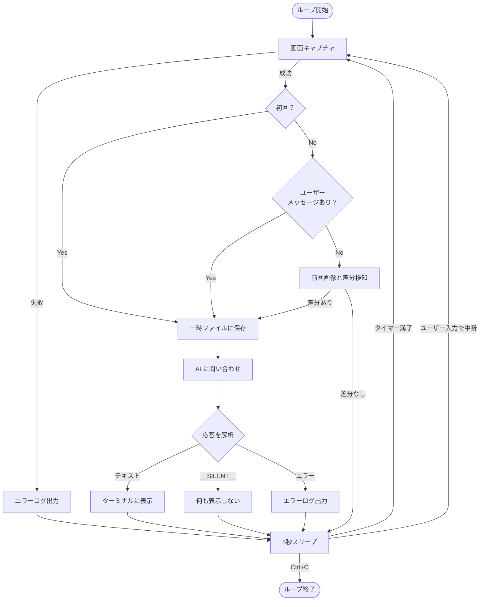
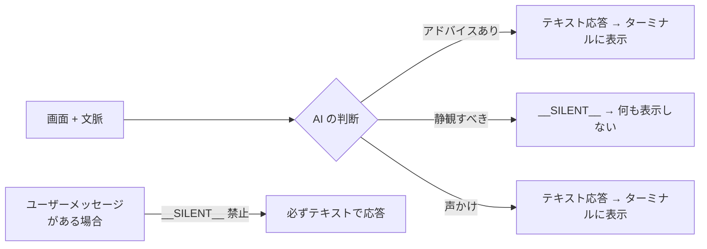
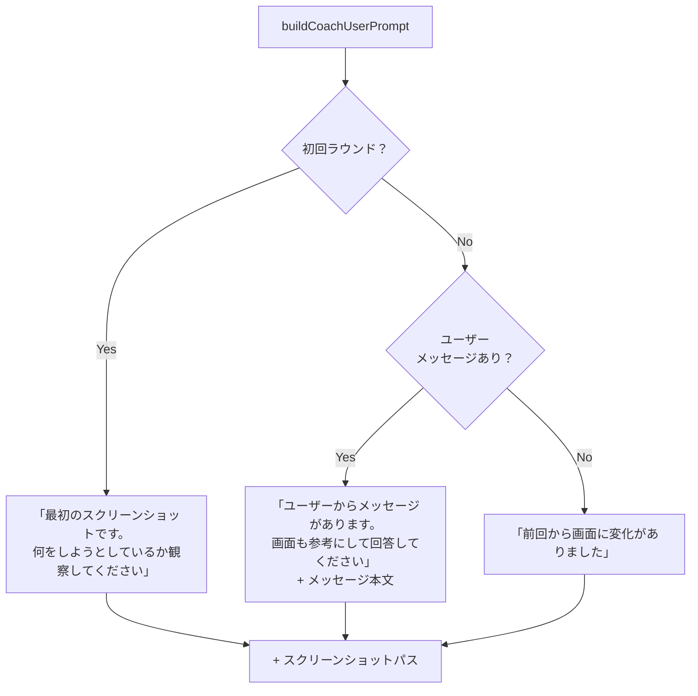
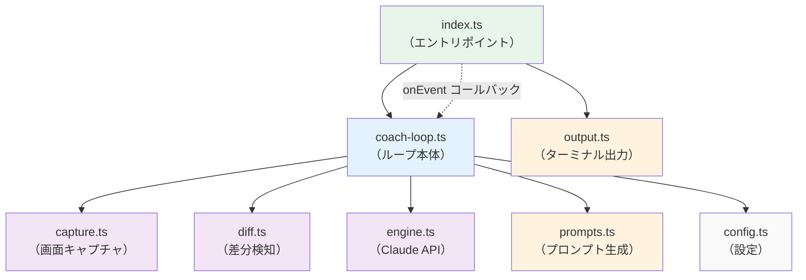

# コーチングループ

> 作成日: 2026-03-06

## 概要

Adobe CC で作業中のユーザーの画面を 5 秒間隔で監視し、AI が制作アドバイスを提供する最小構成のコーチングループ。ループ中もユーザーが stdin からいつでも AI に話しかけられる双方向チャンネルを持つ。

## メインループフロー



## 双方向チャンネル（MessageBox パターン）

ユーザーが stdin から入力したメッセージを MessageBox にバッファし、ループ側の sleep を中断して即座に AI を呼び出す仕組み。

```mermaid
sequenceDiagram
    participant User as ユーザー（stdin）
    participant RL as readline
    participant MB as MessageBox
    participant Loop as コーチループ
    participant AI as Claude API

    Note over Loop: 5秒スリープ中...

    User->>RL: "ここどうすればいい？" + Enter
    RL->>MB: submit("ここどうすればいい？")
    MB-->>Loop: sleep 中断

    Loop->>MB: consume()
    MB-->>Loop: "ここどうすればいい？"

    Loop->>Loop: 画面キャプチャ（diff はスキップ）
    Loop->>AI: メッセージ + スクリーンショット
    AI-->>Loop: 応答テキスト
    Loop->>User: ターミナルに表示

    Note over Loop: 再び5秒スリープ...
```

## AI の判断パターン

AI は毎ラウンド「喋るか黙るか」を自律的に判断する。



## 3-case プロンプト分岐

AI に送るユーザープロンプトは状況に応じて 3 パターンに分岐する。嘘のない文脈を提供するための設計。



## グレースフルシャットダウン

```mermaid
sequenceDiagram
    participant User as ユーザー
    participant Process as プロセス
    participant AC as AbortController
    participant RL as readline
    participant Loop as コーチループ
    participant Tmp as 一時ファイル

    User->>Process: Ctrl+C（SIGINT）
    Process->>AC: abort()
    Process->>RL: close()
    AC-->>Loop: signal.aborted = true
    Loop->>Loop: while ループ脱出
    Loop->>Tmp: 一時ファイル削除
    Loop-->>Process: done Promise 解決
    Process->>Process: プロセス終了
```

## モジュール依存関係



## 関連

- [capture-diff モジュール](./capture-diff.md) — キャプチャリングと差分検知
