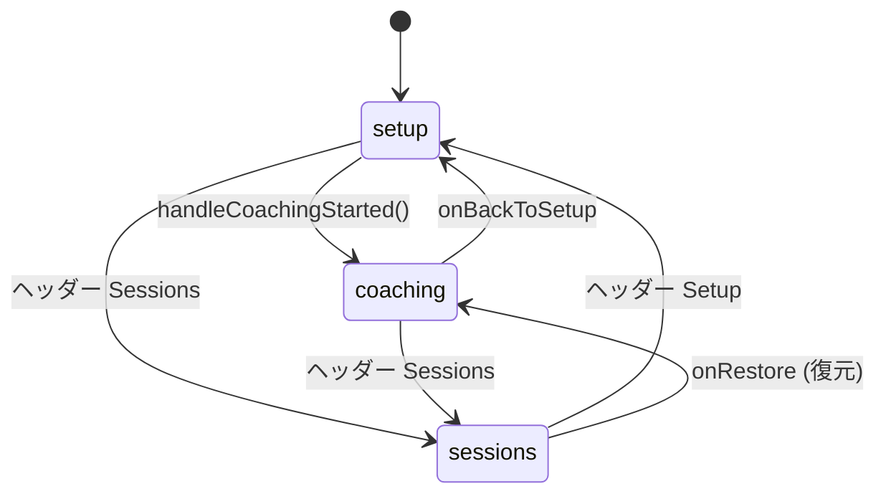
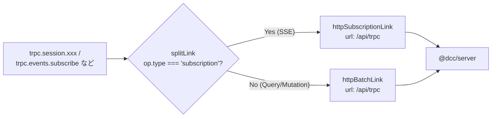
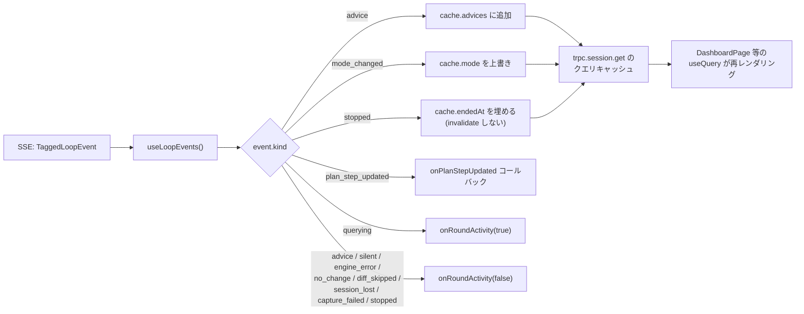
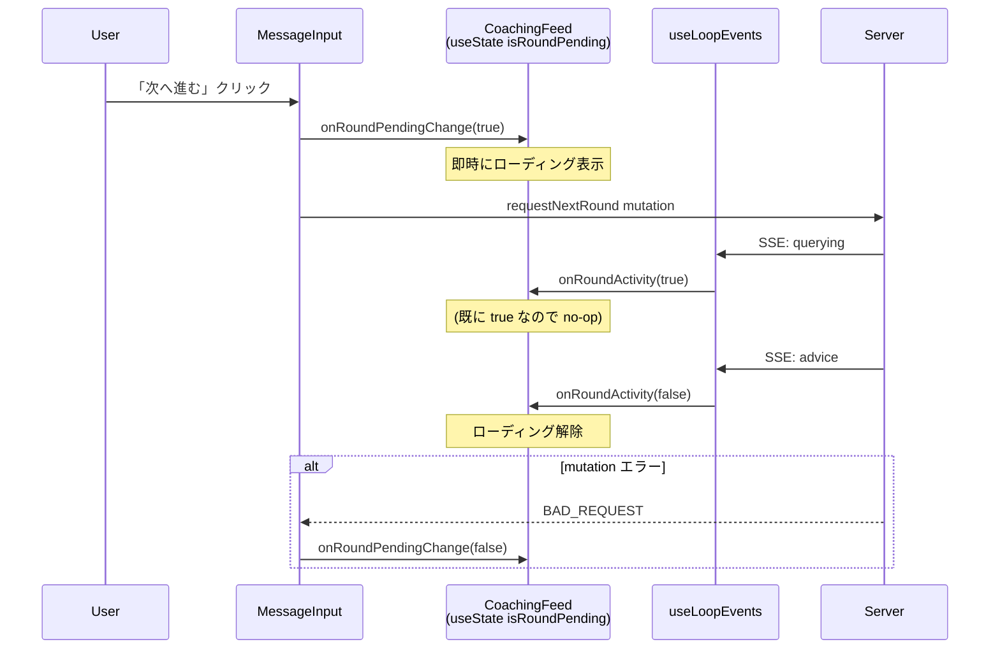
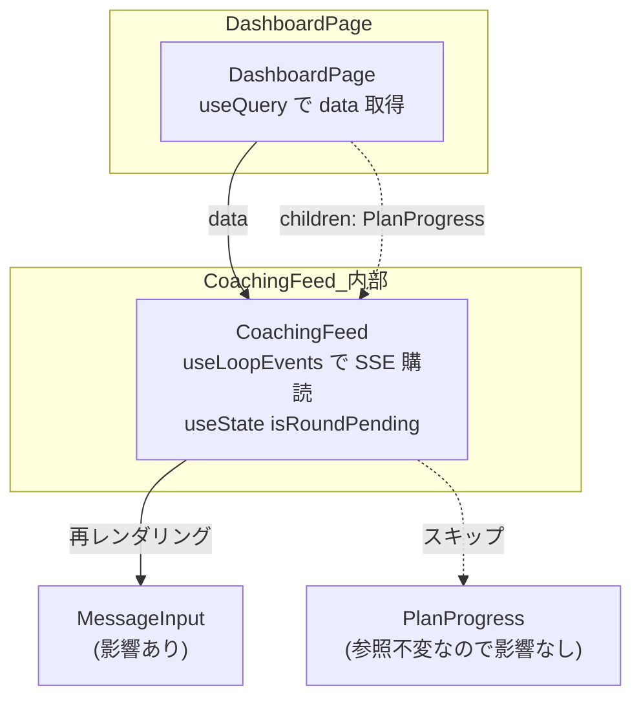
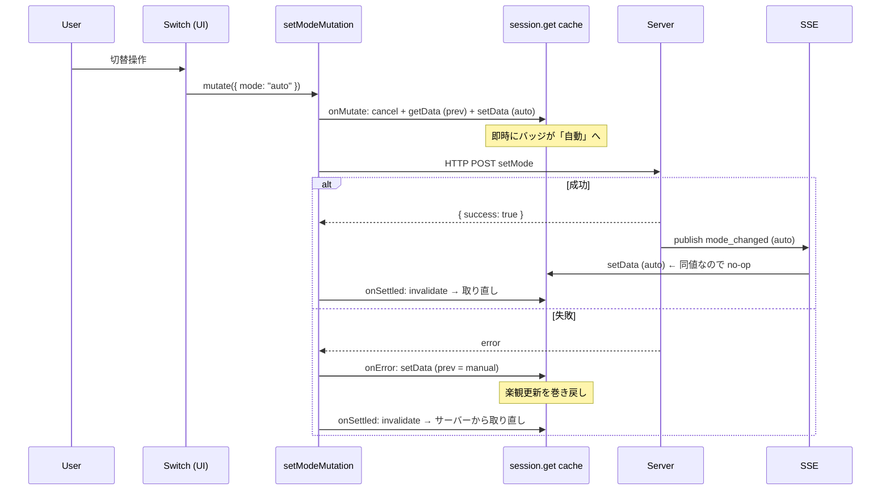
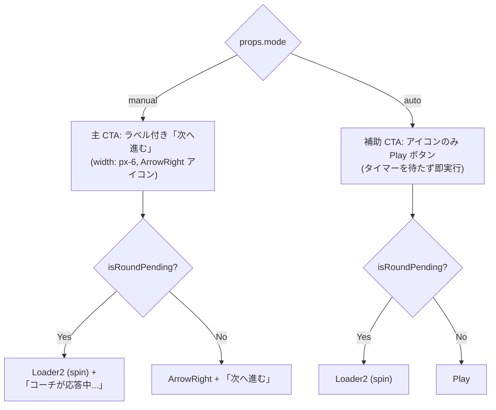
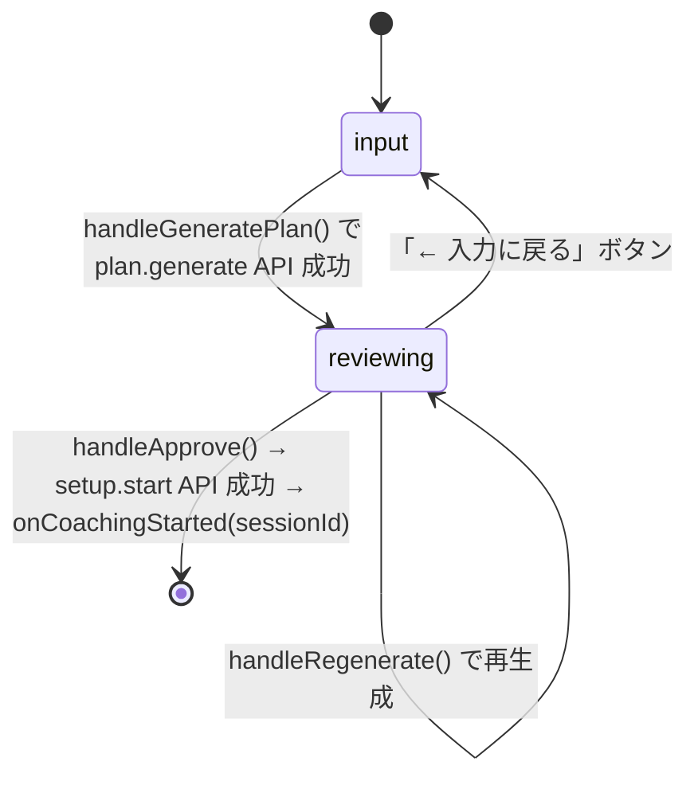

# @dcc/client リーディングガイド

> 最終更新: 2026-04-11

## このパッケージの役割

`@dcc/client` は React 19 + Vite ベースの SPA。`@dcc/server` の tRPC API を叩いてセッションのセットアップ・ダッシュボード・履歴閲覧を提供する。型は `@dcc/server/trpc` から import されるため、サーバーの API 変更がそのまま型として伝搬する。

サーバーから配信される SSE（コーチングループのリアルタイムイベント）を購読し、TanStack Query のクエリキャッシュを更新することで UI が反応する構造。**state は基本的にクエリキャッシュに集約**し、フック内 useState は最小限に保つ。

## 読む順番の推奨

```text
① main.tsx + app.tsx       — エントリポイントと 3 フェーズの状態遷移
② trpc.ts                  — tRPC client セットアップ（SSE と通常 HTTP のリンク分岐）
③ hooks/use-loop-events.ts — SSE 購読の副作用フック（最重要）
④ components/dashboard/dashboard-page.tsx — コーチング画面の親。manual/auto モード切替
⑤ components/dashboard/message-input.tsx  — 「次へ進む」と sendMessage の経路
⑥ components/setup/setup-page.tsx          — セットアップフロー（プラン生成 → 開始）
⑦ components/session/session-list-page.tsx — 過去セッション一覧と復元
⑧ components/dashboard/* と setup/*       — 個別のプレゼンテーションコンポーネント
```

`components/ui/` 配下は shadcn/ui の自動生成。基本的に手で触らない（必要に応じて `bunx shadcn@latest add <name> -c packages/client` で追加）。

## ファイルマップ

```text
packages/client/src/
├── main.tsx              ← React 起動。QueryClientProvider と trpc.Provider をセットアップ
├── app.tsx               ← 3 フェーズ（setup / coaching / sessions）の状態マシン
├── trpc.ts               ← tRPC client 初期化。SSE と HTTP を splitLink で振り分け
│
├── hooks/
│   └── use-loop-events.ts ← [最重要] SSE 購読 → クエリキャッシュ更新の副作用フック
│
├── lib/
│   ├── image-file.ts     ← File → base64 変換（バリデーション付き）
│   └── utils.ts          ← cn() ヘルパー（clsx + tailwind-merge）
│
├── components/
│   ├── shared/
│   │   └── layout.tsx    ← ヘッダー + ナビゲーションを含む共通レイアウト
│   │
│   ├── setup/
│   │   ├── setup-page.tsx          ← セットアップフローの親（input → reviewing）
│   │   ├── display-selector.tsx    ← ディスプレイ一覧から選択
│   │   ├── reference-uploader.tsx  ← 参考画像アップロード（最大5枚 + ラベル）
│   │   ├── goal-input.tsx          ← ゴール文入力
│   │   └── plan-review.tsx         ← 生成プランの確認 / 再生成 / 承認
│   │
│   ├── dashboard/
│   │   ├── dashboard-page.tsx  ← [重要] コーチング画面の親 + Mode トグル
│   │   ├── latest-advice.tsx   ← 最新アドバイスのハイライト表示
│   │   ├── advice-timeline.tsx ← アドバイス履歴（前回 vs 今回セッション分離）
│   │   ├── plan-progress.tsx   ← プランステップの進捗表示 + チェックボックス
│   │   └── message-input.tsx   ← [重要] sendMessage と 「次へ進む」(requestNextRound)
│   │
│   ├── session/
│   │   ├── session-list-page.tsx   ← 過去セッション一覧 + 復元
│   │   └── session-detail-page.tsx ← 個別セッションの履歴閲覧
│   │
│   └── ui/                 ← shadcn/ui の生成物（button, card, switch, など）
│
├── index.css             ← Tailwind CSS の import + ベースカラー定義
└── vite-env.d.ts         ← Vite 型定義
```

---

## アプリ全体の状態マシン

`app.tsx` が 3 つのフェーズを `useState` で持ち、UI 全体を切り替える。



`activeSessionId` が `null` でない場合は、Layout のヘッダーに「Dashboard」リンクが追加で出る。これで「Sessions 画面から進行中ダッシュボードに戻る」動線を確保している。

---

## tRPC client セットアップ（trpc.ts）



`AppRouter` 型は `@dcc/server/trpc` から import するため、サーバーで mutation を追加・削除すると client 側で **コンパイルエラーとして即座に検出される**。型レベルの契約が壊れない仕組み。

`trpc` 自体は `createTRPCReact<AppRouter>()` で生成され、`useQuery` / `useMutation` / `useSubscription` の React フックを提供する。

---

## SSE 購読フック: use-loop-events.ts

クライアント側の心臓部。1 つのフックがコーチングループからのリアルタイムイベントをすべて受け取り、`trpc.session.get` の **クエリキャッシュを single source of truth として書き換える**。フック自体は state を持たない副作用フック。

### 設計原則: state を持たず、すべてキャッシュへ書き戻す

過去には `useState` でアドバイス履歴やモード状態を保持していたが、これだと「フック内 state とクエリキャッシュ」の二重管理になり、トグル直後に古い値が表示に戻る race が起きていた。新設計は **クエリキャッシュだけを真実の源** にする。



### イベントごとの処理

| event.kind | キャッシュ更新 | onRoundActivity |
|---|---|---|
| `advice` | `advices` に追加 | `false`（ラウンド完了） |
| `silent` | なし | `false` |
| `engine_error` | なし | `false` |
| `no_change` | なし | `false`（diff スキップ） |
| `diff_skipped` | なし | `false` |
| `session_lost` | なし | `false` |
| `capture_failed` | なし | `false` |
| `querying` | なし | `true`（ラウンド開始） |
| `plan_step_updated` | `onPlanStepUpdated` 経由で親が更新 | — |
| `mode_changed` | `mode` を上書き | — |
| `stopped` | `endedAt` を ISO 文字列で埋める（**invalidate しない**） | `false` |

### `stopped` で invalidate しない理由

backend が `endSession()` 失敗時のセーフティネットとして、`stopped` 受信時に **`setData` のみ** で `endedAt` を即時更新する。`invalidate()` で refetch すると DB 失敗ケースで `endedAt: null` が返り、せっかく立てた終端表示が巻き戻されるため。

`new Date().toISOString()` は SQL datetime と完全一致しないが、`isCoachingStopped` 判定（`endedAt !== null`）は通るし、`session-detail-page.tsx` の `formatDate(new Date(...))` も ISO 文字列を受け付ける。

### onRoundActivity の役割（「次へ進む」ローディング表示）

SSE の `querying` で立ち、ラウンド終了系イベントで落ちる。`dashboard-page.tsx` の `setIsRoundPending` を直接渡すと、ボタンに loading 表示が出る。



クリック直後の即時反応（200ms-1s の captureScreen 待機を待たずに UI が反応）と、SSE による canonical な完了通知の両方を満たす設計。

---

## ダッシュボード（dashboard-page.tsx）の構造

### コンポーネント階層

```text
DashboardPage
└── CoachingFeed (data を一括で受け取る)
    ├── ヘッダー (badge + Switch トグル)
    ├── LatestAdvice
    ├── MessageInput (mode + isRoundPending を受け取る)
    ├── { children } ← PlanProgress (DashboardPage が外から差し込む)
    └── AdviceTimeline
```

### children パターンによる再レンダリング分離（RULE-012）

`PlanProgress` は `DashboardPage` 側で生成し、`CoachingFeed` には `children` 経由で渡す。これにより `CoachingFeed` 内の SSE state 更新で `PlanProgress` が再生成されることを防ぐ（参照が変わらないため React がスキップする）。



### モード切替の楽観的更新

`setMode` mutation は楽観的更新 + onSettled で invalidate のパターンを取る。



`onSettled` で必ず invalidate するのは、SSE と onError の競合 race を防ぐため。サーバーが成功してモードが変わっているのに、レスポンスだけ網絡で失敗した場合、onError の巻き戻しで UI が逆転するのを最終的にサーバー値で正す。

---

## メッセージ入力（message-input.tsx）の設計

`sendMessage`（自由入力）と `requestNextRound`（次へ進む）は **完全に別のチャンネル**として扱う。前者は messageBox 経由でユーザー発話としてサーバーに渡り、後者は専用の `NextRoundGate` を起こすだけで advice 履歴を汚さない。

### Mode による表示切替



### ボタン無効化条件

「次へ進む」が無効化されるのは以下のいずれか:

- `canSend === true`（下書きまたは添付がある）→ 「素手で次を催促」用途のため、メッセージがあるなら「送信」を使うべき
- `sendMutation.isPending` → 送信中
- `nextRoundMutation.isPending` → mutation 進行中
- `isRoundPending` → ラウンド進行中（多重押下抑止）

### sendMessage のフロー（参考）

```mermaid
sequenceDiagram
    participant User
    participant MI as MessageInput
    participant API as session.sendMessage
    participant CS as coach-session
    participant Loop as coach-loop

    User->>MI: テキスト入力 + 送信
    MI->>API: sendMessage({ sessionId, message, images })
    API->>CS: submitMessage(sessionId, { text, imagePaths })
    CS->>Loop: loop.submitMessage(message)
    Note over Loop: messageBox にバッファ<br/>→ wait 中断<br/>→ trigger=user_message でラウンド実行<br/>→ diff スキップ
    Loop-->>MI: SSE: user_message_received → querying → advice
```

---

## セットアップフロー（setup-page.tsx）

2 ステート（input → reviewing）の小さな state マシン。



`generateMutation` で生成されたプランは server 側の `pendingPlanCache` に TTL 30 分でキャッシュされ、`handleApprove` の `setup.start` で `planId` を渡すと初めて DB に永続化される。

---

## 画像処理（lib/image-file.ts）

`File` → base64 文字列 + プレビュー URL の変換。

| 制約 | 値 |
|---|---|
| 対応形式 | PNG, JPEG, WebP, TIFF, BMP |
| 最大ファイルサイズ | 10 MB |

`reference-uploader.tsx` と `message-input.tsx` の両方から使われる。バリデーションエラーは `{ isOk: false, message }` で返るので、呼び出し側で UI に表示する。

---

## 主要な依存ライブラリ

| ライブラリ | 用途 |
|---|---|
| `react` 19 | UI フレームワーク（React Compiler 対応） |
| `vite` 8 | ビルド & 開発サーバー |
| `@trpc/react-query` + `@tanstack/react-query` | tRPC client + クエリキャッシュ |
| `@radix-ui/react-*` | shadcn/ui のヘッドレスコンポーネント |
| `tailwindcss` 4 | スタイリング |
| `lucide-react` | アイコン |
| `class-variance-authority` + `clsx` + `tailwind-merge` | className の組み立て（cn ヘルパー） |

---

## 設計ルールの遵守ポイント

`/.claude/rules/coderule.md` で特に React 関連を強く意識する箇所:

| ルール | 適用箇所 |
|---|---|
| RULE-009: useEffect を避ける | `use-loop-events.ts` の `useEffect` は `onPlanStepUpdatedRef` / `onRoundActivityRef` の最新化のみ。state 同期目的では使わない |
| RULE-010: 関数にモードをつくらない | `MessageInput` は `mode` props を受けるが、内部で `switch (mode)` で **render 関数を分岐** する。同じボタンに props で表現を変えさせない |
| RULE-011: Compose over Configure | `CoachingFeed` は `children` で `PlanProgress` を受け取る。`PlanProgress` の見た目を boolean props で制御しない |
| RULE-012: children で再レンダリング分離 | 同上。`PlanProgress` は `DashboardPage` 側で生成し、`CoachingFeed` の SSE 更新の影響を受けない |
| RULE-014: useMemo / useCallback は基本不要 | React Compiler に任せる。手動メモ化は 3PL の純粋メソッドが計算に絡む場合のみ（現状なし） |

---

## クライアント特有の落とし穴

### 1. tRPC 型は server から自動伝搬する

`AppRouter` 型を直接 import しているので、server で mutation を rename / 削除すると client 側はコンパイルエラーで気づく。手で型定義を写経する必要はない。

### 2. SSE と HTTP のリンク分岐は splitLink

`trpc.events.subscribe.useSubscription` は内部的に SSE 経由になるよう、`createTrpcClient` の `splitLink` で振り分けられている。SSE 側は keepalive 用の ping が tRPC 11 の `sse.ping` 設定でサーバーから流れてくる（Bun の idleTimeout 対策、DCC-22 で導入）。

### 3. session.get の data から派生する値は呼び出し側で計算

`useLoopEvents` は state を持たないので、`latestAdvice` や `isCoachingStopped` などの派生値は **呼び出し側コンポーネント** で `data.advices.findLast(...)` のように計算する。フックはあくまで「キャッシュを更新する副作用」だけを担う。

### 4. 楽観的更新は onSettled で必ず invalidate する

`setMode` のように optimistic update をするミューテーションでは、SSE と onError の競合を防ぐために `onSettled` で `invalidate` を入れる。これがないと、サーバー成功 + ネットワーク失敗のケースで UI が逆転状態になる。

### 5. shadcn/ui コンポーネントの追加方法

```bash
bunx shadcn@latest add <name> -c packages/client
```

`-c packages/client` を付けないと、monorepo ルートで実行すると失敗するので注意。
