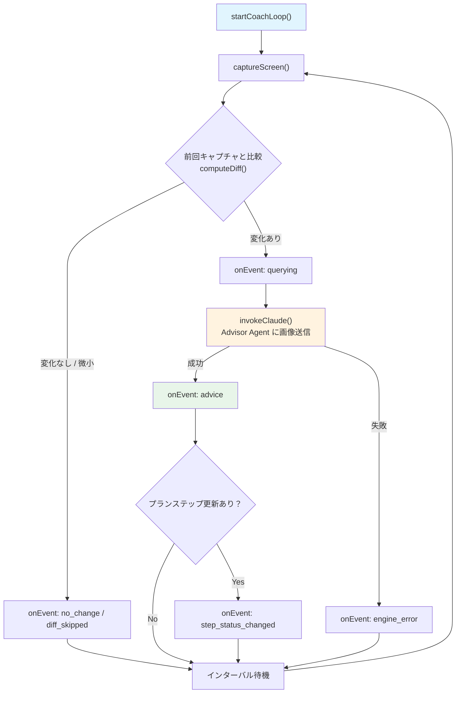
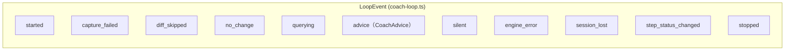
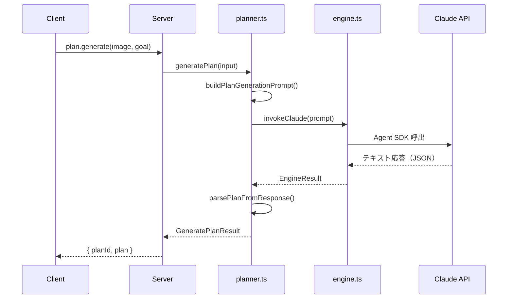
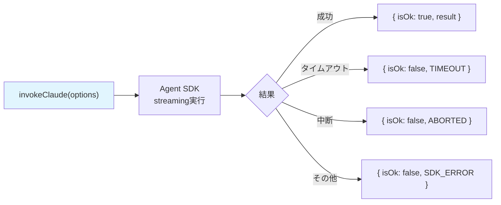
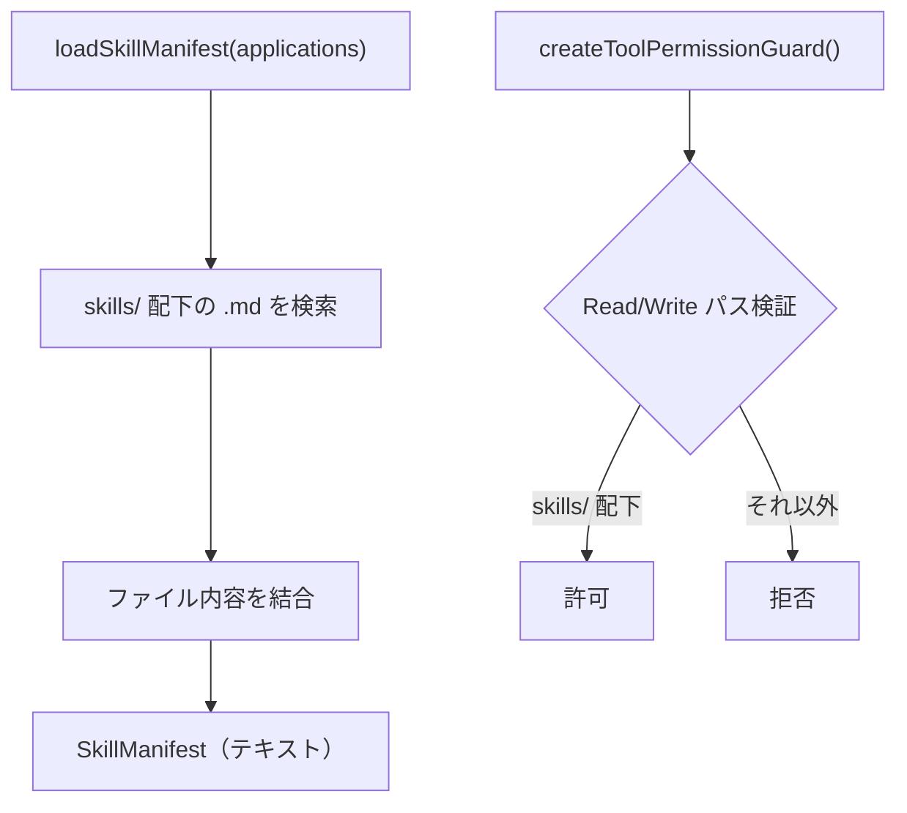

# @dcc/core リーディングガイド

> 最終更新: 2026-03-17

## このパッケージの役割

`@dcc/core` はドメインロジックの集合体。副作用（DB、HTTP）を持たない純粋なビジネスロジック層（functional core）。server / cli の両方から利用される。

## ファイルマップ

```text
packages/core/src/
├── index.ts            ← バレルexport（全公開APIの窓口）
│
├── coach-loop.ts       ← [最重要] コーチングの心臓部
├── engine.ts           ← Claude Agent SDK ラッパー
├── planner.ts          ← プラン生成（Claude呼出→JSON解析）
├── prompts.ts          ← システム/ユーザープロンプト構築
├── agents.ts           ← マルチエージェント定義（ADVISOR / RESEARCHER）
├── skills.ts           ← スキルファイル読込・ツール権限ガード
│
├── capture.ts          ← スクリーンキャプチャ（screenshot-desktop + sharp）
├── diff.ts             ← 画像差分検出（pixelmatch）
├── config.ts           ← config.json 読込
├── list-displays.ts    ← ディスプレイ一覧取得
├── paths.ts            ← プロジェクトパス定数
├── output.ts           ← CLI向けイベント表示
├── gemini.ts           ← YouTube動画からDCC技法を抽出（Gemini API）
└── extract-video.ts    ← gemini.ts のCLIエントリ
```

## 全体フロー: コーチングループの1サイクル

これが core の核心。`startCoachLoop()` が呼ばれると、以下のサイクルが abort されるまで繰り返される。



**読むべきファイル**: `coach-loop.ts` → `capture.ts` → `diff.ts` → `engine.ts` の順

## 重要な型: LoopEvent

coach-loop が外部に通知するすべてのイベント。server の EventBus はこれに `sessionId` をタグ付けして配信する。



| イベント | 意味 | UIでの表示 |
|---------|------|-----------|
| `advice` | Claudeからのアドバイス到着 | ダッシュボードに表示 |
| `stopped` | ループ正常終了 | 「終了」バッジ |
| `engine_error` | Claude呼出失敗 | エラー表示 |
| `step_status_changed` | プランステップ進捗更新 | 進捗バッジ変化 |

## プラン生成フロー

セットアップ時に1回だけ実行される。ループとは別のフロー。



**読むべきファイル**: `planner.ts` のみ。プロンプト構造を知りたければ `prompts.ts`

## engine.ts: Claude Agent SDK ラッパー



- `signal` (AbortSignal) でキャンセル可能
- `checkSessionContinuity()` はセッション維持チェック（画面遷移検出用）

## スキルシステム



スキルファイルは Photoshop 等のツール操作手順書。coach-loop が Advisor Agent に渡すコンテキストの一部。

## 読む順番の推奨

1. **`index.ts`** — 何がexportされているか全体像を把握
2. **`coach-loop.ts`** — 最重要。ループ全体のフローを理解
3. **`engine.ts`** — Claude呼出の仕組み
4. **`planner.ts`** — プラン生成の仕組み
5. **`capture.ts` + `diff.ts`** — スクリーンキャプチャと差分検出

残り（config, agents, skills, prompts, gemini）は必要になったときに読めばよい。
