# @dcc/core リーディングガイド

> 最終更新: 2026-04-13

## このパッケージの役割

`@dcc/core` はコーチングのドメインロジックを集約したパッケージ。server / cli の両方から利用される共有基盤。

ただし「純粋関数だけ」ではない点に注意。スクリーンキャプチャ（OS API）、ファイルI/O（一時PNG書出）、外部API呼出（Claude SDK, Gemini API）など副作用を伴う処理も含まれる。`diff.ts` や `planner.ts` の解析ロジックは純粋だが、パッケージ全体としては副作用を持つ。

## 読む順番の推奨

```text
① index.ts          — 何がexportされているか全体像を把握
② loop-types.ts     — LoopMode / RoundTrigger / UserMessage の集約。coach-loop と prompts が共有
③ coach-loop.ts     — 最重要。manual/auto 二モード、NextRoundGate、ModeController、MessageBox
④ prompts.ts        — AIへの指示の全容（trigger ベースの分岐）
⑤ engine.ts         — Claude SDK呼出の仕組み、onToolUse、セッション継続
⑥ agents.ts         — サブエージェント（researcher）の定義
⑦ skills.ts         — スキルファイル収集、ツール権限ガード、Bashバリデーション
⑧ planner.ts        — プラン生成（セットアップ時のみ使用）
⑨ capture.ts + diff.ts — スクリーンキャプチャと差分検出
```

残り（config, list-displays, paths, output, gemini）は必要になったときに読めばよい。

## ファイルマップ

```text
packages/core/src/
├── index.ts            ← バレルexport（全公開APIの窓口）
│
│ ── コーチングループ ──
├── coach-loop.ts       ← [最重要] コーチングの心臓部。manual/auto モード切替・「次へ進む」要求・メッセージ受信
├── loop-types.ts       ← LoopMode / RoundTrigger / UserMessage（coach-loop と prompts の共有型）
├── engine.ts           ← Claude Agent SDK ラッパー。onToolUseコールバック対応
├── prompts.ts          ← rootエージェントのシステム/ユーザープロンプト構築（trigger 軸で分岐）
├── agents.ts           ← サブエージェント定義（researcher のみ実質稼働）
├── skills.ts           ← スキルファイルパス収集・ツール権限ガード・Bashコマンド検証
│
│ ── キャプチャ・差分 ──
├── capture.ts          ← スクリーンキャプチャ（screenshot-desktop + sharp）
├── diff.ts             ← 画像差分検出（pixelmatch）— 純粋関数
│
│ ── プラン生成 ──
├── planner.ts          ← プラン生成（Claude呼出→JSON解析）。複数リファレンス画像対応
│
│ ── ユーティリティ ──
├── config.ts           ← config.json 読込
├── list-displays.ts    ← ディスプレイ一覧取得
├── paths.ts            ← プロジェクトパス定数
├── output.ts           ← CLI向けイベント表示
├── gemini.ts           ← YouTube動画からDCC技法を抽出（Gemini API）
└── extract-video.ts    ← gemini.ts のCLIエントリ
```

---

## coach-loop.ts: コーチングの心臓部

### エージェント構成の理解（前提知識）

coach-loop を読む前に、エージェント構成を理解しておく必要がある。

```text
root エージェント（= advisor）
├── 自分で判断: 方向性・美的判断・GUI操作案内・進捗評価
├── 自分でツール実行: WebSearch, Bash（YouTube動画検索・要約）
└── サブエージェントに委譲: researcher（スキルファイルの調査・蓄積）
```

**重要**: かつて advisor はサブエージェントだったが、現在は root エージェントが直接その役割を担う。`agents.ts` の advisor 定義は SDK の構造上残っているが、実際のプロンプトは `prompts.ts` の `buildCoachSystemPrompt()` で定義される。

### 1ラウンドの流れ（executeOneRound）

`executeOneRound` は `RoundTrigger`（initial / timer / user_message / manual_next）を引数に取り、trigger に応じて diff スキップとプロンプト分岐を行う。

```mermaid
flowchart TD
    A["executeOneRound(state, trigger)"] --> B["captureScreen()"]
    B -->|失敗| C["onEvent: capture_failed → 次ラウンドへ"]
    B -->|成功| D{"shouldBypassDiffCheck(trigger)?<br/>= initial / user_message / manual_next"}

    D -->|Yes| F["saveScreenshot()"]
    D -->|No (= timer)| E["checkScreenDiff()"]
    E -->|変化なし| G["onEvent: no_change → 次ラウンドへ"]
    E -->|変化あり| F

    F --> H["onEvent: querying"]
    H --> I["invokeClaude()<br/>buildCoachUserPrompt は trigger 軸で分岐<br/>+ onToolUse でツール実行を検証"]
    I -->|失敗| J["onEvent: engine_error → 次ラウンドへ"]
    I -->|成功| K["checkSessionContinuity()"]
    K -->|途切れた| L["onEvent: session_lost<br/>sessionId リセット"]
    K -->|OK| M["parseAdvice()"]
    M -->|__SILENT__| N["onEvent: silent"]
    M -->|テキスト| O["onEvent: advice"]

    style A fill:#e1f5fe
    style I fill:#fff3e0
    style O fill:#e8f5e9
```

### メインループの全体構造（startCoachLoop）

`waitForNextTrigger()` が次に実行すべきラウンドの `RoundInput`（trigger + userMessage）を決定し、`executeOneRound` に渡す。trigger が無いケース（mode_changed や spurious wake）では `null` を返してループ先頭に戻り再判定する。

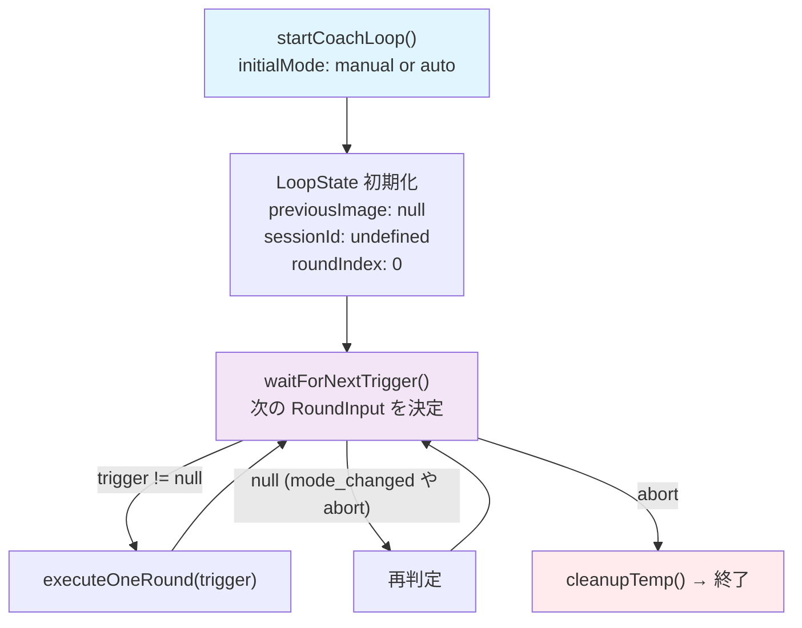

`waitForNextTrigger()` の優先順位:

1. `messageBox.consume()` で保留メッセージがあれば → `trigger: "user_message"`
2. `nextRoundGate.consumePending()` で「次へ進む」要求があれば → `trigger: "manual_next"`
3. **初回かつ auto モード**なら → `trigger: "initial"`（即時実行）
4. それ以外 → `waitForNextRound()` で待機（auto は timer も含む / manual は timer 無し）

### LoopMode と「次へ進む」: manual / auto 二モード制

セッションは `manual`（デフォルト）と `auto` の 2 モードを持つ。manual は「ユーザーが次へ進むを押した時だけ 1 ラウンド実行」、auto は「intervalSeconds 毎に自動実行 + 次へ進む補助 CTA」。

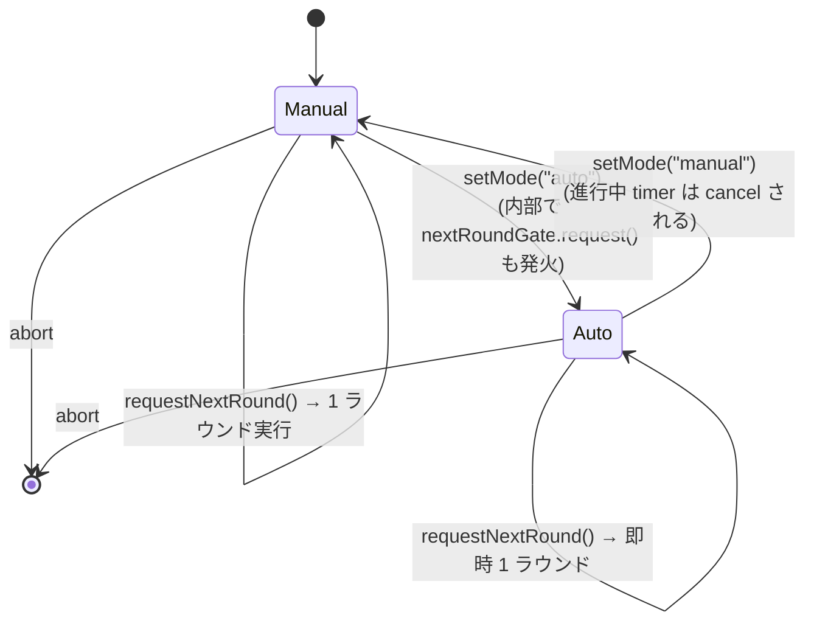

manual モード初回は `state.previousImage === null` のまま wait に落ち、`requestNextRound` / `submitMessage` / `setMode("auto")` 以外では絶対に走らない。「初回ラウンドが勝手に走る退行」を構造的に防ぐ。

### 「次へ進む」専用チャンネル: NextRoundGate

`NextRoundGate` は `pending: boolean` 単一フラグの状態機械で、連打 dedupe を型レベルで保証する。messageBox とは完全に独立した経路で動く。

```mermaid
sequenceDiagram
    participant UI as MessageInput<br/>(次へ進むボタン)
    participant API as session.requestNextRound
    participant CS as coach-session.ts
    participant Gate as NextRoundGate
    participant Loop as メインループ

    UI->>API: requestNextRound({ sessionId })
    API->>CS: requestNextRound(sessionId)
    CS->>Gate: request()
    Note over Gate: pending = true<br/>(既に true なら no-op = dedupe)
    Gate-->>Loop: waitForNextRound を中断

    Loop->>Gate: consumePending() → true
    Note over Gate: pending = false
    Loop->>Loop: makeNextRoundTrigger()<br/>= manual_next
    Loop->>Loop: executeOneRound(manual_next)

    Note over UI,Loop: ラウンド実行中に何度押しても<br/>pending は 1 枚のまま<br/>= 連打しても次の 1 ラウンドだけ実行
```

「`messageBox` には書き込まれない」のがポイント。advice 履歴に偽のユーザー発話が混入しないし、prompt には `manual_next` trigger 経由で「ユーザーが明示的に次を要求している」というメタ情報のみが伝わる。

### auto/manual 切替の race 対策: ModeController

auto モードで `waitForNextRound` が `setTimeout` を待っている最中に manual に切り替えると、放置すれば timer 満了で 1 ラウンド余計に走ってしまう。これを防ぐため、`ModeController.onChange` を `waitForNextRound` の wake 要因に組み込んでいる。

```mermaid
sequenceDiagram
    participant UI as ダッシュボード
    participant CS as coach-session.ts
    participant MC as ModeController
    participant Loop as waitForNextRound

    Note over Loop: auto モード中、timer (60s) を仕掛けて待機

    UI->>CS: setMode({ mode: "manual" })
    CS->>MC: set("manual")
    MC->>MC: current = "manual"
    MC-->>Loop: onChange() callback

    Note over Loop: wakeUp("mode_changed")
    Loop->>Loop: cleanup() → clearTimeout(timer)
    Loop-->>CS: 戻り値 reason="mode_changed"

    Note over CS: メインループ先頭に戻り<br/>新 mode で再判定<br/>= manual なので timer 仕掛けず wait
```

`setMode("auto")` の場合は逆に「即時 1 ラウンド実行」が UX 上自然なので、`setMode` の中で `nextRoundGate.request()` を内部から呼ぶ。これにより auto に切替えた瞬間にすぐ 1 ラウンド回る。

### MessageBox パターン

ユーザーメッセージのバッファリングと、ループの即時起床を実現する仕組み。

```mermaid
sequenceDiagram
    participant UI as MessageInput
    participant API as session.sendMessage
    participant CS as coach-session.ts
    participant MB as MessageBox
    participant Loop as メインループ

    UI->>API: sendMessage({ sessionId, message, images? })
    API->>CS: submitMessage(sessionId, { text, imagePaths })
    CS->>MB: submit(userMessage)
    MB-->>Loop: waitForNextRound を中断

    Loop->>MB: consume()
    MB-->>Loop: UserMessage { text, imagePaths }
    Note over Loop: diff スキップで即座に AI 呼び出し
```

### UserMessage 型

メッセージは単なるテキストではなく、画像添付も可能。

```ts
type UserMessage = {
  readonly text: string;
  readonly imagePaths: readonly string[];  // 添付画像ファイルパス
};
```

### ツール権限の二重チェック（handleToolUse + allowedTools）

`invokeClaude()` に渡す権限設定は3層構造になっている。

```text
tools:        ["Read", "Agent", "WebSearch", "WebFetch", "Write", "Bash", "Glob", "TaskOutput"]
                ↑ セッション全体で「存在を認識する」ツール一覧

allowedTools: ["Read", "Agent", "Bash", "WebSearch", "Write", "TaskOutput"]
                ↑ root が自動承認で使えるツール（canUseTool をスキップする）

canUseTool:   createToolPermissionGuard()
                ↑ allowedTools に含まれないツールの実行時に呼ばれる権限チェック
```

**問題**: `allowedTools` に入れたツールは `canUseTool` をバイパスする。つまり root が使う Bash や Write は `canUseTool` のチェックを受けない。

**解決策**: `onToolUse` コールバックで二重チェック。

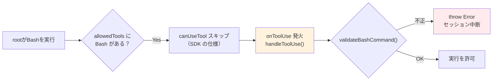

`handleToolUse` のチェック内容:

- **Bash**: `validateBashCommand()` で `bun run extract-video.ts <youtube-url>` のみ許可。加えて、extract-video が `run_in_background: true` なしで同期実行された場合は警告ログを出力
- **Write**: `skills/` ディレクトリ配下のみ許可
- その他: ログ出力のみ

---

## 重要な型: LoopEvent

coach-loop が `onEvent` コールバックで通知するイベント。server の EventBus はこれに `sessionId` をタグ付けして配信する。

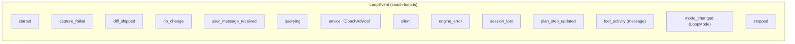

> `started` と `stopped` は LoopEvent の union に含まれるが、**core 内では発火されない**。`stopped` は server 側の `coach-session.ts` が `loopFinished` Promise の `.then`/`.catch` 両方で EventBus へ publish する。「成功/失敗問わずループが終端した」というセマンティクスを backend が保証する契約。`mode_changed` は `setMode` ハンドル呼び出し時に同値でなければ発火する。

| イベント | 意味 | UIでの表示 |
|---------|------|-----------|
| `advice` | Claudeからのアドバイス到着 | ダッシュボードに表示 |
| `engine_error` | Claude呼出失敗 | エラー表示 |
| `plan_step_updated` | プランステップ進捗更新 | 進捗バッジ変化 |
| `user_message_received` | ユーザーからのメッセージ到着 | (内部フロー) |
| `tool_activity` | ツール実行中の途中経過メッセージ | ダッシュボードのローディング表示内に動的メッセージとして表示 |
| `mode_changed` | manual/auto 切替 | 「手動」/「自動」バッジ + Switch 状態 |
| `stopped` | ループ終了 (**server側で発火**、成功/失敗問わず) | 「終了」バッジ |

> 旧仕様との差分: かつて存在した `paused` / `resumed` イベントは廃止された。manual / auto の 2 状態制に統一されており、pause という独立した状態は存在しない。「自動ループを停止したい」場合は `setMode("manual")` を使う。

---

## prompts.ts: rootエージェントへの指示

`buildCoachSystemPrompt()` が root エージェント（= advisor 役）のシステムプロンプトを組み立てる。

含まれる情報:

- advisor としての役割定義（方向性判断・GUI操作案内・進捗評価）
- スキルファイルの目次（`skillManifest`）
- プランのステップ一覧
- リファレンス画像の説明
- YouTube動画の検索・要約フロー手順
- 復元されたアドバイス履歴（`previousAdvices`、直近 20 件にトリミング。トークン消費削減のため）

`buildCoachUserPrompt()` は `RoundTrigger` を主軸に switch 分岐する。各 trigger の中で初回ラウンド（`isFirstRound`）かどうかを内部で扱う。

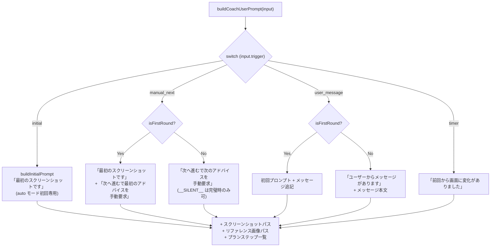

**設計判断**: `isFirstRound` と `trigger` を **直交した次元**として扱う。同じ「初回ラウンド」でも、起動契機（auto モードの自動初回 / ユーザーメッセージ / 「次へ進む」）によって AI に伝えるべき文脈が違うため、trigger を主軸に switch する。

`manual_next` は **偽の発話を入れない**のがポイント。「やりました、次の指示をもらえますか？」のような架空のユーザー発話を作るのではなく、「ユーザーが次へ進むボタンで次のアドバイスを手動で要求しました」というメタ情報を伝える。advice 履歴も汚染されない。

---

## engine.ts: Claude Agent SDK ラッパー

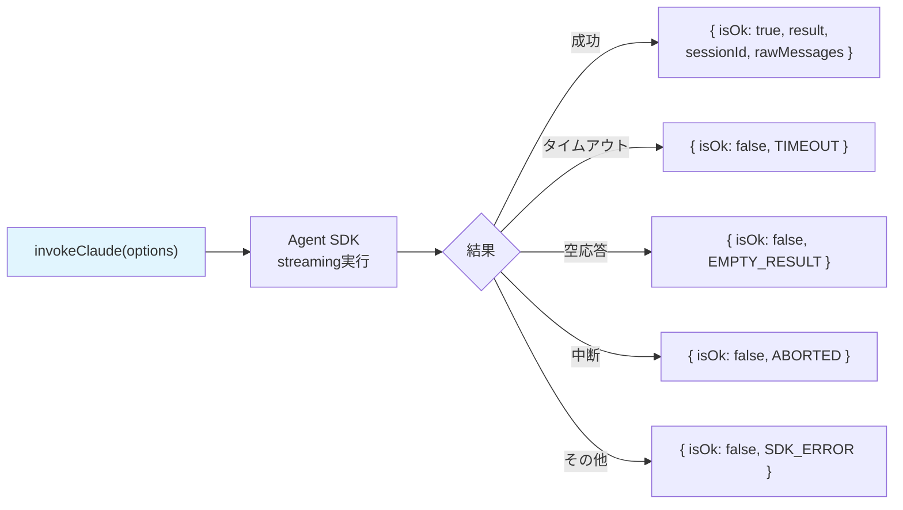

- `signal` (AbortSignal) でキャンセル可能
- `onToolUse` コールバック: ツール実行を検知して `createHandleToolUse()` に中継
- `checkSessionContinuity()`: セッション維持チェック（画面遷移検出用）
- `effort` パラメータ: API 推論の労力レベル（`"low"` / `"medium"` / `"high"` / `"max"`）
- `thinking` パラメータ: 適応的思考モード（`{ type: "adaptive" }` / `{ type: "disabled" }`）。coach-loop.ts は通常 `effort: "high"` + `thinking: { type: "disabled" }` を渡し、YouTube URL を含むユーザーメッセージの場合のみ `thinking: { type: "adaptive" }` に切り替える

---

## agents.ts: サブエージェント定義

```text
advisor   — root エージェントとして動作。プロンプトは prompts.ts で定義（ここの定義は形式上のみ）
researcher — skills/ の Read / Write / Glob のみ使用可能。操作手順・表現技法の調査・蓄積
```

**注意**: researcher のツールは `["Read", "Write", "Glob"]` の3つだけ。WebSearch や Bash は root が直接実行する。researcher はスキルファイルの読み書きに特化している。

---

## skills.ts: スキルファイルとツール権限

2つの役割を持つファイル。

### ① スキルマニフェスト生成

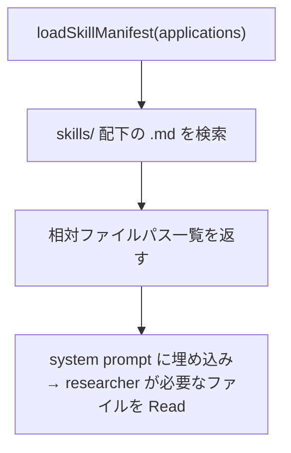

### ② ツール権限ガード（createToolPermissionGuard）

`canUseTool` コールバックとして SDK に登録される。**allowedTools に含まれないツール**の実行時に呼ばれる。

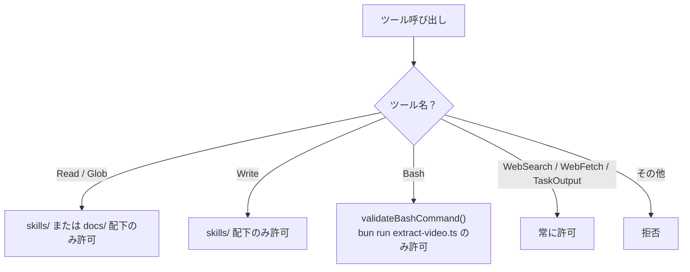

### validateBashCommand の検証フロー

```text
入力: "cd packages/core && bun run src/extract-video.ts 'https://youtube.com/watch?v=xxx'"
  ↓ cd プレフィックスを除去
  ↓ "bun run" であることを確認
  ↓ スクリプトが extract-video.ts であることを確認
  ↓ URL が YouTube URL パターンに一致することを確認
  ↓ シェルメタ文字（; | & ` $ 等）がないことを確認
  → OK
```

### ③ パス契約: `skills/` 仮想ルートと resolveSkillPath

スキルファイルの書き込みは「**`skills/` という単語が必ず `SKILLS_ROOT`（= `packages/core/skills`）の別名を指す**」という仮想ルート契約で統一されている。これは過去の事故対策として導入された設計。

#### なぜ仮想ルートが必要だったか

歴史的な経緯として、3者（LLM・manifest 表示・権限ガード）が同じ `skills/` という単語を**バラバラの意味**で使っていたことで、`skills/ 外への書き込みを検出` エラーが頻発していた。

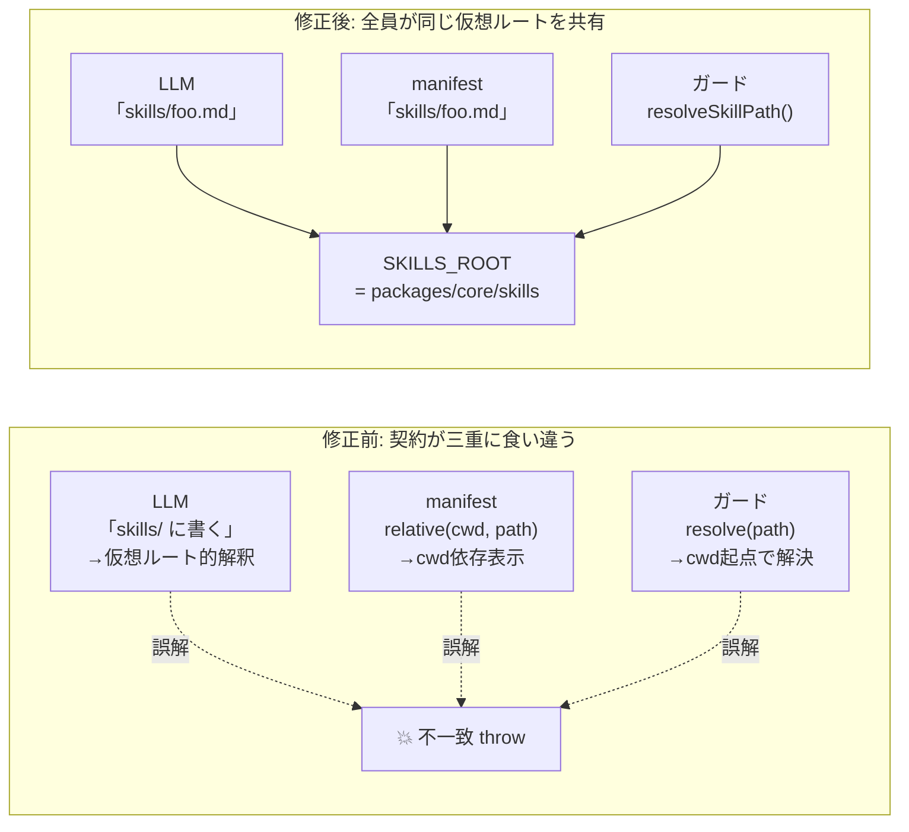

#### 事故の流れ（修正前の挙動）

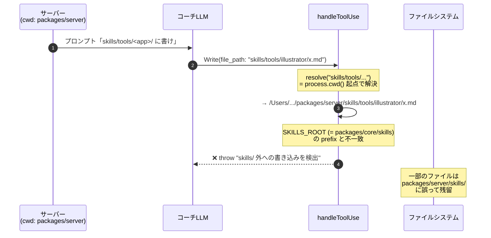

「LLM が思っている skills の場所」と「ガードが認める skills の場所」が、サーバーの cwd を介して食い違っていたのが本質。

#### resolveSkillPath の解決フロー（修正後）

`skills.ts` の `resolveSkillPath(filePath)` がパス契約の中核。3つの分岐で「LLM の意図」を `SKILLS_ROOT` 配下に着地させる:

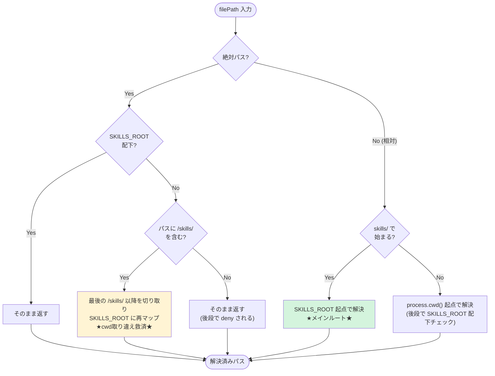

#### 「再マップ」の救済処理

LLM がプロンプト指示を無視して絶対パスを構築してきた場合の補正。サーバーの cwd を取り違えた絶対パスを自動で正しい場所に着地させる。

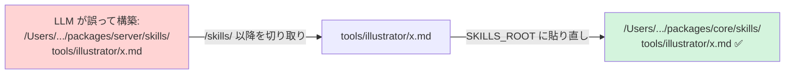

#### 契約を守る3つの仕組み

| レイヤー | 役割 | 実装箇所 |
|---|---|---|
| プロンプト | 「Write の file_path は必ず `skills/` 仮想パス」と明示 | `prompts.ts` のステップ4 |
| manifest | `relative(SKILLS_ROOT, ...)` で `skills/...` 形式に統一 | `skills.ts:formatManifest` |
| ガード | `resolveSkillPath()` で `skills/` を SKILLS_ROOT 基準に解決 | `skills.ts` + `coach-loop.ts:handleToolUse` |

これら3つが揃うことで、サーバーの cwd がどこであろうが、LLM がどう書こうが、最終的に `SKILLS_ROOT` 配下にしか書き込めない契約が成立する。

---

## planner.ts: プラン生成

セットアップ時に実行。ループとは別のフロー。

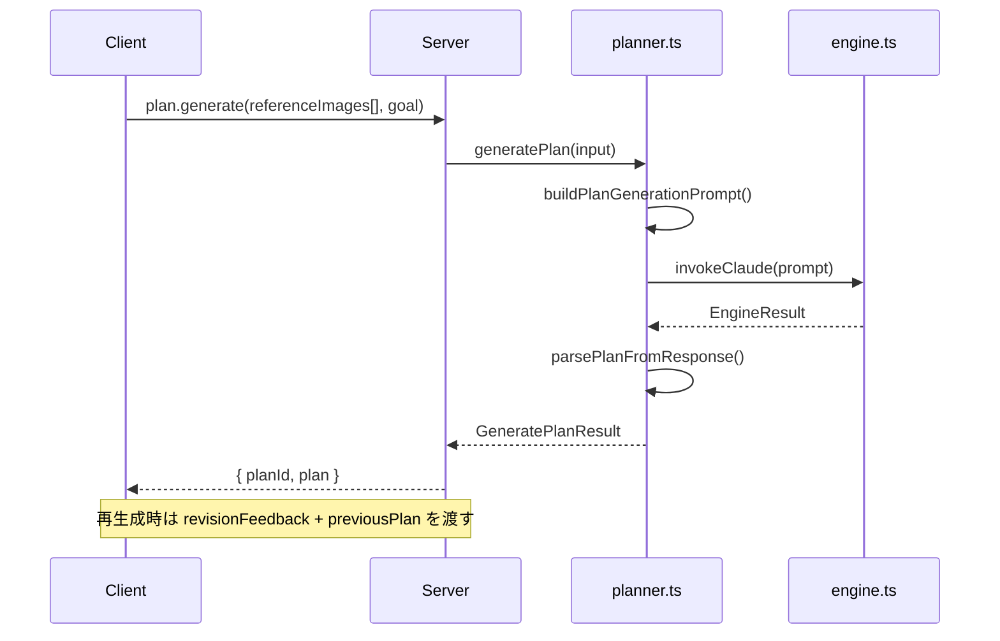

`GeneratePlanInput` は複数のリファレンス画像を受け取る:

```ts
type ReferenceImageInput = { path: string; label: string };
type GeneratePlanInput = {
  referenceImages: readonly ReferenceImageInput[];
  goalDescription: string;
  revisionFeedback?: string;
  previousPlan?: Plan;
};
```

---

## capture.ts + diff.ts: キャプチャと差分検出

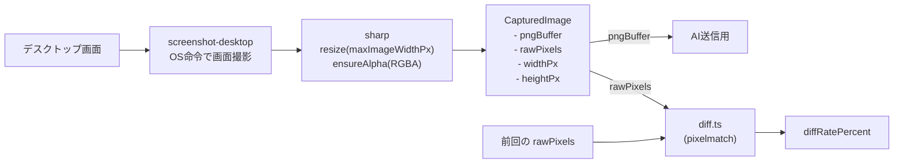

2つの threshold の違い:

| 名前 | 範囲 | 意味 |
|------|------|------|
| `pixelmatchThreshold` | 0.0 - 1.0 | ピクセル単位の色差感度 |
| `diffThresholdPercent` | 例: 5% | 画面全体の変化率の閾値 |

---

## CoachLoopHandle: 外部から操作するためのインターフェース

`startCoachLoop()` が返すハンドル。server の `coach-session.ts` がこれを保持してフロントエンドからの操作を中継する。

```ts
type CoachLoopHandle = {
  readonly loopFinished: Promise<void>;            // ループ終了を待つ
  readonly submitMessage: (msg: UserMessage) => void;  // メッセージ送信
  readonly getMode: () => LoopMode;                // 現在のモード取得
  readonly setMode: (mode: LoopMode) => void;      // モード切替（同値なら no-op）
  readonly requestNextRound: () => void;           // 「次へ進む」要求（連打は dedupe）
};
```

旧仕様の `pause` / `resume` / `isPaused` は **削除済み**。`setMode("manual")` で「自動ループを止める」という意味になる。

---

## コアの内部ヘルパー（export されない関数）

coach-loop.ts 内で定義されている非公開の構造:

| 関数/型 | 役割 |
|---------|------|
| `createMessageBox()` | メッセージのキューイングとループの即時起床 |
| `createNextRoundGate()` | 「次へ進む」専用チャンネル。pending: boolean 単一フラグで連打 dedupe |
| `createModeController()` | manual/auto モード状態と onChange コールバック管理 |
| `waitForNextRound()` | 5トリガー（timer/abort/message/next_round/mode_changed）の統一待機。timer は auto モード時のみ仕掛かる |
| `waitForNextTrigger()` | 次に実行すべき RoundInput（trigger + userMessage）を決定 |
| `executeOneRound()` | 1ラウンド分の処理（キャプチャ→diff→AI→結果解析） |
| `shouldBypassDiffCheck()` | trigger ごとに diff チェックを skip するか判定 |
| `checkScreenDiff()` | diff 結果を DiffCheckResult に変換 |
| `deriveNextState()` | 次ラウンド用の LoopState を導出（不変更新） |
| `describeToolActivity()` | ツール名と input からユーザー向けの進捗メッセージを動的に組み立てる |
| `createHandleToolUse(onEvent)` | ツール実行時の安全チェック（Bash/Write）+ `tool_activity` イベント発火のクロージャ生成 |
