# @dcc/core リーディングガイド

> 最終更新: 2026-04-04

## このパッケージの役割

`@dcc/core` はコーチングのドメインロジックを集約したパッケージ。server / cli の両方から利用される共有基盤。

ただし「純粋関数だけ」ではない点に注意。スクリーンキャプチャ（OS API）、ファイルI/O（一時PNG書出）、外部API呼出（Claude SDK, Gemini API）など副作用を伴う処理も含まれる。`diff.ts` や `planner.ts` の解析ロジックは純粋だが、パッケージ全体としては副作用を持つ。

## 読む順番の推奨

```text
① index.ts          — 何がexportされているか全体像を把握
② coach-loop.ts     — 最重要。ループ全体のフロー、一時停止・再開、MessageBox
③ prompts.ts        — AIへの指示の全容（rootエージェントのシステムプロンプト）
④ engine.ts         — Claude SDK呼出の仕組み、onToolUse、セッション継続
⑤ agents.ts         — サブエージェント（researcher）の定義
⑥ skills.ts         — スキルファイル収集、ツール権限ガード、Bashバリデーション
⑦ planner.ts        — プラン生成（セットアップ時のみ使用）
⑧ capture.ts + diff.ts — スクリーンキャプチャと差分検出
```

残り（config, list-displays, paths, output, gemini）は必要になったときに読めばよい。

## ファイルマップ

```text
packages/core/src/
├── index.ts            ← バレルexport（全公開APIの窓口）
│
│ ── コーチングループ ──
├── coach-loop.ts       ← [最重要] コーチングの心臓部。一時停止・再開・メッセージ受信を含む
├── engine.ts           ← Claude Agent SDK ラッパー。onToolUseコールバック対応
├── prompts.ts          ← rootエージェントのシステム/ユーザープロンプト構築
├── agents.ts           ← サブエージェント定義（researcher のみ実質稼働）
├── skills.ts           ← スキルファイルパス収集・ツール権限ガード・Bashコマンド検証
│
│ ── キャプチャ・差分 ──
├── capture.ts          ← スクリーンキャプチャ（screenshot-desktop + sharp）
├── diff.ts             ← 画像差分検出（pixelmatch）— 純粋関数
│
│ ── プラン生成 ──
├── planner.ts          ← プラン生成（Claude呼出→JSON解析）。複数リファレンス画像対応
│
│ ── ユーティリティ ──
├── config.ts           ← config.json 読込
├── list-displays.ts    ← ディスプレイ一覧取得
├── paths.ts            ← プロジェクトパス定数
├── output.ts           ← CLI向けイベント表示
├── gemini.ts           ← YouTube動画からDCC技法を抽出（Gemini API）
└── extract-video.ts    ← gemini.ts のCLIエントリ
```

---

## coach-loop.ts: コーチングの心臓部

### エージェント構成の理解（前提知識）

coach-loop を読む前に、エージェント構成を理解しておく必要がある。

```text
root エージェント（= advisor）
├── 自分で判断: 方向性・美的判断・GUI操作案内・進捗評価
├── 自分でツール実行: WebSearch, Bash（YouTube動画検索・要約）
└── サブエージェントに委譲: researcher（スキルファイルの調査・蓄積）
```

**重要**: かつて advisor はサブエージェントだったが、現在は root エージェントが直接その役割を担う。`agents.ts` の advisor 定義は SDK の構造上残っているが、実際のプロンプトは `prompts.ts` の `buildCoachSystemPrompt()` で定義される。

### 1ラウンドの流れ（executeOneRound）

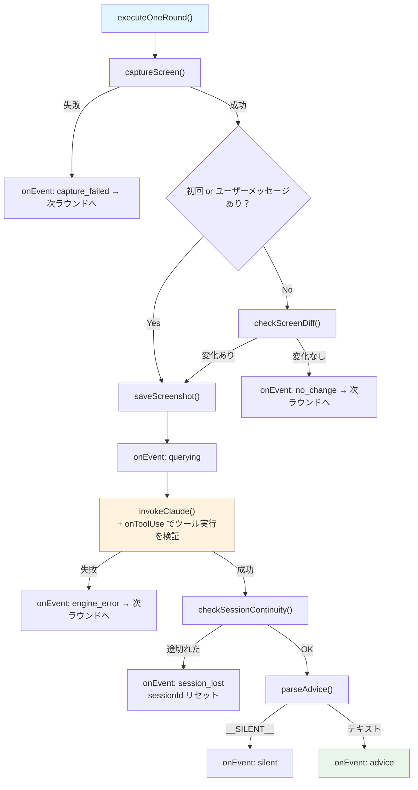

### メインループの全体構造（startCoachLoop）

`executeOneRound` を繰り返すメインループには、5つのウェイクトリガーがある。

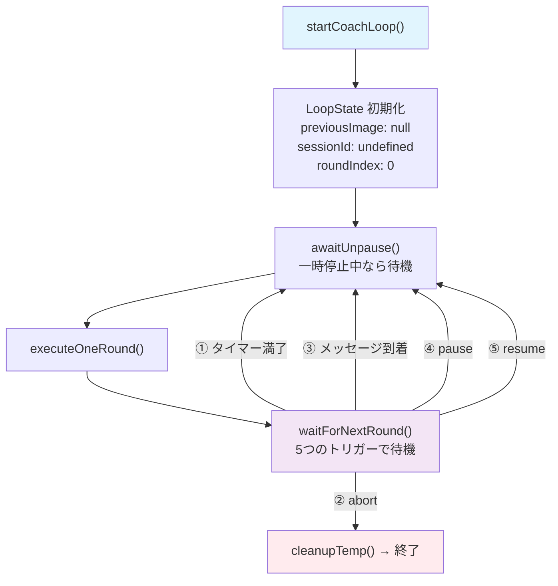

### 一時停止・再開の仕組み（PauseControl + awaitUnpause）

```mermaid
sequenceDiagram
    participant UI as ダッシュボード
    participant Server as coach-session.ts
    participant Loop as メインループ
    participant PC as PauseControl
    participant MB as MessageBox

    UI->>Server: pause(sessionId)
    Server->>Loop: loop.pause()
    Loop->>PC: pause()
    Note over PC: paused = true
    Loop-->>UI: SSE: { kind: "paused" }

    Note over Loop: awaitUnpause() で待機中...
    Note over Loop: 3つの起床トリガー:
    Note over Loop: ① resume() が呼ばれる
    Note over Loop: ② abort される
    Note over Loop: ③ メッセージが届く（→ 自動再開）

    UI->>Server: resume(sessionId)
    Server->>Loop: loop.resume()
    Loop->>PC: resume()
    Note over PC: paused = false
    Loop-->>UI: SSE: { kind: "resumed" }
    Note over Loop: awaitUnpause() 解決 → ループ再開
```

**ポイント**: 一時停止中にユーザーメッセージが届くと自動的に再開する（案A）。

### MessageBox パターン

ユーザーメッセージのバッファリングと、ループの即時起床を実現する仕組み。

```mermaid
sequenceDiagram
    participant UI as MessageInput
    participant API as session.sendMessage
    participant CS as coach-session.ts
    participant MB as MessageBox
    participant Loop as メインループ

    UI->>API: sendMessage({ sessionId, message, images? })
    API->>CS: submitMessage(sessionId, { text, imagePaths })
    CS->>MB: submit(userMessage)
    MB-->>Loop: waitForNextRound を中断

    Loop->>MB: consume()
    MB-->>Loop: UserMessage { text, imagePaths }
    Note over Loop: diff スキップで即座に AI 呼び出し
```

### UserMessage 型

メッセージは単なるテキストではなく、画像添付も可能。

```ts
type UserMessage = {
  readonly text: string;
  readonly imagePaths: readonly string[];  // 添付画像ファイルパス
};
```

### ツール権限の二重チェック（handleToolUse + allowedTools）

`invokeClaude()` に渡す権限設定は3層構造になっている。

```text
tools:        ["Read", "Agent", "WebSearch", "WebFetch", "Write", "Bash", "Glob"]
                ↑ セッション全体で「存在を認識する」ツール一覧

allowedTools: ["Read", "Agent", "Bash", "WebSearch", "Write"]
                ↑ root が自動承認で使えるツール（canUseTool をスキップする）

canUseTool:   createToolPermissionGuard()
                ↑ allowedTools に含まれないツールの実行時に呼ばれる権限チェック
```

**問題**: `allowedTools` に入れたツールは `canUseTool` をバイパスする。つまり root が使う Bash や Write は `canUseTool` のチェックを受けない。

**解決策**: `onToolUse` コールバックで二重チェック。

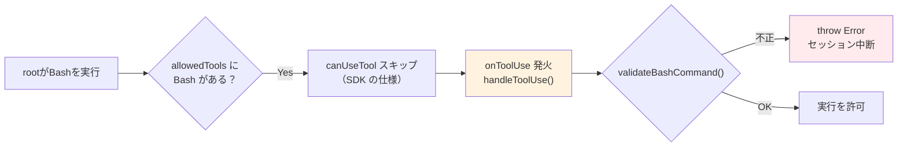

`handleToolUse` のチェック内容:

- **Bash**: `validateBashCommand()` で `bun run extract-video.ts <youtube-url>` のみ許可
- **Write**: `skills/` ディレクトリ配下のみ許可
- その他: ログ出力のみ

---

## 重要な型: LoopEvent

coach-loop が `onEvent` コールバックで通知するイベント。server の EventBus はこれに `sessionId` をタグ付けして配信する。

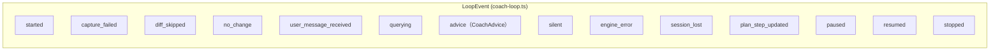

> `started` と `stopped` は LoopEvent の union に含まれるが、**core 内では発火されない**。`stopped` は server 側の `coach-session.ts` が `loopFinished` Promise 解決後に EventBus へ publish する。`paused` は `startCoachLoop` の返り値ハンドルの `pause()` 経由で発火する。`resumed` はハンドルの `resume()` に加え、一時停止中にメッセージが届いた際に `awaitUnpause()` 内部からも発火する。

| イベント | 意味 | UIでの表示 |
|---------|------|-----------|
| `advice` | Claudeからのアドバイス到着 | ダッシュボードに表示 |
| `engine_error` | Claude呼出失敗 | エラー表示 |
| `plan_step_updated` | プランステップ進捗更新 | 進捗バッジ変化 |
| `user_message_received` | ユーザーからのメッセージ到着 | (内部フロー) |
| `paused` | 一時停止 | 「一時停止中」バッジ |
| `resumed` | 再開 | 「コーチング中」バッジに戻る |
| `stopped` | ループ終了 (**server側で発火**) | 「終了」バッジ |

---

## prompts.ts: rootエージェントへの指示

`buildCoachSystemPrompt()` が root エージェント（= advisor 役）のシステムプロンプトを組み立てる。

含まれる情報:

- advisor としての役割定義（方向性判断・GUI操作案内・進捗評価）
- スキルファイルの目次（`skillManifest`）
- プランのステップ一覧
- リファレンス画像の説明
- YouTube動画の検索・要約フロー手順
- 復元されたアドバイス履歴（`previousAdvices`）

`buildCoachUserPrompt()` は状況に応じて3パターンに分岐する。

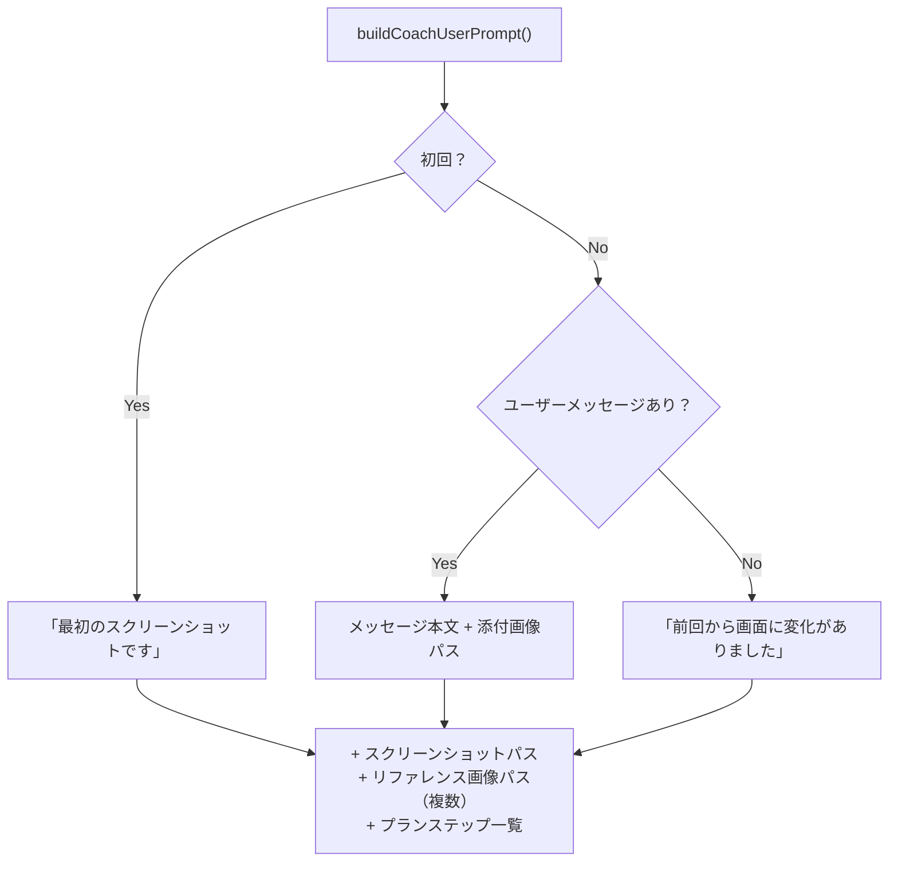

---

## engine.ts: Claude Agent SDK ラッパー

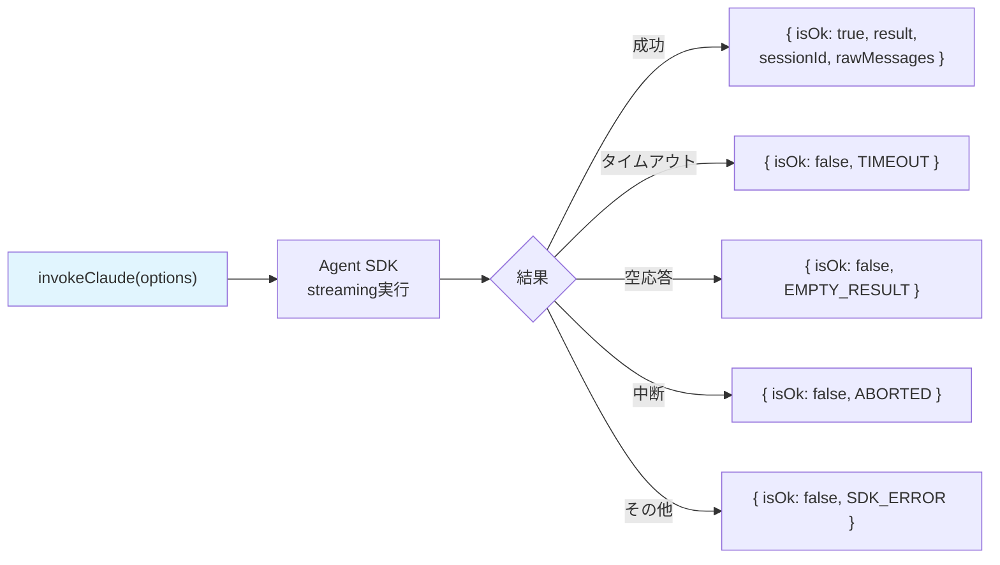

- `signal` (AbortSignal) でキャンセル可能
- `onToolUse` コールバック: ツール実行を検知して `handleToolUse()` に中継
- `checkSessionContinuity()`: セッション維持チェック（画面遷移検出用）

---

## agents.ts: サブエージェント定義

```text
advisor   — root エージェントとして動作。プロンプトは prompts.ts で定義（ここの定義は形式上のみ）
researcher — skills/ の Read / Write / Glob のみ使用可能。操作手順・表現技法の調査・蓄積
```

**注意**: researcher のツールは `["Read", "Write", "Glob"]` の3つだけ。WebSearch や Bash は root が直接実行する。researcher はスキルファイルの読み書きに特化している。

---

## skills.ts: スキルファイルとツール権限

2つの役割を持つファイル。

### ① スキルマニフェスト生成

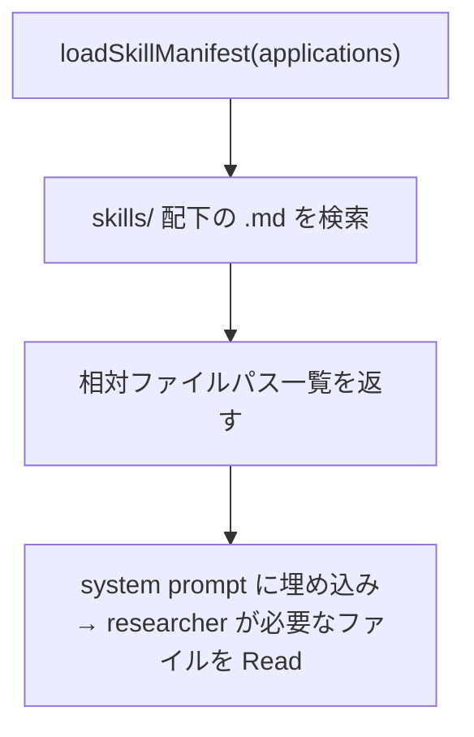

### ② ツール権限ガード（createToolPermissionGuard）

`canUseTool` コールバックとして SDK に登録される。**allowedTools に含まれないツール**の実行時に呼ばれる。

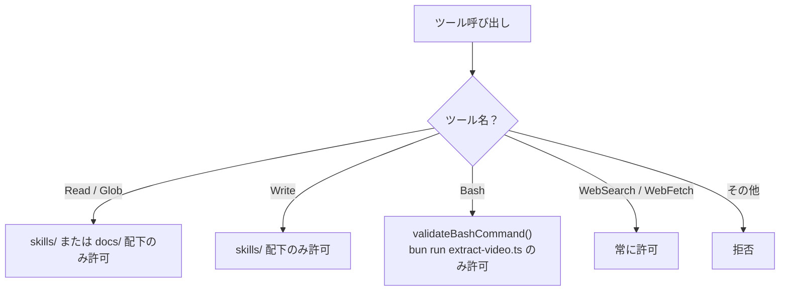

### validateBashCommand の検証フロー

```text
入力: "cd packages/core && bun run src/extract-video.ts 'https://youtube.com/watch?v=xxx'"
  ↓ cd プレフィックスを除去
  ↓ "bun run" であることを確認
  ↓ スクリプトが extract-video.ts であることを確認
  ↓ URL が YouTube URL パターンに一致することを確認
  ↓ シェルメタ文字（; | & ` $ 等）がないことを確認
  → OK
```

### ③ パス契約: `skills/` 仮想ルートと resolveSkillPath

スキルファイルの書き込みは「**`skills/` という単語が必ず `SKILLS_ROOT`（= `packages/core/skills`）の別名を指す**」という仮想ルート契約で統一されている。これは過去の事故対策として導入された設計。

#### なぜ仮想ルートが必要だったか

歴史的な経緯として、3者（LLM・manifest 表示・権限ガード）が同じ `skills/` という単語を**バラバラの意味**で使っていたことで、`skills/ 外への書き込みを検出` エラーが頻発していた。

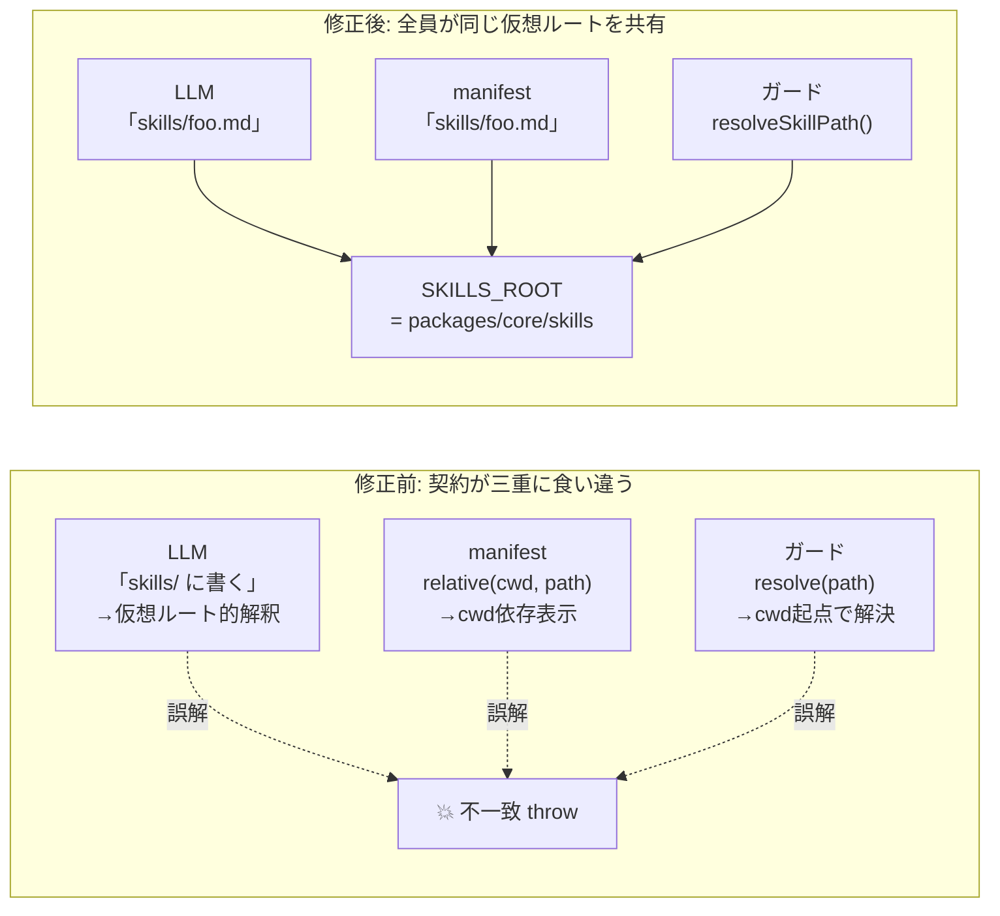

#### 事故の流れ（修正前の挙動）

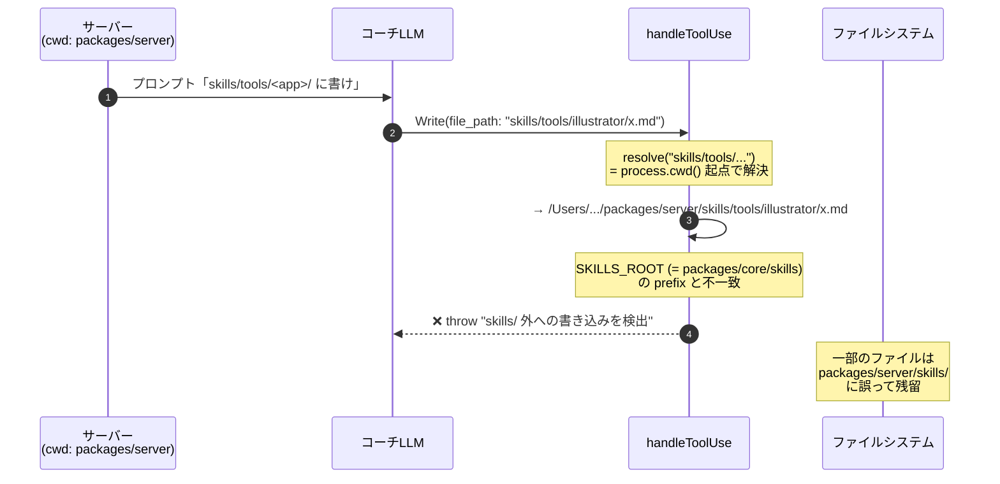

「LLM が思っている skills の場所」と「ガードが認める skills の場所」が、サーバーの cwd を介して食い違っていたのが本質。

#### resolveSkillPath の解決フロー（修正後）

`skills.ts` の `resolveSkillPath(filePath)` がパス契約の中核。3つの分岐で「LLM の意図」を `SKILLS_ROOT` 配下に着地させる:


#### 「再マップ」の救済処理

LLM がプロンプト指示を無視して絶対パスを構築してきた場合の補正。サーバーの cwd を取り違えた絶対パスを自動で正しい場所に着地させる。

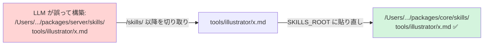

#### 契約を守る3つの仕組み

| レイヤー | 役割 | 実装箇所 |
|---|---|---|
| プロンプト | 「Write の file_path は必ず `skills/` 仮想パス」と明示 | `prompts.ts` のステップ4 |
| manifest | `relative(SKILLS_ROOT, ...)` で `skills/...` 形式に統一 | `skills.ts:formatManifest` |
| ガード | `resolveSkillPath()` で `skills/` を SKILLS_ROOT 基準に解決 | `skills.ts` + `coach-loop.ts:handleToolUse` |

これら3つが揃うことで、サーバーの cwd がどこであろうが、LLM がどう書こうが、最終的に `SKILLS_ROOT` 配下にしか書き込めない契約が成立する。

---

## planner.ts: プラン生成

セットアップ時に実行。ループとは別のフロー。

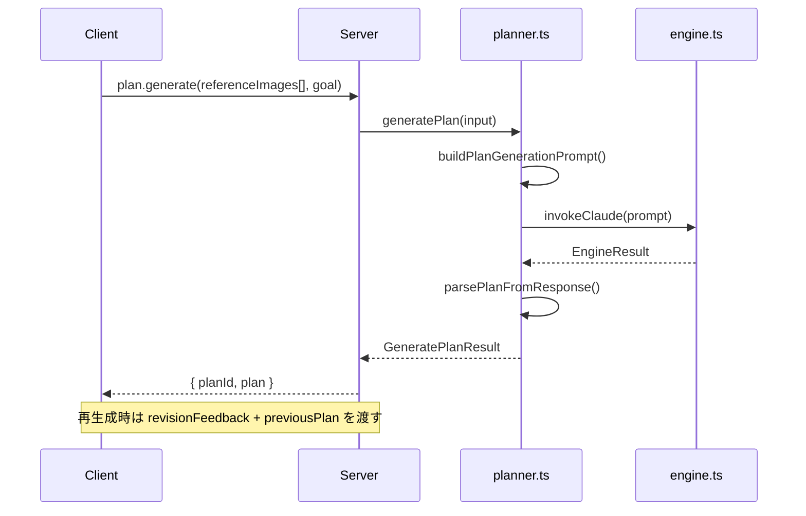

`GeneratePlanInput` は複数のリファレンス画像を受け取る:

```ts
type ReferenceImageInput = { path: string; label: string };
type GeneratePlanInput = {
  referenceImages: readonly ReferenceImageInput[];
  goalDescription: string;
  revisionFeedback?: string;
  previousPlan?: Plan;
};
```

---

## capture.ts + diff.ts: キャプチャと差分検出

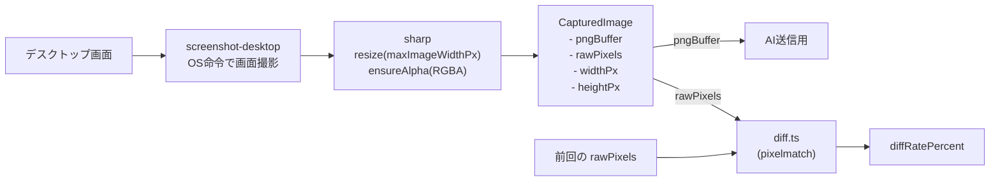

2つの threshold の違い:

| 名前 | 範囲 | 意味 |
|------|------|------|
| `pixelmatchThreshold` | 0.0 - 1.0 | ピクセル単位の色差感度 |
| `diffThresholdPercent` | 例: 5% | 画面全体の変化率の閾値 |

---

## CoachLoopHandle: 外部から操作するためのインターフェース

`startCoachLoop()` が返すハンドル。server の `coach-session.ts` がこれを保持してフロントエンドからの操作を中継する。

```ts
type CoachLoopHandle = {
  readonly loopFinished: Promise<void>;       // ループ終了を待つ
  readonly submitMessage: (msg: UserMessage) => void;  // メッセージ送信
  readonly pause: () => void;                 // 一時停止
  readonly resume: () => void;                // 再開
  readonly isPaused: () => boolean;           // 一時停止中か
};
```

---

## コアの内部ヘルパー（export されない関数）

coach-loop.ts 内で定義されている非公開の構造:

| 関数/型 | 役割 |
|---------|------|
| `createMessageBox()` | メッセージのキューイングとループの即時起床 |
| `createPauseControl()` | 一時停止フラグとコールバック管理 |
| `waitForNextRound()` | 5トリガー（timer/abort/message/pause/resume）の統一待機 |
| `awaitUnpause()` | pause 中の専用待機（resume/abort/message で解決） |
| `executeOneRound()` | 1ラウンド分の処理（キャプチャ→diff→AI→結果解析） |
| `checkScreenDiff()` | diff 結果を DiffCheckResult に変換 |
| `deriveNextState()` | 次ラウンド用の LoopState を導出（不変更新） |
| `handleToolUse()` | onToolUse コールバック。Bash/Write の安全チェック |
