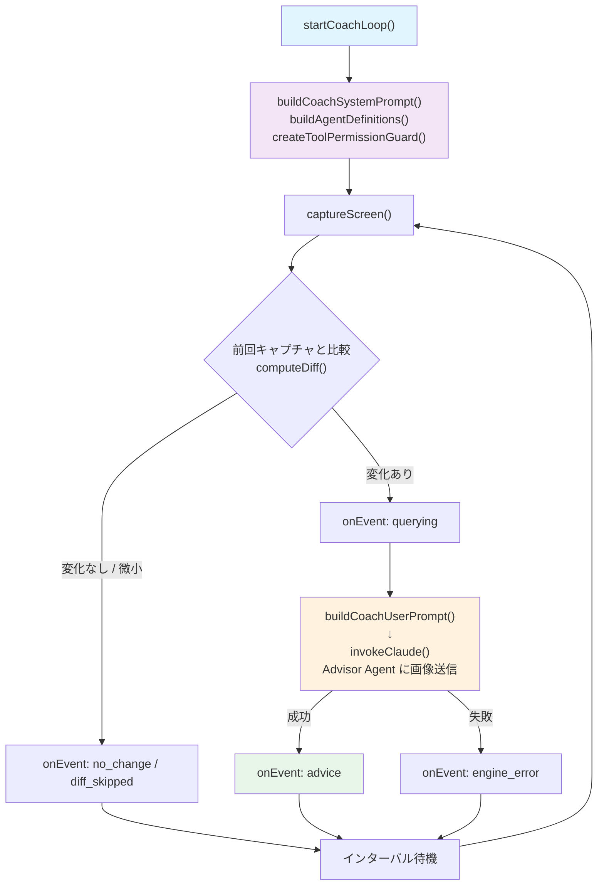
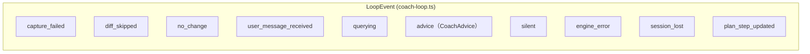
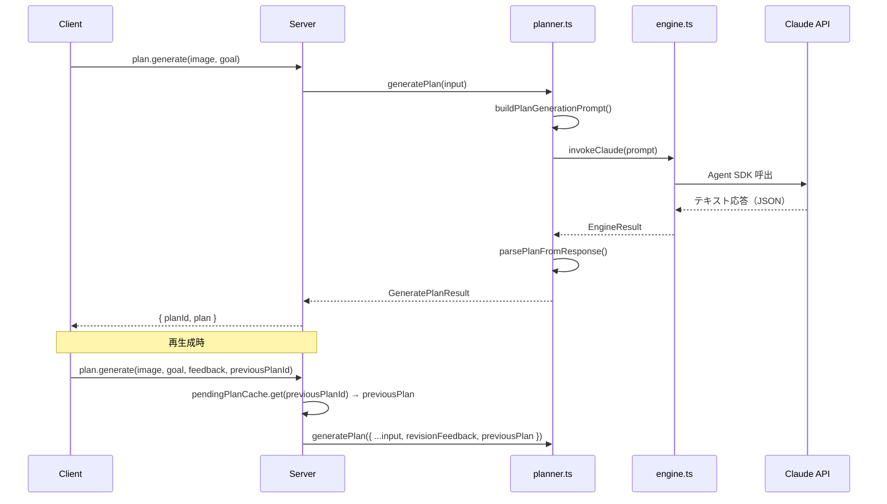
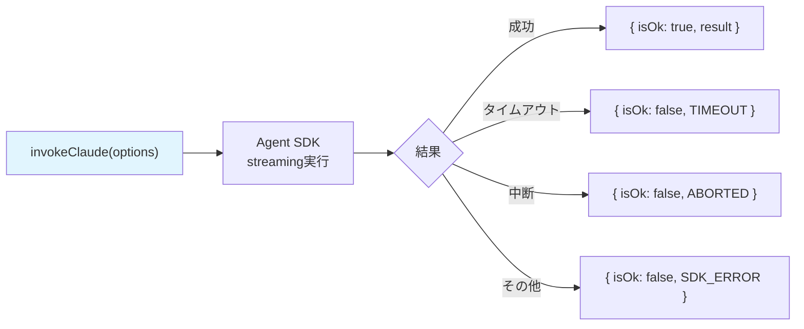
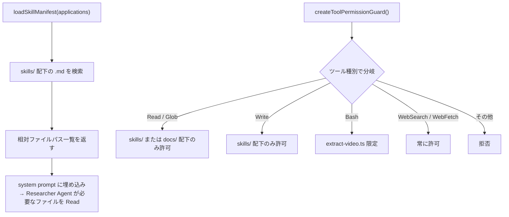

# @dcc/core リーディングガイド

> 最終更新: 2026-03-17

## このパッケージの役割

`@dcc/core` はコーチングのドメインロジックを集約したパッケージ。server / cli の両方から利用される共有基盤。

ただし「純粋関数だけ」ではない点に注意。スクリーンキャプチャ（OS API）、ファイルI/O（一時PNG書出）、外部API呼出（Claude SDK, Gemini API）など副作用を伴う処理も含まれる。`diff.ts` や `planner.ts` の解析ロジックは純粋だが、パッケージ全体としては副作用を持つ。

## ファイルマップ

```text
packages/core/src/
├── index.ts            ← バレルexport（全公開APIの窓口）
│
│ ── コーチングループ ──
├── coach-loop.ts       ← [最重要] コーチングの心臓部
├── engine.ts           ← Claude Agent SDK ラッパー
├── prompts.ts          ← システム/ユーザープロンプト構築（ループ毎回使用）
├── agents.ts           ← マルチエージェント定義 ADVISOR / RESEARCHER（ループ毎回使用）
├── skills.ts           ← スキルファイルパス収集・ツール権限ガード（ループ毎回使用）
│
│ ── キャプチャ・差分 ──
├── capture.ts          ← スクリーンキャプチャ（screenshot-desktop + sharp）
├── diff.ts             ← 画像差分検出（pixelmatch）— 純粋関数
│
│ ── プラン生成 ──
├── planner.ts          ← プラン生成（Claude呼出→JSON解析）
│
│ ── ユーティリティ ──
├── config.ts           ← config.json 読込
├── list-displays.ts    ← ディスプレイ一覧取得
├── paths.ts            ← プロジェクトパス定数
├── output.ts           ← CLI向けイベント表示
├── gemini.ts           ← YouTube動画からDCC技法を抽出（Gemini API）
└── extract-video.ts    ← gemini.ts のCLIエントリ
```

## 全体フロー: コーチングループの1サイクル

これが core の核心。`startCoachLoop()` が呼ばれると、以下のサイクルが abort されるまで繰り返される。



**注意**: `prompts.ts`, `agents.ts`, `skills.ts` はループの各サイクルで使用される。後回しにせず `coach-loop.ts` と一緒に読むこと。

**読むべきファイル**: `coach-loop.ts` → `prompts.ts` + `agents.ts` + `skills.ts` → `engine.ts`

## 重要な型: LoopEvent

coach-loop が `onEvent` コールバックで通知するイベント。server の EventBus はこれに `sessionId` をタグ付けして配信する。



> `started` と `stopped` は LoopEvent の union に含まれるが、**core 内では発火されない**。`stopped` は server 側の `coach-session.ts` が `loopFinished` Promise 解決後に EventBus へ publish する。

| イベント | 意味 | UIでの表示 |
|---------|------|-----------|
| `advice` | Claudeからのアドバイス到着 | ダッシュボードに表示 |
| `engine_error` | Claude呼出失敗 | エラー表示 |
| `plan_step_updated` | プランステップ進捗更新 | 進捗バッジ変化 |
| `user_message_received` | ユーザーからのメッセージ到着 | (内部フロー) |
| `stopped` | ループ終了 (**server側で発火**) | 「終了」バッジ |

## プラン生成フロー

セットアップ時に実行。ループとは別のフロー。再生成時は `revisionFeedback` + `previousPlan` を渡して修正プランを生成する。



**読むべきファイル**: `planner.ts` のみ。プロンプト構造を知りたければ `prompts.ts`

## engine.ts: Claude Agent SDK ラッパー



- `signal` (AbortSignal) でキャンセル可能
- `checkSessionContinuity()` はセッション維持チェック（画面遷移検出用）

## スキルシステム



スキルファイルは Photoshop 等のツール操作手順書。`loadSkillManifest()` はファイルの**内容**ではなく**パス一覧**を返す。Agent が必要に応じて Read ツールで中身を参照する設計。

## 読む順番の推奨

1. **`index.ts`** — 何がexportされているか全体像を把握
2. **`coach-loop.ts`** — 最重要。ループ全体のフローを理解
3. **`prompts.ts` + `agents.ts` + `skills.ts`** — ループの各サイクルで使われるプロンプト構築・エージェント定義・権限ガード
4. **`engine.ts`** — Claude呼出の仕組み
5. **`planner.ts`** — プラン生成の仕組み
6. **`capture.ts` + `diff.ts`** — スクリーンキャプチャと差分検出

残り（config, list-displays, paths, output, gemini）は必要になったときに読めばよい。
