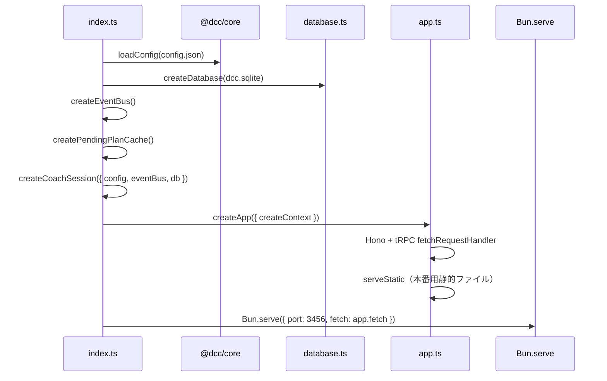
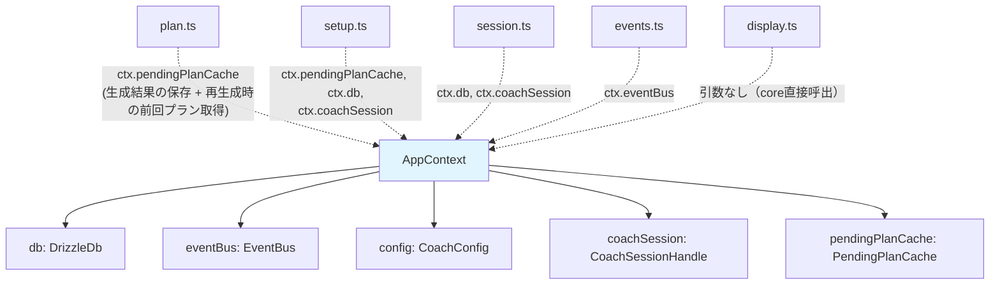
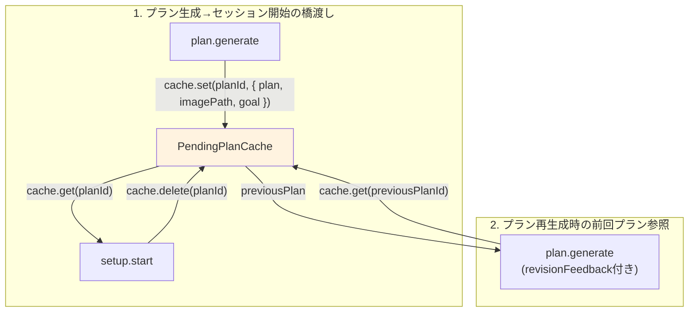
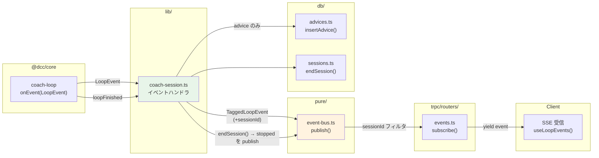
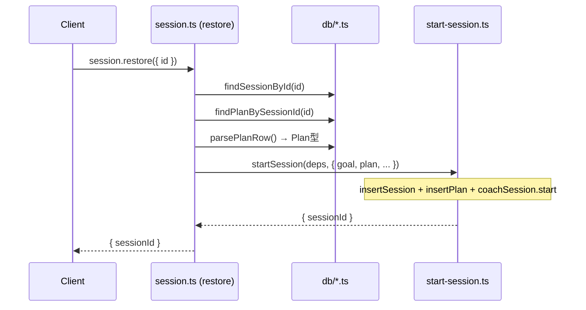
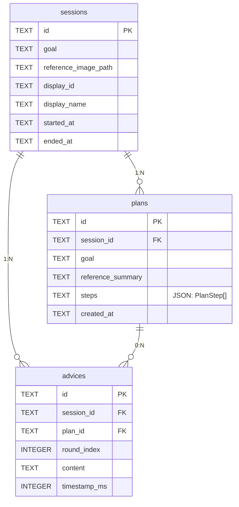
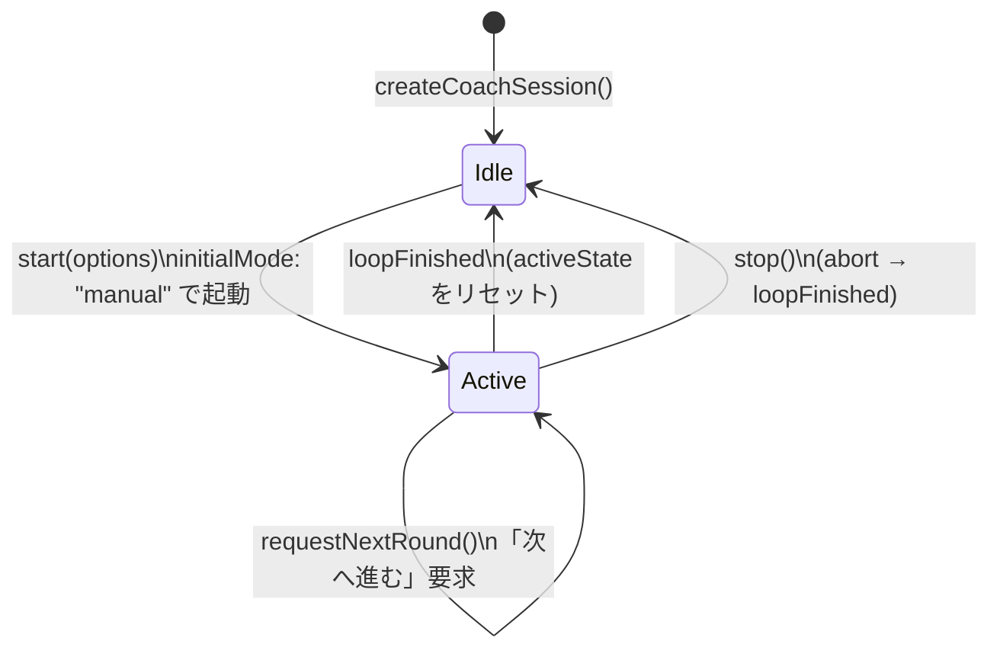
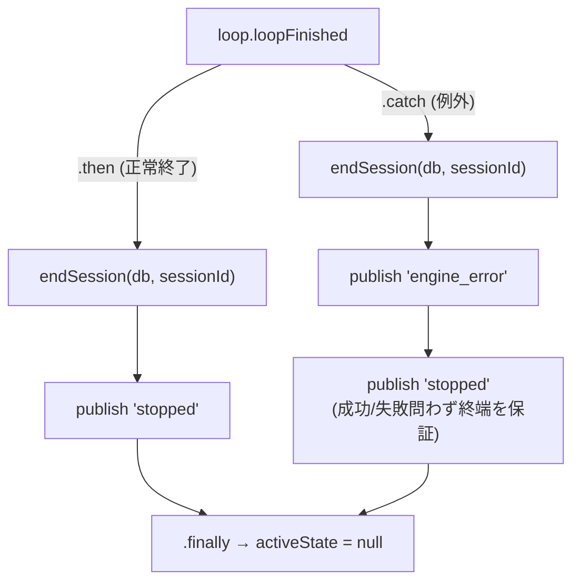

# @dcc/server リーディングガイド

> 最終更新: 2026-04-08

## このパッケージの役割

`@dcc/server` は Hono + tRPC のWebサーバー。`@dcc/core` のドメインロジックを HTTP API として公開し、SQLite で状態を永続化する。mutable shell（副作用層）にあたる。

## ファイルマップ

```text
packages/server/src/
├── index.ts              ← サーバー起動エントリポイント
├── app.ts                ← Hono アプリ定義（tRPCマウント + 静的配信）
│
├── trpc/
│   ├── trpc.ts           ← tRPC 初期化（router, publicProcedure）
│   ├── context.ts        ← AppContext 型定義（全ルーター共通の依存注入）
│   ├── router.ts         ← 全ルーター統合 → AppRouter 型をexport
│   └── routers/
│       ├── plan.ts       ← プラン生成 mutation
│       ├── setup.ts      ← セッション開始 mutation
│       ├── session.ts    ← セッション一覧/詳細/復元
│       ├── display.ts    ← ディスプレイ一覧 query
│       ├── events.ts     ← SSE subscription（リアルタイムイベント配信）
│       └── debug.ts      ← 開発用デバッグAPI（本番では無効）
│
├── db/
│   ├── database.ts       ← SQLite + Drizzle ORM 初期化
│   ├── schema.ts         ← テーブル定義（sessions, plans, advices）
│   ├── sessions.ts       ← sessions テーブル操作
│   ├── plans.ts          ← plans テーブル操作 + JSON パース
│   └── advices.ts        ← advices テーブル操作
│
├── lib/
│   ├── coach-session.ts  ← [最重要] コーチングループのライフサイクル管理
│   ├── start-session.ts  ← [重要] セッション開始の共通ワークフロー（setup/restore両方が使用）
│   ├── image-store.ts    ← Base64画像のバリデーション・保存
│   └── logger.ts         ← タグ付きログユーティリティ
│
└── pure/
    ├── event-bus.ts      ← Pub/Sub イベント配信
    └── pending-plan-cache.ts ← プラン一時キャッシュ（TTL 30分）
```

### ディレクトリの設計意図

| ディレクトリ | 責務 | 副作用 |
|-------------|------|--------|
| `pure/` | 副作用なし。インメモリのデータ構造 | なし |
| `lib/` | core 呼出、DB書込、ファイルI/O | あり |
| `db/` | SQLite 操作。Drizzle ORM 経由 | あり |
| `trpc/` | HTTP API 定義。入力バリデーション | なし（ルーター自体は純粋） |

## 起動フロー

`bun run packages/server/src/index.ts` で何が起きるか。



**読むべきファイル**: `index.ts` → `app.ts` → `trpc/context.ts`

## AppContext: 全ルーターの共有依存



`index.ts` で1回だけ生成され、全リクエストで共有されるシングルトン群。

## PendingPlanCache の役割

DBに書き込む前のプランを一時保持するインメモリキャッシュ。2つの場面で使われる:



- TTL 30分で自動evict（ユーザーが放置した場合のメモリリーク防止）
- DBには `setup.start` が呼ばれた時点で初めて書き込まれる

## メインフロー1: プラン生成 → セッション開始

ユーザーのセットアップ操作で発生する一連のフロー。

```mermaid
sequenceDiagram
    participant C as Client
    participant P as plan.ts
    participant IS as image-store.ts
    participant Core as @dcc/core
    participant Cache as PendingPlanCache
    participant S as setup.ts
    participant SS as start-session.ts
    participant DB as db/*.ts
    participant CS as coach-session.ts
    participant Loop as @dcc/core coach-loop

    Note over C,P: Phase 1: プラン生成
    C->>P: plan.generate({ image, goal })
    P->>IS: saveBase64Image(base64, fileName)
    IS-->>P: { filePath }
    P->>Core: generatePlan({ imagePath, goal })
    Core-->>P: { plan }
    P->>Cache: cache.set(planId, { plan, imagePath, goal })
    P-->>C: { planId, plan }

    Note over C,P: Phase 1.5: プラン再生成（任意）
    C->>P: plan.generate({ ..., feedback, previousPlanId })
    P->>Cache: cache.get(previousPlanId) → previousPlan
    P->>Core: generatePlan({ ..., revisionFeedback, previousPlan })
    Core-->>P: { plan }
    P->>Cache: cache.set(newPlanId, { plan, ... })
    P-->>C: { newPlanId, plan }

    Note over C,S: Phase 2: セッション開始
    C->>S: setup.start({ displayId, displayName, planId })
    S->>Cache: cache.get(planId)
    Cache-->>S: { plan, imagePath, goal }
    S->>Cache: cache.delete(planId)
    S->>SS: startSession(deps, params)
    SS->>DB: insertSession()
    SS->>DB: insertPlan()
    SS->>CS: coachSession.start(options)
    CS->>Core: loadSkillManifest()
    CS->>Loop: startCoachLoop()
    Note over Loop: ループ開始（非同期で継続）
    SS-->>S: { sessionId }
    S-->>C: { sessionId }
```

**読むべきファイル**: `trpc/routers/plan.ts` → `trpc/routers/setup.ts` → `lib/start-session.ts` → `lib/coach-session.ts`

## メインフロー2: リアルタイムイベント配信（SSE）

コーチングループが動いている間のデータフロー。



> **注意**: `stopped` イベントは core の coach-loop が発火するのではなく、server の `coach-session.ts` が `loopFinished` Promise の `.then` / `.catch` 両方で EventBus へ publish する。「成功/失敗問わずループが終端した」というセマンティクスを backend が保証する契約。`.catch` 経路では `engine_error` の後に `stopped` も流す。
>
> **順序が重要**: `stopped` を publish する**前**に `endSession()` を呼んで DB の `endedAt` を埋める。client が `stopped` 受信時に `session.get` を invalidate（再取得）しても `endedAt` が NULL のまま返らないようにするため。

**読むべきファイル**: `lib/coach-session.ts`（イベントハンドラ部分）→ `pure/event-bus.ts` → `trpc/routers/events.ts`

## メインフロー3: セッション復元

過去セッションの復元は `session.restore` → `startSession()` の共通パスを通る。



`start-session.ts` は `setup.start` と `session.restore` の**両方**が使用する共通ワークフロー。DB永続化 → ループ起動の接続点。

## DBスキーマ



- `plans.steps` は `PlanStep[]` のJSON文字列。`parsePlanRow()` / `parseStepsJson()` でデシリアライズ
- `advices` は coach-loop の `advice` イベント到着時に1行ずつ INSERT

## coach-session.ts: ライフサイクル管理

このファイルが server パッケージの心臓部。



内部状態は `activeState: { sessionId, loop, abortController } | null` の単一オブジェクトで管理。

`CoachSessionHandle` の API:

| メソッド | 役割 |
|---|---|
| `start(options)` | コーチングループ起動。常に `initialMode: "manual"` で開始 |
| `getMode(sessionId)` | 現在のモード取得（非アクティブなら `null`） |
| `setMode(sessionId, mode)` | manual/auto 切替を core 層に委譲 |
| `requestNextRound(sessionId)` | 「次へ進む」要求を core 層に委譲（連打 dedupe は core 側） |
| `submitMessage(sessionId, msg)` | ユーザーメッセージ送信 |
| `stop()` | abort で全終了 |

旧仕様の `pause` / `resume` / `isSessionPaused` は **削除済み**。`setMode("manual")` で「自動ループを止める」という意味になる。

### `loopFinished` Promise の終端処理



`.catch` 経路でも `stopped` を流すことで、client は「`stopped` を見ればループが終端した」と単一ルールで扱える。`engine_error` を別途特別扱いする必要がない。

## 読む順番の推奨

1. **`index.ts`** — 起動で何が組み立てられるか
2. **`trpc/context.ts`** — 全ルーターに何が渡されるか
3. **`trpc/routers/plan.ts` → `setup.ts`** — メインのユーザーフロー
4. **`lib/start-session.ts`** — setup/restore の共通パス。DB永続化とループ起動の接続点
5. **`lib/coach-session.ts`** — ループ管理の仕組み
6. **`trpc/routers/events.ts` + `pure/event-bus.ts`** — SSEの仕組み
7. **`db/schema.ts`** — テーブル構造

`lib/image-store.ts`, `lib/logger.ts`, `pure/pending-plan-cache.ts`, `db/sessions.ts` 等は必要なときに参照すれば十分。
