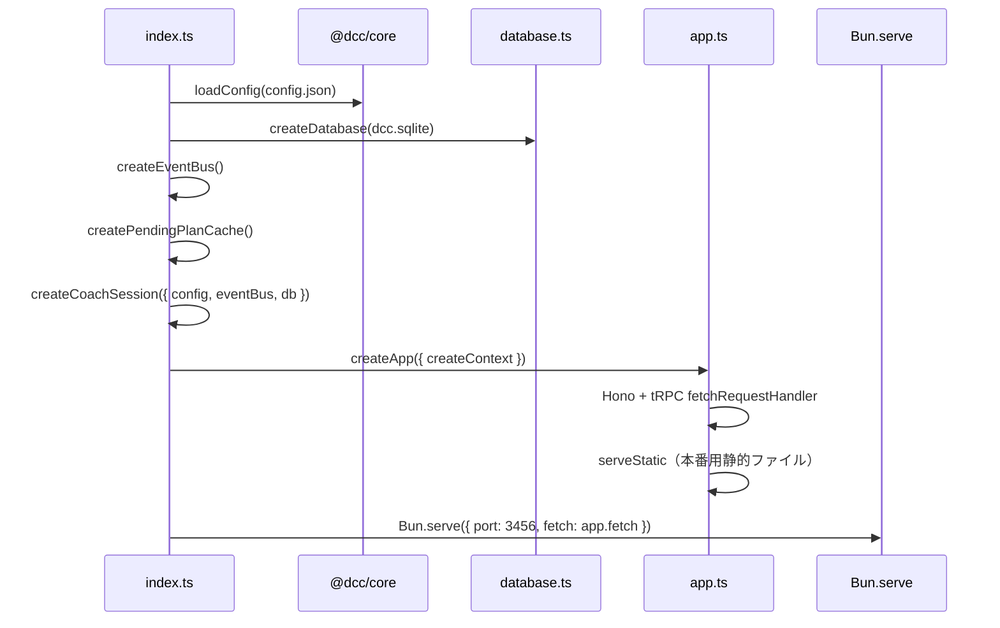
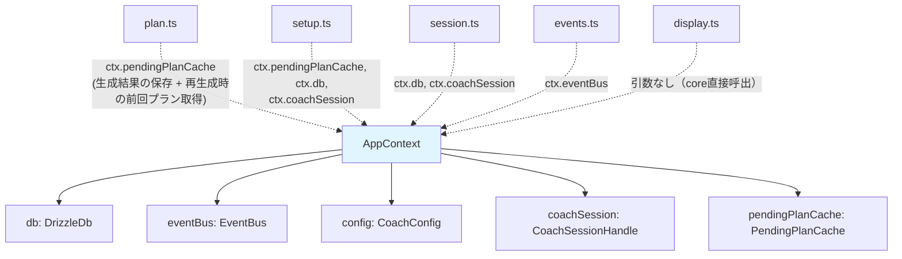
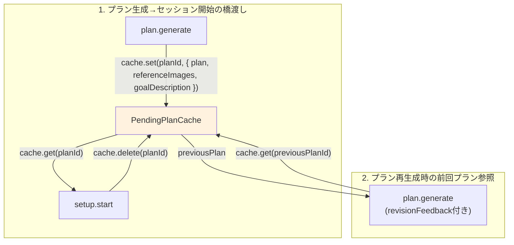
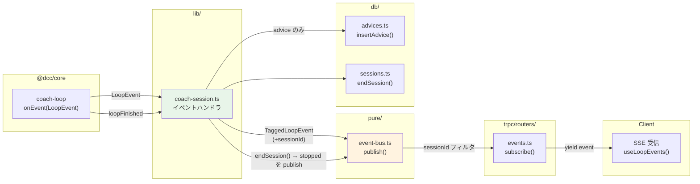
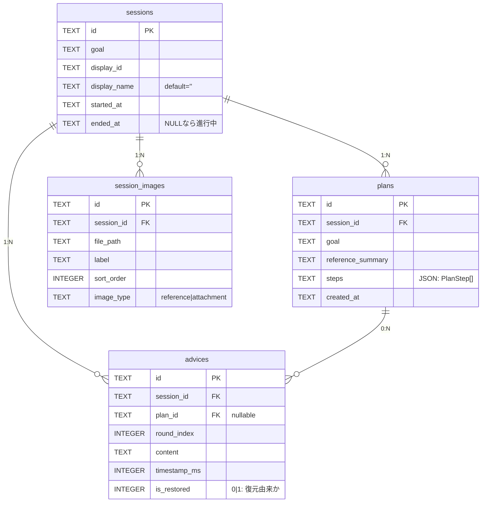
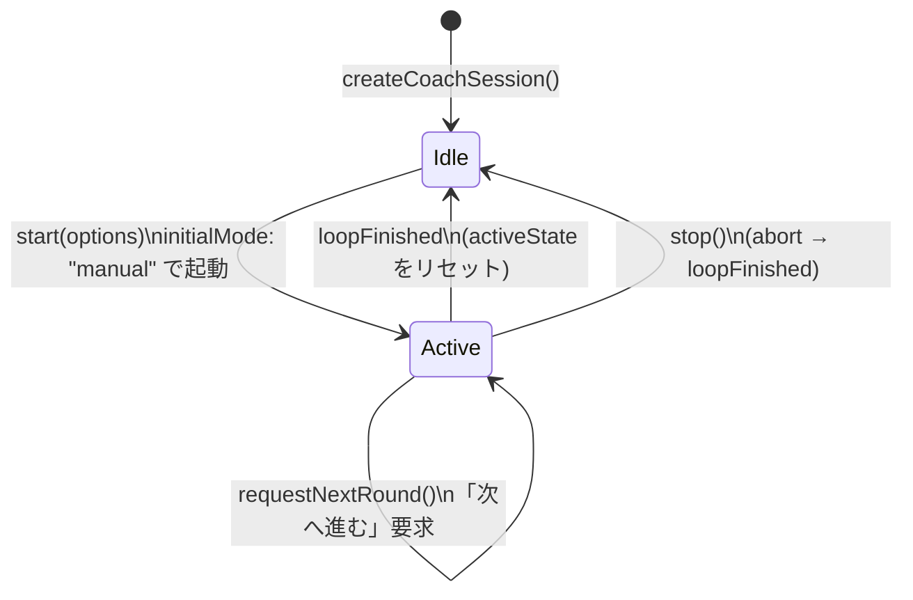
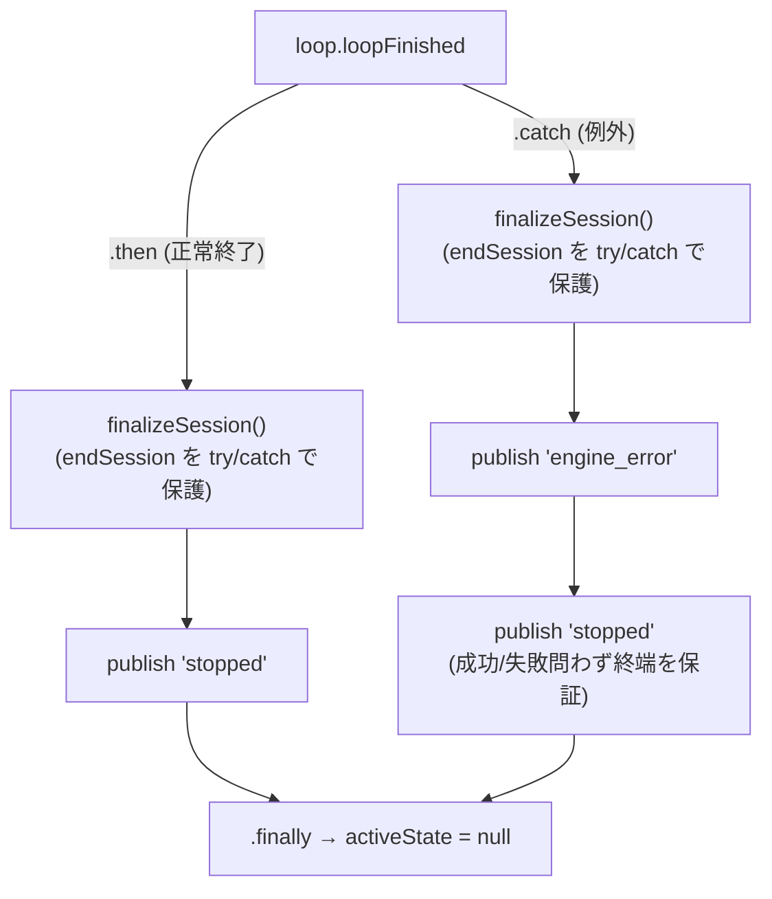

# @dcc/server リーディングガイド

> 最終更新: 2026-04-27

## このパッケージの役割

`@dcc/server` は Hono + tRPC のWebサーバー。`@dcc/core` のドメインロジックを HTTP API として公開し、SQLite で状態を永続化する。mutable shell（副作用層）にあたる。

## ファイルマップ

```text
packages/server/src/
├── index.ts              ← サーバー起動エントリポイント
├── app.ts                ← Hono アプリ定義（tRPCマウント + 静的配信）
│
├── trpc/
│   ├── trpc.ts           ← tRPC 初期化（router, publicProcedure）
│   ├── context.ts        ← AppContext 型定義（全ルーター共通の依存注入）
│   ├── router.ts         ← 全ルーター統合 → AppRouter 型をexport
│   └── routers/
│       ├── plan.ts       ← プラン生成 mutation
│       ├── setup.ts      ← セッション開始 mutation
│       ├── session.ts    ← セッション一覧/詳細/復元
│       ├── display.ts    ← ディスプレイ一覧 query
│       ├── events.ts     ← SSE subscription（リアルタイムイベント配信）
│       └── debug.ts      ← 開発用デバッグAPI（本番では無効）
│
├── db/
│   ├── database.ts       ← SQLite + Drizzle ORM 初期化
│   ├── schema.ts         ← テーブル定義（sessions, plans, advices, session_images）
│   ├── sessions.ts       ← sessions テーブル操作 + purgeOldSessions()
│   ├── plans.ts          ← plans テーブル操作 + JSON パース
│   ├── advices.ts        ← advices テーブル操作（isRestored 含む）
│   └── session-images.ts ← session_images テーブル操作（reference / attachment 画像の保存・取得・コピー）
│
├── lib/
│   ├── coach-session.ts  ← [最重要] コーチングループのライフサイクル管理
│   ├── start-session.ts  ← [重要] setup.start からのセッション開始ワークフロー + schedulePurge()
│   ├── image-store.ts    ← Base64画像のバリデーション・保存
│   └── logger.ts         ← タグ付きログユーティリティ
│
└── pure/
    ├── event-bus.ts      ← Pub/Sub イベント配信
    └── pending-plan-cache.ts ← プラン一時キャッシュ（TTL 30分）
```

### ディレクトリの設計意図

| ディレクトリ | 責務 | 副作用 |
|-------------|------|--------|
| `pure/` | 副作用なし。インメモリのデータ構造 | なし |
| `lib/` | core 呼出、DB書込、ファイルI/O | あり |
| `db/` | SQLite 操作。Drizzle ORM 経由 | あり |
| `trpc/` | HTTP API 定義。入力バリデーション | なし（ルーター自体は純粋） |

## 起動フロー

ルートから `bun run dev`（または `bun run start:web`）で起動する。`process.cwd()` をリポジトリルートに固定するため、ルートの `package.json` は `bun --watch run packages/server/src/index.ts` を直接呼ぶ形にしてある（旧 `bun run --filter @dcc/server dev` だと CWD が `packages/server/` になり `.env` の auto-load が効かなかった）。


```mermaid
sequenceDiagram
    participant Index as index.ts
    participant Core as @dcc/core
    participant DB as database.ts
    participant App as app.ts
    participant Bun as Bun.serve

    Index->>Core: loadConfig(config.json)
    Index->>DB: createDatabase(dcc.sqlite)
    Index->>Index: createEventBus()
    Index->>Index: createPendingPlanCache()
    Index->>Index: createCoachSession({ config, eventBus, db })
    Index->>App: createApp({ createContext })
    App->>App: Hono + tRPC fetchRequestHandler
    App->>App: serveStatic（本番用静的ファイル）
    Index->>Bun: Bun.serve({ port: 3456, fetch: app.fetch })
```

**読むべきファイル**: `index.ts` → `app.ts` → `trpc/context.ts`

## AppContext: 全ルーターの共有依存


```mermaid
graph TD
    CTX["AppContext"]
    CTX --> DB["db: DrizzleDb"]
    CTX --> EB["eventBus: EventBus"]
    CTX --> CFG["config: CoachConfig"]
    CTX --> CS["coachSession: CoachSessionHandle"]
    CTX --> PPC["pendingPlanCache: PendingPlanCache"]

    R1["plan.ts"] -.->|"ctx.pendingPlanCache\n(生成結果の保存 + 再生成時の前回プラン取得)"| CTX
    R2["setup.ts"] -.->|"ctx.pendingPlanCache, ctx.db,\nctx.coachSession"| CTX
    R3["session.ts"] -.->|"ctx.db, ctx.coachSession"| CTX
    R4["events.ts"] -.->|"ctx.eventBus"| CTX
    R5["display.ts"] -.->|"引数なし（core直接呼出）"| CTX

    style CTX fill:#e1f5fe
```

`index.ts` で1回だけ生成され、全リクエストで共有されるシングルトン群。

## PendingPlanCache の役割

DBに書き込む前のプランを一時保持するインメモリキャッシュ。2つの場面で使われる:


```mermaid
flowchart TD
    subgraph "1. プラン生成→セッション開始の橋渡し"
        A["plan.generate"] -->|"cache.set(planId, { plan, referenceImages, goalDescription })"| C["PendingPlanCache"]
        C -->|"cache.get(planId)"| B["setup.start"]
        B -->|"cache.delete(planId)"| C
    end

    subgraph "2. プラン再生成時の前回プラン参照"
        D["plan.generate\n(revisionFeedback付き)"] -->|"cache.get(previousPlanId)"| C
        C -->|"previousPlan"| D
    end

    style C fill:#fff3e0
```

- TTL 30分で自動evict（ユーザーが放置した場合のメモリリーク防止）
- DBには `setup.start` が呼ばれた時点で初めて書き込まれる

## メインフロー1: プラン生成 → セッション開始

ユーザーのセットアップ操作で発生する一連のフロー。

```mermaid
sequenceDiagram
    participant C as Client
    participant P as plan.ts
    participant IS as image-store.ts
    participant Core as @dcc/core
    participant Cache as PendingPlanCache
    participant S as setup.ts
    participant SS as start-session.ts
    participant DB as db/*.ts
    participant CS as coach-session.ts
    participant Loop as @dcc/core coach-loop

    Note over C,P: Phase 1: プラン生成
    C->>P: plan.generate({ referenceImages[], goalDescription })
    P->>IS: saveBase64Images(referenceImages)
    IS-->>P: [{ path, label }, ...]
    P->>Core: generatePlan({ referenceImages, goalDescription })
    Core-->>P: { plan }
    P->>Cache: cache.set(planId, { plan, referenceImages, goalDescription })
    P-->>C: { planId, plan }

    Note over C,P: Phase 1.5: プラン再生成（任意）
    C->>P: plan.generate({ ..., revisionFeedback, previousPlanId })
    P->>Cache: cache.get(previousPlanId) → previousPlan
    P->>Core: generatePlan({ ..., revisionFeedback, previousPlan })
    Core-->>P: { plan }
    P->>Cache: cache.set(newPlanId, { plan, ... })
    P-->>C: { newPlanId, plan }

    Note over C,S: Phase 2: セッション開始
    C->>S: setup.start({ displayId, displayName, planId })
    S->>Cache: cache.get(planId)
    Cache-->>S: { plan, referenceImages, goalDescription }
    S->>Cache: cache.delete(planId)
    S->>SS: startSession(deps, params)
    SS->>DB: insertSession()
    SS->>DB: insertPlan()
    SS->>DB: insertSessionImages(reference)
    SS->>CS: coachSession.start(options)
    CS->>Core: loadSkillManifest()
    CS->>Loop: startCoachLoop()
    Note over Loop: ループ開始（非同期で継続）
    SS->>SS: schedulePurge() (setImmediate で非同期)
    SS-->>S: { sessionId }
    S-->>C: { sessionId }
```

**読むべきファイル**: `trpc/routers/plan.ts` → `trpc/routers/setup.ts` → `lib/start-session.ts` → `lib/coach-session.ts`

## メインフロー2: リアルタイムイベント配信（SSE）

コーチングループが動いている間のデータフロー。


```mermaid
flowchart LR
    subgraph "@dcc/core"
        CL["coach-loop\nonEvent(LoopEvent)"]
    end

    subgraph "lib/"
        CS["coach-session.ts\nイベントハンドラ"]
    end

    subgraph "pure/"
        EB["event-bus.ts\npublish()"]
    end

    subgraph "db/"
        ADV["advices.ts\ninsertAdvice()"]
        SESS["sessions.ts\nendSession()"]
    end

    subgraph "trpc/routers/"
        EV["events.ts\nsubscribe()"]
    end

    subgraph "Client"
        SSE["SSE 受信\nuseLoopEvents()"]
    end

    CL -->|"LoopEvent"| CS
    CS -->|"TaggedLoopEvent\n(+sessionId)"| EB
    CS -->|"advice のみ"| ADV
    EB -->|"sessionId フィルタ"| EV
    EV -->|"yield event"| SSE

    CL -->|"loopFinished"| CS
    CS -->|"endSession() → stopped を publish"| EB
    CS --> SESS

    style EB fill:#fff3e0
    style CS fill:#e8f5e9
```

> **注意**: `stopped` イベントは core の coach-loop が発火するのではなく、server の `coach-session.ts` が `loopFinished` Promise の `.then` / `.catch` 両方で EventBus へ publish する。「成功/失敗問わずループが終端した」というセマンティクスを backend が保証する契約。`.catch` 経路では `engine_error` の後に `stopped` も流す。
>
> **順序が重要**: `stopped` を publish する**前**に `finalizeSession()` ヘルパー（`endSession()` を `try/catch` で保護）を呼んで DB の `endedAt` を埋める。DB エラーが発生しても `stopped` 配信は止まらない。ただし DB エラー時は `endedAt` が NULL のまま残るため、client 側では `stopped` 受信時に **invalidate ではなく `setData` で `endedAt` を直接埋める** セーフティネット設計を採用している（`use-loop-events.ts` 参照）。
>
> **`tool_activity` イベント**: ツール実行中の進捗メッセージ（例: 「YouTube 動画を要約しています...」）も同じ SSE チャンネルで配信される。DB 永続化の対象外で、SSE のみで流れる。client 側では `onToolActivity` 経由で「次へ進む」のローディング表示文言を動的に切り替える。

**読むべきファイル**: `lib/coach-session.ts`（イベントハンドラ部分）→ `pure/event-bus.ts` → `trpc/routers/events.ts`

## メインフロー3: セッション復元

過去セッションのアドバイス履歴を引き継いで**新セッション**を作成する。`startSession()` ではなく `session.restore` ルーター内で完結する 3 フェーズ構造（DB 直接操作 → coachSession.start → schedulePurge）。

```mermaid
sequenceDiagram
    participant C as Client
    participant SR as session.ts (restore)
    participant DB as db/*.ts
    participant CS as coach-session.ts
    participant Loop as @dcc/core coach-loop

    C->>SR: session.restore({ id })  ※id = 復元元セッションID

    Note over SR,DB: Phase 1: DB トランザクションで sessions/plans/advices を複製
    SR->>DB: findSessionById(input.id)
    SR->>DB: findPlanBySessionId(input.id)
    SR->>DB: tx { insertSession(新ID), insertPlan(コピー), insertAdvices(isRestored: 1) }

    Note over SR: Phase 1.5: トランザクション後に画像コピー
    SR->>DB: copyReferenceImages(input.id → 新ID)

    Note over SR,Loop: Phase 2: ループ起動 + 履歴注入
    SR->>DB: findAdvicesBySessionId(新ID) → previousAdvices
    SR->>CS: coachSession.start({ ..., previousAdvices, plan })
    CS->>Loop: startCoachLoop()
    Note over CS: 起動失敗時は endSession で補償（try/catch）

    Note over SR: Phase 3: 古いセッションを非同期パージ
    SR->>SR: schedulePurge(db, 新ID)（setImmediate）

    SR-->>C: { sessionId: 新ID }
```

> `start-session.ts` の `startSession()` は **`setup.start` 専用**。`session.restore` は履歴コピーが必要なため共通化せず、ルーター内に専用フローを実装している。両者の共通点は `coachSession.start` を呼ぶ点と `schedulePurge` を呼ぶ点のみ。

## DBスキーマ


```mermaid
erDiagram
    sessions {
        TEXT id PK
        TEXT goal
        TEXT display_id
        TEXT display_name "default=''"
        TEXT started_at
        TEXT ended_at "NULLなら進行中"
    }
    plans {
        TEXT id PK
        TEXT session_id FK
        TEXT goal
        TEXT reference_summary
        TEXT steps "JSON: PlanStep[]"
        TEXT created_at
    }
    advices {
        TEXT id PK
        TEXT session_id FK
        TEXT plan_id FK "nullable"
        INTEGER round_index
        TEXT content
        INTEGER timestamp_ms
        INTEGER is_restored "0|1: 復元由来か"
    }
    session_images {
        TEXT id PK
        TEXT session_id FK
        TEXT file_path
        TEXT label
        INTEGER sort_order
        TEXT image_type "reference|attachment"
    }

    sessions ||--o{ plans : "1:N"
    sessions ||--o{ advices : "1:N"
    sessions ||--o{ session_images : "1:N"
    plans ||--o{ advices : "0:N"
```

- `plans.steps` は `PlanStep[]` のJSON文字列。`parsePlanRow()` / `parseStepsJson()` でデシリアライズ
- `advices` は coach-loop の `advice` イベント到着時に 1 行ずつ INSERT。`isRestored` は `session.restore` でコピーされたものに `1` が立つ
- `session_images` は参考画像（`image_type: "reference"`）と添付画像（`image_type: "attachment"`、`sendMessage` 経由で保存）を 1 つのテーブルで管理。インデックス: `idx_session_images_session`
- `purgeOldSessions()`: セッション数が `MAX_SESSIONS = 200` を超えたら古いものから削除し、`sessions` / `plans` / `advices` / `session_images` をカスケード除去 + 参照されない画像ファイルを `unlink`。`setup.start` / `session.restore` 完了後に `schedulePurge()` 経由で非同期実行される

## coach-session.ts: ライフサイクル管理

このファイルが server パッケージの心臓部。


```mermaid
stateDiagram-v2
    [*] --> Idle: createCoachSession()
    Idle --> Active: start(options)\ninitialMode: "manual" で起動
    Active --> Active: start(options)\n前ループを abort して新ループ起動
    Active --> Active: setMode(mode)\nmanual ⇄ auto 切替
    Active --> Active: requestNextRound()\n「次へ進む」要求
    Active --> Idle: loopFinished\n(activeState をリセット)
    Active --> Idle: stop()\n(abort → loopFinished)
```

内部状態は `activeState: { sessionId, loop, abortController } | null` の単一オブジェクトで管理。

`CoachSessionHandle` の API:

| メソッド | 役割 |
|---|---|
| `start(options)` | コーチングループ起動。常に `initialMode: "manual"` で開始 |
| `getActiveSessionId()` | 現在アクティブなセッション ID を返す。なければ `null` |
| `isSessionActive(sessionId)` | 指定セッションがアクティブか判定（ルーター側の事前ガード用） |
| `getMode(sessionId)` | 現在のモード取得（非アクティブなら `null`） |
| `setMode(sessionId, mode)` | manual/auto 切替を core 層に委譲 |
| `requestNextRound(sessionId)` | 「次へ進む」要求を core 層に委譲（連打 dedupe は core 側） |
| `submitMessage(sessionId, msg)` | ユーザーメッセージ送信（添付画像があれば `session_images` に "attachment" として保存） |
| `stop()` | abort で全終了 |

旧仕様の `pause` / `resume` / `isSessionPaused` は **削除済み**。`setMode("manual")` で「自動ループを止める」という意味になる。

### `loopFinished` Promise の終端処理


```mermaid
flowchart TD
    LF["loop.loopFinished"]
    LF -->|".then (正常終了)"| OK1["finalizeSession()<br/>(endSession を try/catch で保護)"]
    OK1 --> OK2["publish 'stopped'"]

    LF -->|".catch (例外)"| NG1["finalizeSession()<br/>(endSession を try/catch で保護)"]
    NG1 --> NG2["publish 'engine_error'"]
    NG2 --> NG3["publish 'stopped'<br/>(成功/失敗問わず終端を保証)"]

    OK2 --> Final[".finally → activeState = null"]
    NG3 --> Final
```

`finalizeSession()` は `endSession()` を `try/catch` で包むヘルパー。DB エラーが発生しても `stopped` 配信が止まらないことを保証する。`.catch` 経路でも `stopped` を流すことで、client は「`stopped` を見ればループが終端した」と単一ルールで扱える。

## 読む順番の推奨

1. **`index.ts`** — 起動で何が組み立てられるか
2. **`trpc/context.ts`** — 全ルーターに何が渡されるか
3. **`trpc/routers/plan.ts` → `setup.ts`** — メインのユーザーフロー
4. **`lib/start-session.ts`** — setup.start 専用のセッション開始ワークフロー（DB 永続化 → coachSession.start）と `schedulePurge()`。restore は履歴コピーが必要なため `session.ts` ルーター内に専用フローを実装
5. **`lib/coach-session.ts`** — ループ管理の仕組み
6. **`trpc/routers/events.ts` + `pure/event-bus.ts`** — SSEの仕組み
7. **`db/schema.ts`** — テーブル構造

`lib/image-store.ts`, `lib/logger.ts`, `pure/pending-plan-cache.ts`, `db/sessions.ts` 等は必要なときに参照すれば十分。
